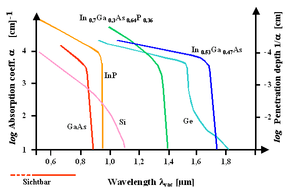

<!--
author:   Hartmut Stöcker

email:    hartmut.stoecker@physik.tu-freiberg.de

version:  0.0.1

language: de

narrator: Deutsch Female

comment:  Struktur der Materie 2 - Übung 01
@style
.lia-toc__bottom {
    display: none;
}
@end

import: https://raw.githubusercontent.com/liaTemplates/KekuleJS/master/README.md

import: https://github.com/liascript/CodeRunner

import: https://raw.githubusercontent.com/LiaTemplates/Pyodide/master/README.md
-->

# Übung 1

## Aufgabe 1

> Die Energielücke zwischen Valenz- und Leitungsband liegt in der Größenordnung von $\mathrm{1~eV}$. Wie stark muss ein von außen angelegtes elektrisches Feld sein, um einen Elektronenübergang vom Valenz- zum Leitungsband zu erzeugen? Nehmen Sie eine mittlere Elektronengeschwindigkeit von $\mathrm{10^6~m/s}$ und eine Relaxationszeit von $\mathrm{10^{-14}~s}$ an.

                                      {{1}}
Ein elektrisches Feld führt zur Verkippung der Bänder (allgemein gültig, nicht nur bei Halbleitern).

                                      {{2}}
Kann das Elektron ausreichend weit springen, kann es die Bandlücke $E_\mathrm{g}$ zwischen Valenzband und Leitungsband überwinden.

                                      {{3}}
 bewegt sich vom Valenzband zum Leitungsband. *Quelle: Hartmut Stöcker, [CC BY-NC-SA](https://creativecommons.org/licenses/by-nc-sa/4.0/)*")<!-- style = "width: 250px;" -->

                                      {{4}}
Die Sprungweite $s$ ergibt sich aus Geschwindigkeit $v$ und Relaxationszeit $t$ (Lebensdauer):
$$s = v \cdot t = \mathrm{10^6~\frac{m}{s}} \cdot \mathrm{10^{-14}~s} = \mathrm{10^{-8}~m}$$

                                      {{5}}
Die Bandlücke $E_\mathrm{g} = \mathrm{1~eV}$ entspricht für das Elektron einer Potentialbarriere von $U = \mathrm{1~V}$.

                                      {{6}}
Für das elektrische Feld $E$ folgt:
$$E = \frac{U}{s} = \frac{\mathrm{1~V}}{\mathrm{10^{-8}~m}} = \mathrm{10^8~\frac{V}{m}} = \mathrm{10^5~\frac{V}{mm}} = \mathrm{100~\frac{kV}{mm}}$$

## Aufgabe 2 

> Zeichnen Sie schematisch die Bandstruktur $E(k)$ für einen direkten und einen indirekten Halbleiter. Wo befindet sich das Fermi-Niveau $E_\mathrm{F}$ bei Raumtemperatur für einen intrinsischen, Donator- oder Akzeptor-dotierten Halbleiter?

                                      {{1}}
**Bandstruktur direkter Halbleiter:**
$ für zwei direkte Halbleiter. Das Valenzbandmaximum und das Leitungsbandminimum liegen genau beim gleichen $k$-Wert. *Quelle: Helmut Föll, [Matwiss II](https://www.tf.uni-kiel.de/matwis/amat/mw2_ge/kap_4/backbone/r4_3_2.html)*")

                                      {{2}}
**Bandstruktur indirekter Halbleiter:**
$ für zwei indirekte Halbleiter. Das Valenzbandmaximum und das Leitungsbandminimum befinden sich bei unterschiedlichen $k$-Werten. *Quelle: Helmut Föll, [Matwiss II](https://www.tf.uni-kiel.de/matwis/amat/mw2_ge/kap_4/backbone/r4_3_2.html)*")

                                      {{3}}
**Fermi-Niveau intrinsischer Halbleiter:**
*")<!-- style = "height: 200px;" -->

                                      {{4}}
**Fermi-Niveau Donator-dotierter Halbleiter:**
*")<!-- style = "height: 200px;" --> 

                                      {{5}}
**Fermi-Niveau Akzeptor-dotierter Halbleiter:**
*")<!-- style = "height: 200px;" -->

## Aufgabe 3

> Beantworten Sie mit Hilfe der nebenstehenden Grafik die folgenden Fragen:

**a) Wie groß ist die Energie der Bandlücke?**

                                      {{1}}
Der Abstand zwischen Valenzbandmaximum und Leitungsbandminimum beträgt $\mathrm{0,\!5~eV}$.

**b) Markieren Sie die niedrigste Energie eines Elektrons im Leitungsband.**

                                      {{2}}
Das Leitungsbandminimum liegt bei $k = \frac{8}{11}\,\frac{\pi}{a}$.

**c) Markieren Sie die höchste Energie eines Loches im Valenzband.**

                                      {{3}}
Das Valenzbandmaximum liegt bei $k = 0$.

**d) Ist die Energielücke direkt oder indirekt? Warum?**

                                      {{4}}
Die Energielücke ist indirekt, da Leitungsbandminimum und Valenzbandmaximum bei unterschiedlichen $k$-Werten liegen.

## Aufgabe 4 

> Wie ist die effektive Masse von Elektronen bzw. Löchern in Halbleitern definiert?

                                      {{1}}
Die effektive Masse wird als $m^*$ oder $m^\mathrm{eff}$ bezeichnet und ergibt sich aus der inversen Krümmung des Bandes $E(k)$. Die Krümmung wird über die zweite Ableitung berechnet:
$$m^\mathrm{eff} = \hbar^2 \left( \frac{\mathrm{d}^2 E}{\mathrm{d} k^2} \right)^{-1}$$

                                      {{2}}
Für Elektronen wird für $E(k)$ das Leitungsband genutzt, für Löcher das Valenzband.

## Aufgabe 5 

> Gibt es Unterschiede in der effektiven Elektronenmasse von direkten und indirekten Halbleitern?

                                      {{1}}
**Direkte Halbleiter** (z. B. GaAs, GaN, InP) haben ein Leitungsbandminimum bei $k = 0$. Dort ist die effektive Masse isotrop, d. h. in allen Richtungen gleich:
$$m^\mathrm{eff} = m_x^\mathrm{eff} = m_y^\mathrm{eff} = m_z^\mathrm{eff}$$

                                      {{2}}
An diesem Punkt kann die Energie $E(k)$ durch eine isotrope Parabel mit nur einer Masse $m^\mathrm{eff}$ angenähert werden:
$$E(k) = \frac{\hbar^2 k^2}{2 m^\mathrm{eff}}$$

                                      {{3}}
************************************
**Indirekte Halbleiter** (z. B. Si, Ge, GaP) haben ein Leitungsbandminimum bei $k \neq 0$. Dort ist die effektive Masse richtungsabhängig. Man unterscheidet zwei effektive Massen:

- die longitudinale $m_l^\mathrm{eff}$ (entlang der $k$-Richtung)
- die transversale $m_t^\mathrm{eff}$ (senkrecht zu $k$)
************************************

                                      {{4}}
Die Energieparabel $E(k)$ hängt dann von zwei Massen ab, zum Beispiel:
$$E(k) = \frac{\hbar^2}{2} \left( \frac{k_x^2}{m_t^\mathrm{eff}} + \frac{k_y^2}{m_t^\mathrm{eff}} + \frac{k_z^2}{m_l^\mathrm{eff}} \right)$$

## Aufgabe 6 

> Was sind leichte, schwere und abgespaltene Löcher?

                                      {{1}}

                                      {{2}}
Das Valenzband entsteht aus einem $p^3$-Orbital, d. h. die Drehimpulsquantenzahl beträgt $l=1$. Die Spin-Bahn-Kopplung $j = l \pm s$ (mit $s = \frac{1}{2}$) verursacht eine Energieaufspaltung um $\Delta$. 

                                      {{3}}
Die energetisch nach unten abgespaltenen Löcher besitzen den Gesamtdrehimpuls $j = l - s = \frac{1}{2}$ und die Masse $m_\mathrm{soh}^*$ (*split-off holes*).

                                      {{4}}
************************************
Die energetisch höher liegenden Löcher besitzen den Gesamtdrehimpuls $j = l + s = \frac{3}{2}$. Dieser Gesamtdrehimpuls ermöglich zwei unterschiedliche magnetische Quantenzahlen $m_j$:

- $m_j = \frac{3}{2}$ => schwere Löcher mit $m_\mathrm{hh}^*$ (*heavy holes*)
- $m_j = \frac{1}{2}$ => leichte Löcher mit $m_\mathrm{lh}^*$ (*light holes*)
************************************

## Aufgabe 7

> Man zeige, dass für das chemische Potential eines intrinsischen Halbleiters gilt:
> $$\mu = \frac{E_\mathrm{g}}{2} + \frac{3}{4} k_\mathrm{B} T \cdot \ln \left( \frac{m_\mathrm{h}^\mathrm{eff}}{m_\mathrm{e}^\mathrm{eff}} \right)$$
> Erklären Sie qualitativ, warum das chemische Potential von den effektiven Massen in dieser Form abhängt.

                                      {{1}}
Bei nicht zu hohen Temperaturen, also z. B. bei Raumtemperatur, sind das chemische Potential und die Fermi-Energie ungefähr gleich: $\mu \approx E_\mathrm{F}$.

                                      {{2}}
Für die Herleitung beginnen wir mit den Formeln für die Elektronenkonzentration $n$ und die Löcherkonzentration $p$:
$$n = 2 \left( \frac{m_\mathrm{e}^\mathrm{eff} k_\mathrm{B} T}{2 \pi \hbar^2} \right)^{3/2} \exp \left( - \frac{E_\mathrm{L} - E_\mathrm{F}}{k_\mathrm{B} T} \right)$$
$$p = 2 \left( \frac{m_\mathrm{h}^\mathrm{eff} k_\mathrm{B} T}{2 \pi \hbar^2} \right)^{3/2} \exp \left( \frac{E_\mathrm{V} - E_\mathrm{F}}{k_\mathrm{B} T} \right)$$

                                      {{3}}
Bei intrinsischen Halbleitern stammen alle Leitungselektronen aus dem Valenzband, so dass $n = p$ gilt:
$$2 \left( \frac{m_\mathrm{e}^\mathrm{eff} k_\mathrm{B} T}{2 \pi \hbar^2} \right)^{3/2} \exp \left( - \frac{E_\mathrm{L} - E_\mathrm{F}}{k_\mathrm{B} T} \right) = 2 \left( \frac{m_\mathrm{h}^\mathrm{eff} k_\mathrm{B} T}{2 \pi \hbar^2} \right)^{3/2} \exp \left( \frac{E_\mathrm{V} - E_\mathrm{F}}{k_\mathrm{B} T} \right)$$

                                      {{4}}
Kürzen und umstellen führt zu:
$$\left( m_\mathrm{e}^\mathrm{eff} \right)^{3/2} \exp \left( - \frac{E_\mathrm{L} - E_\mathrm{F}}{k_\mathrm{B} T} \right) = \left( m_\mathrm{h}^\mathrm{eff} \right)^{3/2} \exp \left( \frac{E_\mathrm{V} - E_\mathrm{F}}{k_\mathrm{B} T} \right)$$
$$\exp \left( \frac{-E_\mathrm{L} + 2 E_\mathrm{F} - E_\mathrm{V}}{k_\mathrm{B} T} \right) = \left( \frac{m_\mathrm{h}^\mathrm{eff}}{m_\mathrm{e}^\mathrm{eff}} \right)^{3/2}$$

                                      {{5}}
Weiter umformen:
$$\frac{-E_\mathrm{L} + 2 E_\mathrm{F} - E_\mathrm{V}}{k_\mathrm{B} T} = \ln \left[ \left( \frac{m_\mathrm{h}^\mathrm{eff}}{m_\mathrm{e}^\mathrm{eff}} \right)^{3/2} \right]$$
$$-E_\mathrm{L} + 2 E_\mathrm{F} - E_\mathrm{V} = \frac{3}{2} k_\mathrm{B} T \cdot \ln \left( \frac{m_\mathrm{h}^\mathrm{eff}}{m_\mathrm{e}^\mathrm{eff}} \right)$$

                                      {{6}}
Daraus folgt der gesuchte Zusammenhang (wobei $E_\mathrm{g} = E_\mathrm{L} + E_\mathrm{V}$):
$$E_\mathrm{F} = \frac{E_\mathrm{L} + E_\mathrm{V}}{2} + \frac{3}{4} k_\mathrm{B} T \cdot \ln \left( \frac{m_\mathrm{h}^\mathrm{eff}}{m_\mathrm{e}^\mathrm{eff}} \right)$$

                                      {{7}}
************************************
Das bedeutet:

- Bei $T = 0~\mathrm{K}$ liegt die Fermi-Energie genau in der Mitte der Bandlücke: $E_\mathrm{F} = \frac{E_\mathrm{g}}{2}$.
- Bei höheren Temperaturen verschiebt sich die Fermi-Energie leicht nach oben oder unten (je nach dem Verhältnis der effektiven Massen).
- Ist $m_\mathrm{h}^\mathrm{eff} > m_\mathrm{e}^\mathrm{eff}$ (z. B. GaAs), steigt die Fermi-Energie mit der Temperatur an.
- Ist $m_\mathrm{h}^\mathrm{eff} < m_\mathrm{e}^\mathrm{eff}$ (z. B. Si), nimmt die Fermi-Energie mit der Temperatur ab.
************************************

                                      {{8}}
************************************
**Beispiel für $m_\mathrm{h}^\mathrm{eff} < m_\mathrm{e}^\mathrm{eff}$:**

*")
************************************

                                      {{9}}
Für $m_\mathrm{h}^\mathrm{eff} < m_\mathrm{e}^\mathrm{eff}$ ist das Valenzband stärker gekrümmt als das Leitungsband. Bei gleicher Ladungsträgerdichte ($n=p$) im intrinsischen Halbleiter muss sich die Fermi-Energie $E_\mathrm{F}$ leicht nach unten verschieben. Dies ist notwendig um die ungleiche Besetzung der Zustände richtig zu beschreiben. Diese Verschiebung steigt mit der Temperatur, da immer mehr Elektronen und Löcher entstehen und damit die Besetzung der Bänder zunimmt.

## Aufgabe 8

> Diskutieren Sie die Abhängigkeit des Fermi-Niveaus von der Temperatur bei Eigen- und bei Störstellenleitung.

                                      {{1}}
************************************
**Eigenleitung:**

- Bei $T = 0~\mathrm{K}$ liegt die Fermi-Energie genau in der Mitte der Bandlücke: $E_\mathrm{F} = \frac{E_\mathrm{g}}{2}$.
- Bei höheren Temperaturen verschiebt sich die Fermi-Energie leicht nach oben oder unten (je nach dem Verhältnis der effektiven Massen).
- Der Zusammenhang lautet (siehe Aufgabe 7):
$$E_\mathrm{F} = \frac{E_\mathrm{g}}{2} + \frac{3}{4} k_\mathrm{B} T \cdot \ln \left( \frac{m_\mathrm{h}^\mathrm{eff}}{m_\mathrm{e}^\mathrm{eff}} \right)$$
************************************

                                      {{2}}
************************************
**Störstellenleitung:**

Dotierte Halbleiter zeigen eine ausgeprägte Temperaturabhängigkeit der Fermi-Energie (bzw. des chemischen Potentials). Daran gekoppelt ändert sich auch die Ladungsträgerkonzentration.
************************************

                                      {{3}}

                                      {{4}}
- Im Bereich I liegt Störstellenkompensation durch eine endliche Akzeptordichte vor. Die Fermi-Energie liegt nahe des Störstellenniveaus: $E_\mathrm{F} \approx E_\mathrm{D}$
- Im Bereich II dominiert reine Störstellenleitung. Die Fermi-Energie liegt etwa mittig zwischen Störstellenniveau und Leitungsband: $E_\mathrm{F} \approx \frac{E_\mathrm{C} + E_\mathrm{D}}{2}$
- Im Bereich III der Störstellenerschöpfung sind sämtliche Störstellen ionisiert, so dass die Ladungsträgerdichte etwa konstant bleibt. Die Fermi-Energie bewegt sich mit steigender Temperatur in Richtung Bandmitte.
- Im Bereich IV tritt die Eigenleitung gegenüber der Störstellenleitung in den Vordergrund. Wie im intrinsischen Halbleiter gilt im dotierten Halbleiter bei sehr hohen Temperaturen: $E_\mathrm{F} \approx \frac{E_\mathrm{g}}{2}$.

## Aufgabe 9

> Leiten Sie einen vereinfachten Ausdruck für die Fermi-Dirac-Verteilung bei der Besetzung der Elektronen im Leitungsband $f(E,T) = \frac{1}{\mathrm{e}^{(E−\mu)/k_\mathrm{B} T} + 1}$ bzw. Löcher im Valenzband $1 - f(E,T) = 1 - \frac{1}{\mathrm{e}^{(E−\mu)/k_\mathrm{B} T} + 1}$ eines nicht-degenerierten Halbleiters her. Nehmen Sie dabei an, dass sich das chemische Potential $\mu$ ungefähr in der Mitte der Bandlücke befindet.

                                      {{1}}
Da sich $\mu$ ungefähr in der Mitte der Bandlücke befindet, gilt $(E −\mu) \gg 𝑘_\mathrm{B} 𝑇$.

                                      {{2}}
Damit gilt auch $\mathrm{e}^{(E−\mu)/k_\mathrm{B} T} \gg 1$.

                                      {{3}}
Der Summand $+1$ im Nenner kann also vernachlässigt werden:
$$f(E,T) = \frac{1}{\mathrm{e}^{(E−\mu)/k_\mathrm{B} T} + 1} \approx \frac{1}{\mathrm{e}^{(E−\mu)/k_\mathrm{B} T}} = \mathrm{e}^{-(E−\mu)/k_\mathrm{B} T}$$

                                      {{4}}
Für die Besetzung der Elektronen im Leitungsband erhalten wir also den vereinfachten Ausdruck (der auch als Boltzmann-Verteilung bezeichnet wird):
$$f(E,T) \approx \exp \left( -\frac{E−\mu}{k_\mathrm{B} T} \right)$$

                                      {{5}}
Für die Besetzung der Löcher im Valenzband beginnen wir noch einmal beim ursprünglichen Ausdruck:
$$1 - f(E,T) = 1 - \frac{1}{\mathrm{e}^{(E−\mu)/k_\mathrm{B} T} + 1} = \frac{\mathrm{e}^{(E−\mu)/k_\mathrm{B} T} + 1 - 1}{\mathrm{e}^{(E−\mu)/k_\mathrm{B} T} + 1} = \frac{\mathrm{e}^{(E−\mu)/k_\mathrm{B} T}}{\mathrm{e}^{(E−\mu)/k_\mathrm{B} T} + 1}$$

                                      {{6}}
Wir teilen im letzten Ausdruck durch den Term mit der $\mathrm{e}$-Funktion:
$$1 - f(E,T) = \frac{1}{1 + \mathrm{e}^{-(E−\mu)/k_\mathrm{B} T}} = \frac{1}{\mathrm{e}^{(\mu - E)/k_\mathrm{B} T} + 1}$$

                                      {{7}}
Auch hier ist $\mathrm{e}^{(\mu - E)/k_\mathrm{B} T} \gg 1$ und der Summand $+1$ im Nenner kann vernachlässigt werden:
$$1 - f(E,T) \approx \exp \left( -\frac{\mu - E}{k_\mathrm{B} T} \right)$$

## Aufgabe 10

> In der folgenden Abbildung sehen Sie den Verlauf des Absorptionskoeffizienten in Abhängigkeit der Wellenlänge für verschiedene Halbleiter. Welche Halbleiter sind direkt und welche indirekt? Warum? Nennen Sie häufig eingesetzte Element- und Verbindungshalbleiter und ihre Anwendungen!

                                      {{1}}
Direkte Halbleiter: $\mathrm{GaAs, InP, In_{0.7}Ga_{0.3}As_{0.64}P_{0.36}, In_{0.53}Ga_{0.47}As}$

                                      {{2}}
Indirekte Halbleiter: $\mathrm{Si, Ge}$

                                      {{3}}
************************************
Erklärung:

- Für $E>E_\mathrm{g}$ steigt die Absorption der direkten Halbleiter mit abnehmender Wellenlänge $\lambda$ steil an. 
- Für indirekte Halbleiter sind nur indirekte Übergänge unter Mitwirken eines Phonons möglich. Die Absorption steigt wesentlich langsamer an.
- Nach dem Einsetzen des direkten Prozesses steigt die Absorption noch einmal deutlich an (siehe $\mathrm{Ge}$).
************************************

                                      {{4}}
************************************
Beispiele:

| Material | Anwendung |
| -------- | --------- |
| GaAs | Hochfrequenzbauteile (Mobiltelefone und Satellitenkommunikation) |
| GaN  | Leuchtdioden |
| Ge   | Fotodioden |
| InSb | Infrarotsensoren |
| Si   | Mikrochips, Prozessoren, Solarzellen |
************************************