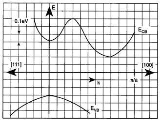
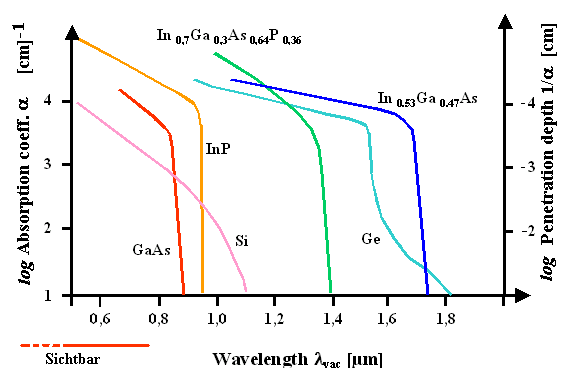

<!--
author:   Hartmut Stöcker

email:    hartmut.stoecker@physik.tu-freiberg.de

version:  0.2

language: de

narrator: Deutsch Female

comment:  Struktur der Materie 2 - Übung 01
@style
.lia-toc__bottom {
    display: none;
}
@end

import: https://raw.githubusercontent.com/liaTemplates/KekuleJS/master/README.md

import: https://github.com/liascript/CodeRunner

import: https://raw.githubusercontent.com/LiaTemplates/Pyodide/master/README.md
-->

# Übung 1

                                      {{1}}
************************************
**Frage 1: Welche Eigenschaften kennzeichnen einen Halbleiter?**

- [[X]] Die Leitfähigkeit liegt zwischen der von Metallen und Isolatoren.
- [[X]] Die Leitfähigkeit steigt mit der Temperatur stark an.
- [[X]] Die Leitfähigkeit ändert sich durch Beimischung von Fremdatomen.
- [[X]] Die Leitfähigkeit wird durch das elektronische System bestimmt.
************************************

                                      {{2}}
************************************
**Frage 2: Was sind dotierte Halbleiter?**

- [[X]] Es werden gezielt Fremdatome in das Kristallgitter eingebracht.
- [[ ]] Das Kristallgitter wird von zwei oder mehr verschiedenen Atomen gebildet.
- [[X]] Die Leitfähigkeit wird durch die Dotierung absichtlich erhöht.
- [[ ]] Die Bandlücke wird gezielt vergrößert oder verkleinert.
************************************

## Aufgabe 1

> Die Energielücke zwischen Valenz- und Leitungsband liegt in der Größenordnung von $\mathrm{1~eV}$. Wie stark muss ein von außen angelegtes elektrisches Feld sein, um einen Elektronenübergang vom Valenz- zum Leitungsband zu erzeugen? Nehmen Sie eine mittlere Elektronengeschwindigkeit von $\mathrm{10^6~m/s}$ und eine Relaxationszeit von $\mathrm{10^{-14}~s}$ an.

                                      {{1}}
Ein elektrisches Feld führt zur Verkippung der Bänder (allgemein gültig, nicht nur bei Halbleitern).

                                      {{2}}
Kann das Elektron ausreichend weit springen, kann es die Bandlücke $E_\mathrm{g}$ zwischen Valenzband und Leitungsband überwinden.

                                      {{3}}
 bewegt sich vom Valenzband zum Leitungsband. *Quelle: Hartmut Stöcker, [CC BY-NC-SA](https://creativecommons.org/licenses/by-nc-sa/4.0/)*")<!-- style = "width: 250px;" -->

                                      {{4}}
Die Sprungweite $s$ ergibt sich aus Geschwindigkeit $v$ und Relaxationszeit $t$ (Lebensdauer):
$$s = v \cdot t = \mathrm{10^6~\frac{m}{s}} \cdot \mathrm{10^{-14}~s} = \mathrm{10^{-8}~m}$$

                                      {{5}}
Die Bandlücke $E_\mathrm{g} = \mathrm{1~eV}$ entspricht für das Elektron einer Potentialbarriere von $U = \mathrm{1~V}$.

                                      {{6}}
Für das elektrische Feld $E$ folgt:
$$E = \frac{U}{s} = \frac{\mathrm{1~V}}{\mathrm{10^{-8}~m}} = \mathrm{10^8~\frac{V}{m}} = \mathrm{10^5~\frac{V}{mm}} = \mathrm{100~\frac{kV}{mm}}$$

## Aufgabe 2 

> Zeichnen Sie schematisch die Bandstruktur $E(k)$ für einen direkten und einen indirekten Halbleiter. Wo befindet sich das Fermi-Niveau $E_\mathrm{F}$ bei Raumtemperatur für einen intrinsischen, Donator- oder Akzeptor-dotierten Halbleiter?

                                      {{1}}
**Bandstruktur direkter Halbleiter:**
$ für zwei direkte Halbleiter. Das Valenzbandmaximum und das Leitungsbandminimum liegen genau beim gleichen $k$-Wert. *Quelle: Helmut Föll, [Matwiss II](https://www.tf.uni-kiel.de/matwis/amat/mw2_ge/kap_4/backbone/r4_3_2.html)*")

                                      {{2}}
**Bandstruktur indirekter Halbleiter:**
$ für zwei indirekte Halbleiter. Das Valenzbandmaximum und das Leitungsbandminimum befinden sich bei unterschiedlichen $k$-Werten. *Quelle: Helmut Föll, [Matwiss II](https://www.tf.uni-kiel.de/matwis/amat/mw2_ge/kap_4/backbone/r4_3_2.html)*")

                                      {{3}}
**Fermi-Niveau intrinsischer Halbleiter:**
*")<!-- style = "height: 200px;" -->

                                      {{4}}
**Fermi-Niveau Donator-dotierter Halbleiter:**
*")<!-- style = "height: 200px;" --> 

                                      {{5}}
**Fermi-Niveau Akzeptor-dotierter Halbleiter:**
*")<!-- style = "height: 200px;" -->

## Aufgabe 3

> Beantworten Sie mit Hilfe der Grafik die folgenden Fragen:
>
> 

**a) Wie groß ist die Energie der Bandlücke?**

                                      {{1}}
Der Abstand zwischen Valenzbandmaximum und Leitungsbandminimum beträgt $\mathrm{0,\!5~eV}$.

**b) Markieren Sie die niedrigste Energie eines Elektrons im Leitungsband.**

                                      {{2}}
Das Leitungsbandminimum liegt bei $k = \frac{8}{11}\,\frac{\pi}{a}$.

**c) Markieren Sie die höchste Energie eines Loches im Valenzband.**

                                      {{3}}
Das Valenzbandmaximum liegt bei $k = 0$.

**d) Ist die Energielücke direkt oder indirekt? Warum?**

                                      {{4}}
Die Energielücke ist indirekt, da Leitungsbandminimum und Valenzbandmaximum bei unterschiedlichen $k$-Werten liegen.

## Aufgabe 4

> In der folgenden Abbildung sehen Sie den Verlauf des Absorptionskoeffizienten in Abhängigkeit der Wellenlänge für verschiedene Halbleiter. Welche Halbleiter sind direkt und welche indirekt? Warum? Nennen Sie häufig eingesetzte Element- und Verbindungshalbleiter und ihre Anwendungen!
> 
> 

                                      {{1}}
Direkte Halbleiter: $\mathrm{GaAs, InP, In_{0.7}Ga_{0.3}As_{0.64}P_{0.36}, In_{0.53}Ga_{0.47}As}$

                                      {{2}}
Indirekte Halbleiter: $\mathrm{Si, Ge}$

                                      {{3}}
************************************
Erklärung:

- Für $E>E_\mathrm{g}$ steigt die Absorption der direkten Halbleiter mit abnehmender Wellenlänge $\lambda$ steil an. 
- Für indirekte Halbleiter sind nur indirekte Übergänge unter Mitwirken eines Phonons möglich. Die Absorption steigt wesentlich langsamer an.
- Nach dem Einsetzen des direkten Prozesses steigt die Absorption noch einmal deutlich an (siehe $\mathrm{Ge}$).
************************************

                                      {{4}}
************************************
Beispiele:

| Material | Anwendung |
| -------- | --------- |
| GaAs | Hochfrequenzbauteile (Mobiltelefone und Satellitenkommunikation) |
| GaN  | Leuchtdioden |
| Ge   | Fotodioden |
| InSb | Infrarotsensoren |
| Si   | Mikrochips, Prozessoren, Solarzellen |
************************************

## Aufgabe 5

> Leiten Sie einen vereinfachten Ausdruck für die Fermi-Dirac-Verteilung bei der Besetzung der Elektronen im Leitungsband $f(E,T) = \frac{1}{\mathrm{e}^{(E−\mu)/k_\mathrm{B} T} + 1}$ bzw. Löcher im Valenzband $1 - f(E,T) = 1 - \frac{1}{\mathrm{e}^{(E−\mu)/k_\mathrm{B} T} + 1}$ eines nicht-degenerierten Halbleiters her. Nehmen Sie dabei an, dass sich das chemische Potential $\mu$ ungefähr in der Mitte der Bandlücke befindet.

                                      {{1}}
Da sich $\mu$ ungefähr in der Mitte der Bandlücke befindet, gilt $(E −\mu) \gg 𝑘_\mathrm{B} 𝑇$.

                                      {{2}}
Damit gilt auch $\mathrm{e}^{(E−\mu)/k_\mathrm{B} T} \gg 1$.

                                      {{3}}
Der Summand $+1$ im Nenner kann also vernachlässigt werden:
$$f(E,T) = \frac{1}{\mathrm{e}^{(E−\mu)/k_\mathrm{B} T} + 1} \approx \frac{1}{\mathrm{e}^{(E−\mu)/k_\mathrm{B} T}} = \mathrm{e}^{-(E−\mu)/k_\mathrm{B} T}$$

                                      {{4}}
Für die Besetzung der Elektronen im Leitungsband erhalten wir also den vereinfachten Ausdruck (der auch als Boltzmann-Verteilung bezeichnet wird):
$$f(E,T) \approx \exp \left( -\frac{E−\mu}{k_\mathrm{B} T} \right)$$

                                      {{5}}
Für die Besetzung der Löcher im Valenzband beginnen wir noch einmal beim ursprünglichen Ausdruck:
$$1 - f(E,T) = 1 - \frac{1}{\mathrm{e}^{(E−\mu)/k_\mathrm{B} T} + 1} = \frac{\mathrm{e}^{(E−\mu)/k_\mathrm{B} T} + 1 - 1}{\mathrm{e}^{(E−\mu)/k_\mathrm{B} T} + 1} = \frac{\mathrm{e}^{(E−\mu)/k_\mathrm{B} T}}{\mathrm{e}^{(E−\mu)/k_\mathrm{B} T} + 1}$$

                                      {{6}}
Wir teilen im letzten Ausdruck durch den Term mit der $\mathrm{e}$-Funktion:
$$1 - f(E,T) = \frac{1}{1 + \mathrm{e}^{-(E−\mu)/k_\mathrm{B} T}} = \frac{1}{\mathrm{e}^{(\mu - E)/k_\mathrm{B} T} + 1}$$

                                      {{7}}
Auch hier ist $\mathrm{e}^{(\mu - E)/k_\mathrm{B} T} \gg 1$ und der Summand $+1$ im Nenner kann vernachlässigt werden:
$$1 - f(E,T) \approx \exp \left( -\frac{\mu - E}{k_\mathrm{B} T} \right)$$

## Aufgabe 6

> Bestimmen Sie die Dotierstoffkonzentration in Silizium, wenn eins von einer Million Si-Atome durch ein Bor-Atom ersetzt wird (molare Masse von Si: 28 g/mol, Dichte: 2,3 g/cm³).

                                      {{1}}
Die Stoffmenge $n$ (*Bitte nicht mit einer Elektronenkonzentration verwechseln!*) erhalten wir entweder aus der Anzahl der Teilchen $N$ geteilt durch die Avogadro-Konstante $N_\mathrm{A}$ oder aus der Masse $m$ geteilt durch die molare Masse $M$:
$$n = \frac{N}{N_\mathrm{A}} = \frac{m}{M}$$

                                      {{2}}
Die Konzentration der Silizium-Atome ist die Anzahl der Atome $N$ pro Volumen $V$. Wir bezeichnen sie mit $n_\mathrm{Si}$. Aus der vorherigen Formel folgt:
$$n_\mathrm{Si} = \frac{N}{V} = \frac{m \cdot N_\mathrm{A}}{M \cdot V}$$

                                      {{3}}
In dieser Formel können wir $\frac{m}{V}$ durch die Dichte $\varrho$ ersetzen:
$$n_\mathrm{Si} = \frac{\varrho \cdot N_\mathrm{A}}{M}$$

                                      {{4}}
Da Bor in Silizium ein Akzeptor ist, bezeichnen wir die gesuchte Dotierstoffkonzentration mit $n_\mathrm{A}$. Wenn eins von einer Million Si-Atome durch ein Bor-Atom ersetzt wird, folgt aus der vorherigen Formel:
$$n_\mathrm{A} = 10^{-6} \cdot n_\mathrm{Si} = 10^{-6} \cdot \frac{\varrho \cdot N_\mathrm{A}}{M}$$

                                      {{5}}
Einsetzen der gegebenen Werte liefert:
$$n_\mathrm{A} = 4,\!9 \cdot 10^{16}~\mathrm{cm^{-3}}$$