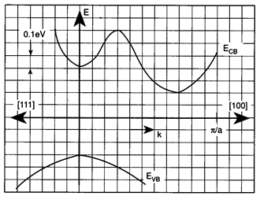

<!--
author:   Hartmut Stöcker
email:    hartmut.stoecker@physik.tu-freiberg.de
version:  0.0.1
language: de
narrator: Deutsch Female
comment:  Struktur der Materie 2 - Übung 02

@style
.lia-toc__bottom {
    display: none;
}
@end

import: https://raw.githubusercontent.com/liaTemplates/KekuleJS/master/README.md
import: https://github.com/liascript/CodeRunner
import: https://raw.githubusercontent.com/LiaTemplates/Pyodide/master/README.md
-->

# Übung 2

## Aufgabe 1

> Zeigen Sie, dass das Produkt aus Majoritäts- und Minoritätsladungsträgerdichte für einen gegebenen Halbleiter und eine vorgegebene Temperatur konstant ist.

                                      {{1}}
Für die Herleitung beginnen wir mit den Formeln für die Elektronenkonzentration $n$ und die Löcherkonzentration $p$:
$$n = N_\mathrm{L} \cdot \exp \left( - \frac{E_\mathrm{L} - E_\mathrm{F}}{k_\mathrm{B} T} \right)$$
$$p = N_\mathrm{V} \cdot \exp \left( \frac{E_\mathrm{V} - E_\mathrm{F}}{k_\mathrm{B} T} \right)$$

                                      {{2}}
Die gesuchte Größe ist das Produkt $n \cdot p$, für das folgt:
$$n \cdot p = N_\mathrm{L} \cdot N_\mathrm{V} \cdot \exp \left( - \frac{E_\mathrm{L} - E_\mathrm{F}}{k_\mathrm{B} T} \right) \cdot \exp \left( \frac{E_\mathrm{V} - E_\mathrm{F}}{k_\mathrm{B} T} \right)$$
$$n \cdot p = N_\mathrm{L} N_\mathrm{V} \cdot \exp \left( - \frac{E_\mathrm{L} - E_\mathrm{F} - E_\mathrm{V} + E_\mathrm{F}}{k_\mathrm{B} T} \right)$$

                                      {{3}}
Da $E_\mathrm{L} - E_\mathrm{V} = E_\mathrm{g}$ gerade die Bandlücke ergibt, erhält man:
$$n \cdot p = N_\mathrm{L} N_\mathrm{V} \cdot \exp \left( - \frac{E_\mathrm{g}}{k_\mathrm{B} T} \right)$$

                                      {{4}}
Schreibt man die effektiven Zustandsdichten $N_\mathrm{L}$ und $N_\mathrm{V}$ aus, erkennt man die vollständige Temperaturabhängigkeit:
$$n \cdot p = 4 \left( \frac{k_\mathrm{B} T}{2 \pi \hbar^2} \right)^3 \left( m_\mathrm{e}^\mathrm{eff} m_\mathrm{h}^\mathrm{eff} \right)^{3/2} \cdot \exp \left( - \frac{E_\mathrm{g}}{k_\mathrm{B} T} \right)$$

                                      {{5}}
Damit ist das Produkt $n \cdot p$ nur von der Temperatur $T$, den effektiven Massen $m_\mathrm{e}^\mathrm{eff}$ und $m_\mathrm{h}^\mathrm{eff}$ sowie der Bandlücke $E_\mathrm{g}$ des betrachteten Halbleiters abhängig. Dieser Zusammenhang gilt für intrinsische und dotierte Halbleiter (aber nicht für entartete Halbleiter) und wird als **Massenwirkungsgesetz** bezeichnet.

## Aufgabe 2 

> Die Temperatur eigenleitenden Siliziums wird von -20 °C auf 200 °C erhöht. Wie ändert sich die Elektronenkonzentration (Quotient beider Konzentrationen)?

                                      {{1}}
**Bandstruktur direkter Halbleiter:**
$ für zwei direkte Halbleiter. Das Valenzbandmaximum und das Leitungsbandminimum liegen genau beim gleichen $k$-Wert. *Quelle: Helmut Föll, [Matwiss II](https://www.tf.uni-kiel.de/matwis/amat/mw2_ge/kap_4/backbone/r4_3_2.html)*")

                                      {{2}}
**Bandstruktur indirekter Halbleiter:**
$ für zwei indirekte Halbleiter. Das Valenzbandmaximum und das Leitungsbandminimum befinden sich bei unterschiedlichen $k$-Werten. *Quelle: Helmut Föll, [Matwiss II](https://www.tf.uni-kiel.de/matwis/amat/mw2_ge/kap_4/backbone/r4_3_2.html)*")

                                      {{3}}
**Fermi-Niveau intrinsischer Halbleiter:**
*")<!-- style = "height: 200px;" -->

                                      {{4}}
**Fermi-Niveau Donator-dotierter Halbleiter:**
*")<!-- style = "height: 200px;" --> 

                                      {{5}}
**Fermi-Niveau Akzeptor-dotierter Halbleiter:**
*")<!-- style = "height: 200px;" -->

## Aufgabe 3

> Bestimmen Sie die Dotierstoffkonzentration in Silizium, wenn eins von einer Million Si-Atome durch ein Bor-Atom ersetzt wird (molare Masse von Si: 28 g/mol, Dichte: 2,3 g/cm³).

**a) Wie groß ist die Energie der Bandlücke?**

                                      {{1}}
Der Abstand zwischen Valenzbandmaximum und Leitungsbandminimum beträgt $\mathrm{0,\!5~eV}$.

**b) Markieren Sie die niedrigste Energie eines Elektrons im Leitungsband.**

                                      {{2}}
Das Leitungsbandminimum liegt bei $k = \frac{8}{11}\,\frac{\pi}{a}$.

**c) Markieren Sie die höchste Energie eines Loches im Valenzband.**

                                      {{3}}
Das Valenzbandmaximum liegt bei $k = 0$.

**d) Ist die Energielücke direkt oder indirekt? Warum?**

                                      {{4}}
Die Energielücke ist indirekt, da Leitungsbandminimum und Valenzbandmaximum bei unterschiedlichen $k$-Werten liegen.

## Aufgabe 4 

> Ein Halbleiter hat eine Donator-Konzentration von $n_\mathrm{D} = 3,\!5 \cdot 10^{16}~\mathrm{cm^{-3}}$ und eine Akzeptor-Konzentration von $n_\mathrm{A} = 1,\!0 \cdot 10^{16}~\mathrm{cm^{-3}}$. Man berechne die Konzentration der Elektronen und Löcher ($n_i = 5,\!0 \cdot 10^{9}~\mathrm{cm^{-3}}$).

                                      {{1}}
Die effektive Masse wird als $m^*$ oder $m^\mathrm{eff}$ bezeichnet und ergibt sich aus der inversen Krümmung des Bandes $E(k)$. Die Krümmung wird über die zweite Ableitung berechnet:
$$m^\mathrm{eff} = \hbar^2 \left( \frac{\mathrm{d}^2 E}{\mathrm{d} k^2} \right)^{-1}$$

                                      {{2}}
Für Elektronen wird für $E(k)$ das Leitungsband genutzt, für Löcher das Valenzband.

## Aufgabe 5 

> Für Indiumantimonid ist die Bandlücke $E_\mathrm{g} = 0,\!23~\mathrm{eV}$, die Dielektrizitätskonstante $\varepsilon_r = 18$, die effektive Masse der Elektronen $m_\mathrm{e}^\mathrm{eff} = 0,\!015\,m_0$. Berechnen Sie:
>
> a) die Ionisierungsenergie der Donatoren!
>
> b) den Bahnradius für den Grundzustand!
>
> c) Ab welcher Donatorkonzentration treten deutliche Überlappungseffekte zwischen den Bahnen benachbarter Fremdatome auf? Diese Überlappung kann ein Störstellenband erzeugen. Dies ist ein Energieband, das die elektrische Leitung durch den Sprung-mechanismus (*Hopping*) ermöglicht, bei dem Elektronen von einem Fremdatom auf ein benachbartes, ionisiertes Fremdatom springen.

                                      {{1}}
**Direkte Halbleiter** (z. B. GaAs, GaN, InP) haben ein Leitungsbandminimum bei $k = 0$. Dort ist die effektive Masse isotrop, d. h. in allen Richtungen gleich:
$$m^\mathrm{eff} = m_x^\mathrm{eff} = m_y^\mathrm{eff} = m_z^\mathrm{eff}$$

                                      {{2}}
An diesem Punkt kann die Energie $E(k)$ durch eine isotrope Parabel mit nur einer Masse $m^\mathrm{eff}$ angenähert werden:
$$E(k) = \frac{\hbar^2 k^2}{2 m^\mathrm{eff}}$$

                                      {{3}}
************************************
**Indirekte Halbleiter** (z. B. Si, Ge, GaP) haben ein Leitungsbandminimum bei $k \neq 0$. Dort ist die effektive Masse richtungsabhängig. Man unterscheidet zwei effektive Massen:

- die longitudinale $m_l^\mathrm{eff}$ (entlang der $k$-Richtung)
- die transversale $m_t^\mathrm{eff}$ (senkrecht zu $k$)
************************************

                                      {{4}}
Die Energieparabel $E(k)$ hängt dann von zwei Massen ab, zum Beispiel:
$$E(k) = \frac{\hbar^2}{2} \left( \frac{k_x^2}{m_t^\mathrm{eff}} + \frac{k_y^2}{m_t^\mathrm{eff}} + \frac{k_z^2}{m_l^\mathrm{eff}} \right)$$

## Aufgabe 6 

> Wie lassen sich durch Messung der Temperaturabhängigkeit des Hall-Koeffizienten die Energielücke $E_\mathrm{g}$ eines Halbleiters sowie bei einem n-Typ-Halbleiter der Abstand $E_\mathrm{d}$ des Donatorniveaus von der Leitungsbandkante bzw. bei einem p-Typ-Halbleiter der Abstand $E_\mathrm{a}$ des Akzeptorniveaus von der Valenzbandkante bestimmen?

                                      {{1}}

                                      {{2}}
Das Valenzband entsteht aus einem $p^3$-Orbital, d. h. die Drehimpulsquantenzahl beträgt $l=1$. Die Spin-Bahn-Kopplung $j = l \pm s$ (mit $s = \frac{1}{2}$) verursacht eine Energieaufspaltung um $\Delta$. 

                                      {{3}}
Die energetisch nach unten abgespaltenen Löcher besitzen den Gesamtdrehimpuls $j = l - s = \frac{1}{2}$ und die Masse $m_\mathrm{soh}^*$ (*split-off holes*).

                                      {{4}}
************************************
Die energetisch höher liegenden Löcher besitzen den Gesamtdrehimpuls $j = l + s = \frac{3}{2}$. Dieser Gesamtdrehimpuls ermöglich zwei unterschiedliche magnetische Quantenzahlen $m_j$:

- $m_j = \frac{3}{2}$ => schwere Löcher mit $m_\mathrm{hh}^*$ (*heavy holes*)
- $m_j = \frac{1}{2}$ => leichte Löcher mit $m_\mathrm{lh}^*$ (*light holes*)
************************************

## Aufgabe 7

> Lässt sich durch Messung des Hall-Effekts die Dichte $n_\mathrm{D}$ der Donatoren in einem n-Typ-Halbleiter bzw. die Dichte $n_\mathrm{A}$ der Akzeptoren in einem p-Typ-Halbleiter bestimmen? Wenn ja, in welchem Temperaturbereich muss die Messung stattfinden?

                                      {{1}}
Bei nicht zu hohen Temperaturen, also z. B. bei Raumtemperatur, sind das chemische Potential und die Fermi-Energie ungefähr gleich: $\mu \approx E_\mathrm{F}$.

                                      {{2}}
Für die Herleitung beginnen wir mit den Formeln für die Elektronenkonzentration $n$ und die Löcherkonzentration $p$:
$$n = 2 \left( \frac{m_\mathrm{e}^\mathrm{eff} k_\mathrm{B} T}{2 \pi \hbar^2} \right)^{3/2} \exp \left( - \frac{E_\mathrm{L} - E_\mathrm{F}}{k_\mathrm{B} T} \right)$$
$$p = 2 \left( \frac{m_\mathrm{h}^\mathrm{eff} k_\mathrm{B} T}{2 \pi \hbar^2} \right)^{3/2} \exp \left( \frac{E_\mathrm{V} - E_\mathrm{F}}{k_\mathrm{B} T} \right)$$

                                      {{3}}
Bei intrinsischen Halbleitern stammen alle Leitungselektronen aus dem Valenzband, so dass $n = p$ gilt:
$$2 \left( \frac{m_\mathrm{e}^\mathrm{eff} k_\mathrm{B} T}{2 \pi \hbar^2} \right)^{3/2} \exp \left( - \frac{E_\mathrm{L} - E_\mathrm{F}}{k_\mathrm{B} T} \right) = 2 \left( \frac{m_\mathrm{h}^\mathrm{eff} k_\mathrm{B} T}{2 \pi \hbar^2} \right)^{3/2} \exp \left( \frac{E_\mathrm{V} - E_\mathrm{F}}{k_\mathrm{B} T} \right)$$

                                      {{4}}
Kürzen und umstellen führt zu:
$$\left( m_\mathrm{e}^\mathrm{eff} \right)^{3/2} \exp \left( - \frac{E_\mathrm{L} - E_\mathrm{F}}{k_\mathrm{B} T} \right) = \left( m_\mathrm{h}^\mathrm{eff} \right)^{3/2} \exp \left( \frac{E_\mathrm{V} - E_\mathrm{F}}{k_\mathrm{B} T} \right)$$
$$\exp \left( \frac{-E_\mathrm{L} + 2 E_\mathrm{F} - E_\mathrm{V}}{k_\mathrm{B} T} \right) = \left( \frac{m_\mathrm{h}^\mathrm{eff}}{m_\mathrm{e}^\mathrm{eff}} \right)^{3/2}$$

                                      {{5}}
Weiter umformen:
$$\frac{-E_\mathrm{L} + 2 E_\mathrm{F} - E_\mathrm{V}}{k_\mathrm{B} T} = \ln \left[ \left( \frac{m_\mathrm{h}^\mathrm{eff}}{m_\mathrm{e}^\mathrm{eff}} \right)^{3/2} \right]$$
$$-E_\mathrm{L} + 2 E_\mathrm{F} - E_\mathrm{V} = \frac{3}{2} k_\mathrm{B} T \cdot \ln \left( \frac{m_\mathrm{h}^\mathrm{eff}}{m_\mathrm{e}^\mathrm{eff}} \right)$$

                                      {{6}}
Daraus folgt der gesuchte Zusammenhang (wobei $E_\mathrm{g} = E_\mathrm{L} + E_\mathrm{V}$):
$$E_\mathrm{F} = \frac{E_\mathrm{L} + E_\mathrm{V}}{2} + \frac{3}{4} k_\mathrm{B} T \cdot \ln \left( \frac{m_\mathrm{h}^\mathrm{eff}}{m_\mathrm{e}^\mathrm{eff}} \right)$$

                                      {{7}}
************************************
Das bedeutet:

- Bei $T = 0~\mathrm{K}$ liegt die Fermi-Energie genau in der Mitte der Bandlücke: $E_\mathrm{F} = \frac{E_\mathrm{g}}{2}$.
- Bei höheren Temperaturen verschiebt sich die Fermi-Energie leicht nach oben oder unten (je nach dem Verhältnis der effektiven Massen).
- Ist $m_\mathrm{h}^\mathrm{eff} > m_\mathrm{e}^\mathrm{eff}$ (z. B. GaAs), steigt die Fermi-Energie mit der Temperatur an.
- Ist $m_\mathrm{h}^\mathrm{eff} < m_\mathrm{e}^\mathrm{eff}$ (z. B. Si), nimmt die Fermi-Energie mit der Temperatur ab.
************************************

                                      {{8}}
************************************
**Beispiel für $m_\mathrm{h}^\mathrm{eff} < m_\mathrm{e}^\mathrm{eff}$:**

*")
************************************

                                      {{9}}
Für $m_\mathrm{h}^\mathrm{eff} < m_\mathrm{e}^\mathrm{eff}$ ist das Valenzband stärker gekrümmt als das Leitungsband. Bei gleicher Ladungsträgerdichte ($n=p$) im intrinsischen Halbleiter muss sich die Fermi-Energie $E_\mathrm{F}$ leicht nach unten verschieben. Dies ist notwendig um die ungleiche Besetzung der Zustände richtig zu beschreiben. Diese Verschiebung steigt mit der Temperatur, da immer mehr Elektronen und Löcher entstehen und damit die Besetzung der Bänder zunimmt.