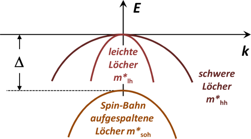

<!--
author:   Hartmut Stöcker
email:    hartmut.stoecker@physik.tu-freiberg.de
version:  0.2
language: de
narrator: Deutsch Female
comment:  Struktur der Materie 2 - Übung 02

@style
.lia-toc__bottom {
    display: none;
}
@end

import: https://raw.githubusercontent.com/liaTemplates/KekuleJS/master/README.md
import: https://github.com/liascript/CodeRunner
import: https://raw.githubusercontent.com/LiaTemplates/Pyodide/master/README.md
-->

# Übung 2

Welche Größen sind jeweils für die Berechnung notwendig?

- [[$m_\mathrm{e}^\mathrm{eff}$] [$m_\mathrm{h}^\mathrm{eff}$] [$E_\mathrm{L}$] [$E_\mathrm{V}$] ]
- [ [X]  [ ]  [X]  [ ]  ]  Elektronenkonzentration $n$
- [ [ ]  [X]  [ ]  [X]  ]  Löcherkonzentration $p$
- [ [X]  [X]  [X]  [X]  ]  Fermi-Niveau $E_\mathrm{F}(T)$ bei Eigenleitung
- [ [X]  [X]  [X]  [X]  ]  Massenwirkungsgesetz $n \cdot p$

## Aufgabe 1 

> Wie ist die effektive Masse von Elektronen bzw. Löchern in Halbleitern definiert?

                                      {{1}}
Die effektive Masse wird als $m^*$ oder $m^\mathrm{eff}$ bezeichnet und ergibt sich aus der inversen Krümmung des Bandes $E(k)$. Die Krümmung wird über die zweite Ableitung berechnet:
$$m^\mathrm{eff} = \hbar^2 \left( \frac{\mathrm{d}^2 E}{\mathrm{d} k^2} \right)^{-1}$$

                                      {{2}}
Für Elektronen wird für $E(k)$ das Leitungsband genutzt, für Löcher das Valenzband.

**a) Gibt es Unterschiede in der effektiven Elektronenmasse von direkten und indirekten Halbleitern?**

                                      {{3}}
**Direkte Halbleiter** (z. B. GaAs, GaN, InP) haben ein Leitungsbandminimum bei $k = 0$. Dort ist die effektive Masse isotrop, d. h. in allen Richtungen gleich:
$$m^\mathrm{eff} = m_x^\mathrm{eff} = m_y^\mathrm{eff} = m_z^\mathrm{eff}$$

                                      {{4}}
An diesem Punkt kann die Energie $E(k)$ durch eine isotrope Parabel mit nur einer Masse $m^\mathrm{eff}$ angenähert werden:
$$E(k) = \frac{\hbar^2 k^2}{2 m^\mathrm{eff}}$$

                                      {{5}}
************************************
**Indirekte Halbleiter** (z. B. Si, Ge, GaP) haben ein Leitungsbandminimum bei $k \neq 0$. Dort ist die effektive Masse richtungsabhängig. Man unterscheidet zwei effektive Massen:

- die longitudinale $m_l^\mathrm{eff}$ (entlang der $k$-Richtung)
- die transversale $m_t^\mathrm{eff}$ (senkrecht zu $k$)
************************************

                                      {{6}}
Die Energieparabel $E(k)$ hängt dann von zwei Massen ab, zum Beispiel:
$$E(k) = \frac{\hbar^2}{2} \left( \frac{k_x^2}{m_t^\mathrm{eff}} + \frac{k_y^2}{m_t^\mathrm{eff}} + \frac{k_z^2}{m_l^\mathrm{eff}} \right)$$

**b) Was sind leichte, schwere und abgespaltene Löcher?**

                                      {{7}}

                                      {{8}}
Das Valenzband entsteht aus einem $p^3$-Orbital, d. h. die Drehimpulsquantenzahl beträgt $l=1$. Die Spin-Bahn-Kopplung $j = l \pm s$ (mit $s = \frac{1}{2}$) verursacht eine Energieaufspaltung um $\Delta$. 

                                      {{9}}
Die energetisch nach unten abgespaltenen Löcher besitzen den Gesamtdrehimpuls $j = l - s = \frac{1}{2}$ und die Masse $m_\mathrm{soh}^*$ (*split-off holes*).

                                      {{10}}
************************************
Die energetisch höher liegenden Löcher besitzen den Gesamtdrehimpuls $j = l + s = \frac{3}{2}$. Dieser Gesamtdrehimpuls ermöglich zwei unterschiedliche magnetische Quantenzahlen $m_j$:

- $m_j = \frac{3}{2}$ => schwere Löcher mit $m_\mathrm{hh}^*$ (*heavy holes*)
- $m_j = \frac{1}{2}$ => leichte Löcher mit $m_\mathrm{lh}^*$ (*light holes*)
************************************

## Aufgabe 2

> Man zeige, dass für das chemische Potential eines intrinsischen Halbleiters gilt:
> $$\mu = \frac{E_\mathrm{g}}{2} + \frac{3}{4} k_\mathrm{B} T \cdot \ln \left( \frac{m_\mathrm{h}^\mathrm{eff}}{m_\mathrm{e}^\mathrm{eff}} \right)$$
> Erklären Sie qualitativ, warum das chemische Potential von den effektiven Massen in dieser Form abhängt.

                                      {{1}}
Bei nicht zu hohen Temperaturen, also z. B. bei Raumtemperatur, sind das chemische Potential und die Fermi-Energie ungefähr gleich: $\mu \approx E_\mathrm{F}$.

                                      {{2}}
Für die Herleitung beginnen wir mit den Formeln für die Elektronenkonzentration $n$ und die Löcherkonzentration $p$:
$$n = 2 \left( \frac{m_\mathrm{e}^\mathrm{eff} k_\mathrm{B} T}{2 \pi \hbar^2} \right)^{3/2} \exp \left( - \frac{E_\mathrm{L} - E_\mathrm{F}}{k_\mathrm{B} T} \right)$$
$$p = 2 \left( \frac{m_\mathrm{h}^\mathrm{eff} k_\mathrm{B} T}{2 \pi \hbar^2} \right)^{3/2} \exp \left( \frac{E_\mathrm{V} - E_\mathrm{F}}{k_\mathrm{B} T} \right)$$

                                      {{3}}
Bei intrinsischen Halbleitern stammen alle Leitungselektronen aus dem Valenzband, so dass $n = p$ gilt:
$$2 \left( \frac{m_\mathrm{e}^\mathrm{eff} k_\mathrm{B} T}{2 \pi \hbar^2} \right)^{3/2} \exp \left( - \frac{E_\mathrm{L} - E_\mathrm{F}}{k_\mathrm{B} T} \right) = 2 \left( \frac{m_\mathrm{h}^\mathrm{eff} k_\mathrm{B} T}{2 \pi \hbar^2} \right)^{3/2} \exp \left( \frac{E_\mathrm{V} - E_\mathrm{F}}{k_\mathrm{B} T} \right)$$

                                      {{4}}
Kürzen und umstellen führt zu:
$$\left( m_\mathrm{e}^\mathrm{eff} \right)^{3/2} \exp \left( - \frac{E_\mathrm{L} - E_\mathrm{F}}{k_\mathrm{B} T} \right) = \left( m_\mathrm{h}^\mathrm{eff} \right)^{3/2} \exp \left( \frac{E_\mathrm{V} - E_\mathrm{F}}{k_\mathrm{B} T} \right)$$
$$\exp \left( \frac{-E_\mathrm{L} + 2 E_\mathrm{F} - E_\mathrm{V}}{k_\mathrm{B} T} \right) = \left( \frac{m_\mathrm{h}^\mathrm{eff}}{m_\mathrm{e}^\mathrm{eff}} \right)^{3/2}$$

                                      {{5}}
Weiter umformen:
$$\frac{-E_\mathrm{L} + 2 E_\mathrm{F} - E_\mathrm{V}}{k_\mathrm{B} T} = \ln \left[ \left( \frac{m_\mathrm{h}^\mathrm{eff}}{m_\mathrm{e}^\mathrm{eff}} \right)^{3/2} \right]$$
$$-E_\mathrm{L} + 2 E_\mathrm{F} - E_\mathrm{V} = \frac{3}{2} k_\mathrm{B} T \cdot \ln \left( \frac{m_\mathrm{h}^\mathrm{eff}}{m_\mathrm{e}^\mathrm{eff}} \right)$$

                                      {{6}}
Daraus folgt der gesuchte Zusammenhang (wobei $E_\mathrm{g} = E_\mathrm{L} + E_\mathrm{V}$):
$$E_\mathrm{F} = \frac{E_\mathrm{L} + E_\mathrm{V}}{2} + \frac{3}{4} k_\mathrm{B} T \cdot \ln \left( \frac{m_\mathrm{h}^\mathrm{eff}}{m_\mathrm{e}^\mathrm{eff}} \right)$$

                                      {{7}}
************************************
Das bedeutet:

- Bei $T = 0~\mathrm{K}$ liegt die Fermi-Energie genau in der Mitte der Bandlücke: $E_\mathrm{F} = \frac{E_\mathrm{g}}{2}$.
- Bei höheren Temperaturen verschiebt sich die Fermi-Energie leicht nach oben oder unten (je nach dem Verhältnis der effektiven Massen).
- Ist $m_\mathrm{h}^\mathrm{eff} > m_\mathrm{e}^\mathrm{eff}$ (z. B. GaAs), steigt die Fermi-Energie mit der Temperatur an.
- Ist $m_\mathrm{h}^\mathrm{eff} < m_\mathrm{e}^\mathrm{eff}$ (z. B. Si), nimmt die Fermi-Energie mit der Temperatur ab.
************************************

                                      {{8}}
************************************
**Beispiel für $m_\mathrm{h}^\mathrm{eff} < m_\mathrm{e}^\mathrm{eff}$:**

*")
************************************

                                      {{9}}
Für $m_\mathrm{h}^\mathrm{eff} < m_\mathrm{e}^\mathrm{eff}$ ist das Valenzband stärker gekrümmt als das Leitungsband. Bei gleicher Ladungsträgerdichte ($n=p$) im intrinsischen Halbleiter muss sich die Fermi-Energie $E_\mathrm{F}$ leicht nach unten verschieben. Dies ist notwendig um die ungleiche Besetzung der Zustände richtig zu beschreiben. Diese Verschiebung steigt mit der Temperatur, da immer mehr Elektronen und Löcher entstehen und damit die Besetzung der Bänder zunimmt.

## Aufgabe 3

> Diskutieren Sie die Abhängigkeit des Fermi-Niveaus von der Temperatur bei Eigen- und bei Störstellenleitung.

                                      {{1}}
************************************
**Eigenleitung:**

- Bei $T = 0~\mathrm{K}$ liegt die Fermi-Energie genau in der Mitte der Bandlücke: $E_\mathrm{F} = \frac{E_\mathrm{g}}{2}$.
- Bei höheren Temperaturen verschiebt sich die Fermi-Energie leicht nach oben oder unten (je nach dem Verhältnis der effektiven Massen).
- Der Zusammenhang lautet (siehe Aufgabe 2):
$$E_\mathrm{F} = \frac{E_\mathrm{g}}{2} + \frac{3}{4} k_\mathrm{B} T \cdot \ln \left( \frac{m_\mathrm{h}^\mathrm{eff}}{m_\mathrm{e}^\mathrm{eff}} \right)$$
************************************

                                      {{2}}
************************************
**Störstellenleitung:**

Dotierte Halbleiter zeigen eine ausgeprägte Temperaturabhängigkeit der Fermi-Energie (bzw. des chemischen Potentials). Daran gekoppelt ändert sich auch die Ladungsträgerkonzentration.
************************************

                                      {{3}}

                                      {{4}}
- Im Bereich I liegt Störstellenkompensation durch eine endliche Akzeptordichte vor. Die Fermi-Energie liegt nahe des Störstellenniveaus: $E_\mathrm{F} \approx E_\mathrm{D}$
- Im Bereich II dominiert reine Störstellenleitung. Die Fermi-Energie liegt etwa mittig zwischen Störstellenniveau und Leitungsband: $E_\mathrm{F} \approx \frac{E_\mathrm{C} + E_\mathrm{D}}{2}$
- Im Bereich III der Störstellenerschöpfung sind sämtliche Störstellen ionisiert, so dass die Ladungsträgerdichte etwa konstant bleibt. Die Fermi-Energie bewegt sich mit steigender Temperatur in Richtung Bandmitte.
- Im Bereich IV tritt die Eigenleitung gegenüber der Störstellenleitung in den Vordergrund. Wie im intrinsischen Halbleiter gilt im dotierten Halbleiter bei sehr hohen Temperaturen: $E_\mathrm{F} \approx \frac{E_\mathrm{g}}{2}$.

## Aufgabe 4

> Zeigen Sie, dass das Produkt aus Majoritäts- und Minoritätsladungsträgerdichte für einen gegebenen Halbleiter und eine vorgegebene Temperatur konstant ist.

                                      {{1}}
Für die Herleitung beginnen wir mit den Formeln für die Elektronenkonzentration $n$ und die Löcherkonzentration $p$:
$$n = N_\mathrm{L} \cdot \exp \left( - \frac{E_\mathrm{L} - E_\mathrm{F}}{k_\mathrm{B} T} \right)$$
$$p = N_\mathrm{V} \cdot \exp \left( \frac{E_\mathrm{V} - E_\mathrm{F}}{k_\mathrm{B} T} \right)$$

                                      {{2}}
Die gesuchte Größe ist das Produkt $n \cdot p$, für das folgt:
$$n \cdot p = N_\mathrm{L} \cdot N_\mathrm{V} \cdot \exp \left( - \frac{E_\mathrm{L} - E_\mathrm{F}}{k_\mathrm{B} T} \right) \cdot \exp \left( \frac{E_\mathrm{V} - E_\mathrm{F}}{k_\mathrm{B} T} \right)$$
$$n \cdot p = N_\mathrm{L} N_\mathrm{V} \cdot \exp \left( - \frac{E_\mathrm{L} - E_\mathrm{F} - E_\mathrm{V} + E_\mathrm{F}}{k_\mathrm{B} T} \right)$$

                                      {{3}}
Da $E_\mathrm{L} - E_\mathrm{V} = E_\mathrm{g}$ gerade die Bandlücke ergibt, erhält man:
$$n \cdot p = N_\mathrm{L} N_\mathrm{V} \cdot \exp \left( - \frac{E_\mathrm{g}}{k_\mathrm{B} T} \right)$$

                                      {{4}}
Schreibt man die effektiven Zustandsdichten $N_\mathrm{L}$ und $N_\mathrm{V}$ aus, erkennt man die vollständige Temperaturabhängigkeit:
$$n \cdot p = 4 \left( \frac{k_\mathrm{B} T}{2 \pi \hbar^2} \right)^3 \left( m_\mathrm{e}^\mathrm{eff} m_\mathrm{h}^\mathrm{eff} \right)^{3/2} \cdot \exp \left( - \frac{E_\mathrm{g}}{k_\mathrm{B} T} \right)$$

                                      {{5}}
Damit ist das Produkt $n \cdot p$ nur von der Temperatur $T$, den effektiven Massen $m_\mathrm{e}^\mathrm{eff}$ und $m_\mathrm{h}^\mathrm{eff}$ sowie der Bandlücke $E_\mathrm{g}$ des betrachteten Halbleiters abhängig. Dieser Zusammenhang gilt für intrinsische und dotierte Halbleiter (aber nicht für entartete Halbleiter) und wird als **Massenwirkungsgesetz** bezeichnet.

                                      {{6}}
Für einen intrinsischen Halbleiter ist $n_i = p_i$ und es gilt:
$$n \cdot p = n_i \cdot p_i = n_i^2 = N_\mathrm{L} N_\mathrm{V} \cdot \exp \left( - \frac{E_\mathrm{g}}{k_\mathrm{B} T} \right)$$

                                      {{7}}
Daraus folgt:
$$n_i = p_i = \sqrt{N_\mathrm{L} N_\mathrm{V}} \cdot \exp \left( - \frac{E_\mathrm{g}}{2 k_\mathrm{B} T} \right)$$

## Aufgabe 5 

> Die Temperatur eigenleitenden Siliziums wird von -20 °C auf 200 °C erhöht. Wie ändert sich die Elektronenkonzentration (Quotient beider Konzentrationen)?

                                      {{1}}
Gemäß Aufgabe 4 gilt:
$$n_i = \sqrt{N_\mathrm{L} N_\mathrm{V}} \cdot \exp \left( - \frac{E_\mathrm{g}}{2 k_\mathrm{B} T} \right) = 2 \left( \frac{k_\mathrm{B} T}{2 \pi \hbar^2} \right)^{3/2} \left( m_\mathrm{e}^\mathrm{eff} m_\mathrm{h}^\mathrm{eff} \right)^{3/4} \cdot \exp \left( - \frac{E_\mathrm{g}}{2 k_\mathrm{B} T} \right)$$

                                      {{2}}
Zu vergleichen sind die Temperaturen $T_1 = 253~\mathrm{K}$ und $T_2 = 473~\mathrm{K}$. Bildet man das Verhältnis der zwei Elektronenkonzentrationen bei diesen Temperaturen, erhält man:
$$\frac{n_2}{n_1} = \left( \frac{T_2}{T_1} \right)^{3/2} \cdot \frac{\exp \left( - \frac{E_\mathrm{g}}{2 k_\mathrm{B} T_2} \right)}{\exp \left( - \frac{E_\mathrm{g}}{2 k_\mathrm{B} T_1} \right)} = \left( \frac{T_2}{T_1} \right)^{3/2} \cdot \exp \left[ - \frac{E_\mathrm{g}}{2 k_\mathrm{B}} \left( \frac{1}{T_2} - \frac{1}{T_1} \right) \right]$$

                                      {{3}}
Wir nehmen an, dass die Bandlückenenergie ungefähr konstant bleibt. (Eigentlich gibt es eine leichte Temperaturabhängigkeit.) Der Wert für Silizium bei Raumtemperatur ist $E_\mathrm{g} = 1,\!12~\mathrm{eV}$. Damit ergibt sich:
$$\frac{n_2}{n_1} = 3,\!95 \cdot 10^5$$

                                      {{4}}
Die Elektronenkonzentration nimmt also zwischen -20 °C und 200 °C um mehr als fünf Größenordnungen zu.

## Aufgabe 6 

> Ein Halbleiter hat eine Donator-Konzentration von $n_\mathrm{D} = 3,\!5 \cdot 10^{16}~\mathrm{cm^{-3}}$ und eine Akzeptor-Konzentration von $n_\mathrm{A} = 1,\!0 \cdot 10^{16}~\mathrm{cm^{-3}}$. Man berechne die Konzentration der Elektronen und Löcher ($n_i = 5,\!0 \cdot 10^{9}~\mathrm{cm^{-3}}$).

                                      {{1}}
Für den gegebenen Halbleiter überwiegt die Donator-Konzentration und wir betrachten zunächst die Elektronen.

                                      {{2}}
Bei Raumtemperatur sind in der Regel alle Donatoren ionisiert, d. h. die Elektronen der Donatoren wurden bereits komplett thermisch angeregt.

                                      {{3}}
Der größte Teil dieser Elektronen befindet sich nun im Leitungsband und bildet die frei beweglichen Elektronen.

                                      {{4}}
Der zweite Teil der über die Donatoren eingebrachten Elektronen besetzt aber die zusätzlich vorhandenen Akzeptor-Zustände. Für die Elektronenkonzentration folgt daraus:
$$n = n_\mathrm{D} - n_\mathrm{A} = 2,\!5 \cdot 10^{16}~\mathrm{cm^{-3}}$$

                                      {{5}}
Die Löcherkonzentration lässt sich aus dem Massenwirkungsgesetz bestimmen:
$$p = \frac{n_i^2}{n} = 1,\!0 \cdot 10^{3}~\mathrm{cm^{-3}}$$

                                      {{6}}
Demzufolge ist die Löcherkonzentration $p$ um 13 Größenordnungen geringer als die Elektronenkonzentration $n$.
