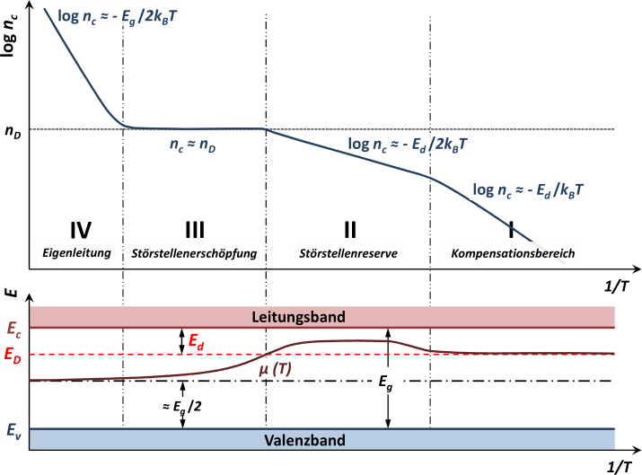

<!--
author:   Hartmut Stöcker
email:    hartmut.stoecker@physik.tu-freiberg.de
version:  0.1
language: de
narrator: Deutsch Female
comment:  Struktur der Materie 2 - Übung 03

@style
.lia-toc__bottom {
    display: none;
}
@end

import: https://raw.githubusercontent.com/liaTemplates/KekuleJS/master/README.md
import: https://github.com/liascript/CodeRunner
import: https://raw.githubusercontent.com/LiaTemplates/Pyodide/master/README.md
-->

# Übung 3

## Aufgabe 1 

> Für Indiumantimonid ist die Bandlücke $E_\mathrm{g} = 0,\!23~\mathrm{eV}$, die Dielektrizitätskonstante $\varepsilon_r = 18$, die effektive Masse der Elektronen $m_\mathrm{e}^\mathrm{eff} = 0,\!015\,m_0$. Berechnen Sie:
>
> a) die Ionisierungsenergie der Donatoren!
>
> b) den Bahnradius für den Grundzustand!
>
> c) Ab welcher Donatorkonzentration treten deutliche Überlappungseffekte zwischen den Bahnen benachbarter Fremdatome auf? Diese Überlappung kann ein Störstellenband erzeugen. Dies ist ein Energieband, das die elektrische Leitung durch den Sprung-mechanismus (*Hopping*) ermöglicht, bei dem Elektronen von einem Fremdatom auf ein benachbartes, ionisiertes Fremdatom springen.

                                      {{1}}
**a)** Aus dem Wasserstoffmodell eines Dotieratoms erhält man:
$$E_n = -\frac{1}{2} \frac{m^\mathrm{eff} e^4}{(4 \pi \varepsilon_0 \varepsilon_r \hbar)^2} \frac{1}{n^2}$$

                                      {{2}}
Für die Hauptquantenzahl wird $n=1$ eingesetzt. Mit den gegebenen Werten erhält man:
$$E_1 = E_\mathrm{d} = -0,\!63~\mathrm{meV}$$

                                      {{3}}
**b)** Das Wasserstoffmodell ergibt weiterhin einen skalierten Bohrradius:
$$a_\mathrm{d} = \frac{4 \pi \varepsilon_0 \varepsilon_r \hbar^2}{m^\mathrm{eff} e^2}$$

                                      {{4}}
Mit den gegebenen Werten erhält man:
$$a_\mathrm{d} = 63,\!5~\mathrm{nm}$$

                                      {{5}}
**c)** Nimmt man kugelförmige Orbitale der Elektronen um die Donatoren an, erhält man die maximal mögliche Konzentration aus:
$$n_\mathrm{d} = \frac{1}{V} = \frac{1}{\frac{4}{3} \pi a_\mathrm{d}^3}$$

                                      {{6}}
Mit dem vorherigen Ergebnis erhält man:
$$n_\mathrm{d} = 9,\!3 \cdot 10^{14}~\mathrm{cm^{-3}}$$

## Aufgabe 2 

> Wie lassen sich durch Messung der Temperaturabhängigkeit des Hall-Koeffizienten die Energielücke $E_\mathrm{g}$ eines Halbleiters sowie bei einem n-Typ-Halbleiter der Abstand $E_\mathrm{d}$ des Donatorniveaus von der Leitungsbandkante bzw. bei einem p-Typ-Halbleiter der Abstand $E_\mathrm{a}$ des Akzeptorniveaus von der Valenzbandkante bestimmen?

                                      {{1}}
Wenn die elektrische Leitfähigkeit nur von einer Ladungsträgerart bestimmt wird, also z. B. von Elektronen in einem n-dotierten Halbleiter, so kann der Hall-Koeffizient $R_\mathrm{H}$ aus der Ladungsträgerdichte $n$ und der Ladung $q$ berechnet werden:
$$R_\mathrm{H} = \frac{1}{q n}$$

                                      {{2}}
Für einen n-Typ-Halbleiter ist $q=-e$; für einen p-Typ-Halbleiter gilt $q = +e$. Aus der Messung des Hall-Koeffizienten $R_\mathrm{H}$ folgt also direkt die Ladungsträgerdichte $n$ gemäß:
$$n = \frac{1}{q R_\mathrm{H}}$$

                                      {{3}}
Aus einer temperaturabhängigen Messung von $R_\mathrm{H}$ erhält man also den Temperaturverlauf von $n$. Dieser ist schematisch in der nachfolgenden Abbildung gezeigt:

                                      {{4}}
**Bei hohen Temperaturen** steigt $\ln n$ mit $-E_\mathrm{g} / (2 k_\mathrm{B} T)$ an. Aus dem Anstieg kann also direkt die Bandlücke $E_\mathrm{g}$ berechnet werden.

                                      {{5}}
**Bei niedrigen Temperaturen** (ohne Kompensation) steigt $\ln n$ mit $-E_\mathrm{d} / (2 k_\mathrm{B} T)$ an. Aus dem Anstieg kann bei einem n-Typ-Halbleiter also direkt das Donatorniveau $E_\mathrm{d}$ berechnet werden.

                                      {{6}}
**Für p-Typ-Halbleiter** steigt bei niedrigen Temperaturen (ohne Kompensation) die Ladungsträgerdichte $\ln n$ mit $-E_\mathrm{a} / (2 k_\mathrm{B} T)$ an. Aus dem Anstieg kann hier das Akzeptorniveau $E_\mathrm{a}$ berechnet werden.

## Aufgabe 3

> Lässt sich durch Messung des Hall-Effekts die Dichte $n_\mathrm{D}$ der Donatoren in einem n-Typ-Halbleiter bzw. die Dichte $n_\mathrm{A}$ der Akzeptoren in einem p-Typ-Halbleiter bestimmen? Wenn ja, in welchem Temperaturbereich muss die Messung stattfinden?

                                      {{1}}
Aus einer temperaturabhängigen Messung des Hall-Koeffizienten $R_\mathrm{H}$ erhält man den Temperaturverlauf der Ladungsträgerdichte $n$ (siehe auch Aufgabe 6). Dieser ist schematisch in der nachfolgenden Abbildung gezeigt:

                                      {{2}}
Um die Dichte $n_\mathrm{D}$ der Donatoren in einem n-Typ-Halbleiter zu bestimmen, muss also die Ladungsträgerdichte $n$ im Bereich mittlerer Temperaturen (Störstellenerschöpfung) gemessen werden. In diesem Bereich gilt $n \approx n_\mathrm{D}$.

                                      {{3}}
Um die Dichte $n_\mathrm{A}$ der Akzeptoren in einem p-Typ-Halbleiter zu bestimmen, wird analog die Ladungsträgerdichte $n$ im Bereich mittlerer Temperaturen (Störstellenerschöpfung) gemessen. In diesem Bereich gilt $n \approx n_\mathrm{A}$.
