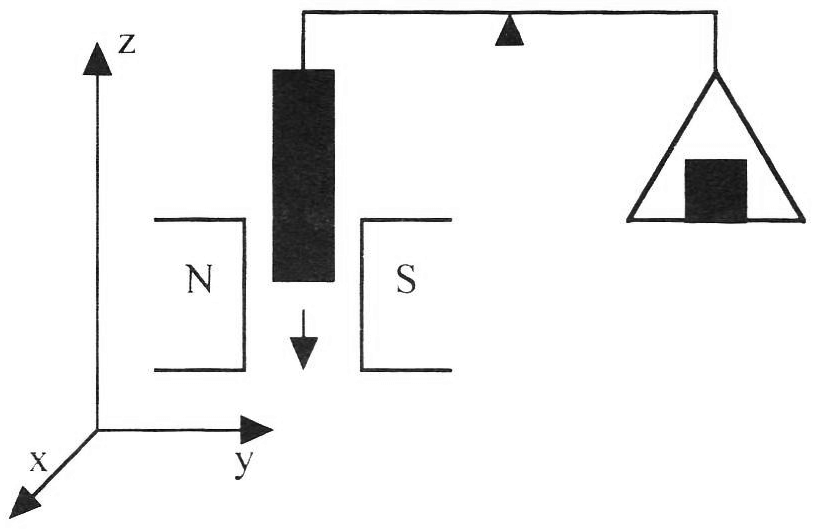

<!--
author:   Hartmut Stöcker
email:    hartmut.stoecker@physik.tu-freiberg.de
version:  0.0.1
language: de
narrator: Deutsch Female
comment:  Struktur der Materie 2 - Übung 04

@style
.lia-toc__bottom {
    display: none;
}
@end

import: https://raw.githubusercontent.com/liaTemplates/KekuleJS/master/README.md
import: https://github.com/liascript/CodeRunner
import: https://raw.githubusercontent.com/LiaTemplates/Pyodide/master/README.md
-->

# Übung 4

## Aufgabe 1

> Die magnetische Suszeptibilität eines kristallinen Materials kann bestimmt werden, indem eine zylindrische Probe an einem Balkenende der Gouy’schen Waage aufgehängt wird, die sich vor dem Versuchsbeginn im Gleichgewicht befindet. Das untere Ende der Probe wird in ein Magnetfeld gebracht. Um die Waage wieder ins Gleichgewicht zu bringen, muss ein Ausgleichsgewicht am anderen Balkenende aufgelegt werden.
>
>  <!-- style = "width: 350px;" -->
>
> Berechnen Sie für eine zylindrische Probe mit dem Durchmesser $d = 2r = 5~\mathrm{mm}$, die in ein Magnetfeld der Stärke $H = 10^4~\mathrm{Oe}$ gebracht und mit einem Gegengewicht von $0,\!5~\mathrm{g}$ ausgeglichen wird, die magnetische Suszeptibilität. Um welche Form des Magnetismus handelt es sich?

                                      {{1}}
Die magnetische Energiedichte (auch als magnetischer Druck bezeichnet) berechnet sich aus:
$$w = \frac{1}{2} B H = \frac{1}{2 \mu_0 \mu_r} B^2 = \frac{\mu_0 \mu_r}{2} H^2$$

                                      {{2}}
Dieses Integral über das ganze Volumen wird in Kugelkoordinaten $(r, \vartheta, \varphi)$ ausgeführt. Da die Wellenfunktion $\Psi$ nur vom Radius $r$ abhängt, kann über die zwei Winkel $\vartheta$ und $\varphi$ leicht abintegriert werden. Neben der Anpassung der Integrationsgrenzen muss wegen der Koordinatentransformation $\mathrm{d} \vec{r} = r^2 \sin \vartheta \, \mathrm{d} \vartheta \, \mathrm{d} \varphi \, \mathrm{d} r$ beachtet werden:
$$\langle r^2 \rangle = \int_{0}^{+\infty} \int_{0}^{2 \pi} \int_{0}^{\pi} \Psi^* r^2 \Psi \, r^2 \sin \vartheta \, \mathrm{d} \vartheta \, \mathrm{d} \varphi \, \mathrm{d} r$$

                                      {{3}}
Mit $\int_{0}^{\pi} \sin \vartheta \, \mathrm{d} \vartheta = 2$ und $\int_{0}^{2 \pi} \mathrm{d} \varphi = 2 \pi$ erhält man:
$$\langle r^2 \rangle = \int_{0}^{\infty} \Psi^* r^2 \Psi \, 4 \pi r^2 \, \mathrm{d} r$$

                                      {{4}}
Da die gegebene Wellenfunktion $\Psi$ rein reell ist, gilt $\Psi^* = \Psi$ und Einsetzen ergibt:
$$\langle r^2 \rangle = 4 \pi \int_{0}^{\infty} \Psi^2 \, r^4 \, \mathrm{d} r = \frac{4 \pi}{\pi a_0^3} \, \int_{0}^{\infty} r^4 \, \exp \left( -\frac{2r}{a_0} \right) \, \mathrm{d} r$$

                                      {{5}}
Dieses bestimmte Integral kann mit Hilfe der allgemeinen Lösung $\int_{0}^{\infty} x^n \, \mathrm{e}^{-ax} \, \mathrm{d} x = \frac{n!}{a^{n+1}}$ berechnet werden. Im vorliegenden Fall ist $n = 4$ und $a = \frac{2}{a_0}$. Damit folgt:
$$\langle r^2 \rangle = \frac{4}{a_0^3} \cdot \frac{24}{(2/a_0)^5} = \frac{4}{a_0^3} \cdot \frac{24 \, a_0^5}{32} = 3 a_0^2$$

                                      {{6}}
Die diamagnetische Volumensuszeptibilität nach Langevin wird mit folgender Formel berechnet (in SI-Einheiten):
$$\chi_V = - \frac{\mu_0 e^2 n}{6 m_\mathrm{e}} \langle r^2 \rangle$$

                                      {{7}}
Dabei ist $n$ die Teilchendichte pro Volumen, für die $n = \frac{\varrho \cdot N_\mathrm{A}}{M}$ gilt (siehe Übung 2, Aufgabe 3). Für die molare Suszeptibilität folgt:
$$\chi_{mol} = \frac{M}{\varrho} \chi_V = - \frac{M}{\varrho} \cdot \frac{\mu_0 e^2 n}{6 m_\mathrm{e}} \langle r^2 \rangle = - \frac{\mu_0 e^2 N_\mathrm{A}}{6 m_\mathrm{e}} \langle r^2 \rangle$$

                                      {{8}}
Einsetzen des Ergebnisses für $\langle r^2 \rangle$ ergibt die molare diamagnetische Suszeptibilität von atomarem Wasserstoff (in SI-Einheiten):
$$\chi_{mol} = - \frac{\mu_0 e^2 N_\mathrm{A}}{6 m_\mathrm{e}} \cdot 3 a_0^2 = - \frac{\mu_0 e^2 N_\mathrm{A}}{2 m_\mathrm{e}} \cdot a_0^2 = -2,\!98 \cdot 10^{-11}~\mathrm{m^3/mol}$$

                                      {{9}}
Der Übergang in CGS-Einheiten erfordert die Division durch $4\pi$, d. h. $\chi_\mathrm{SI} = 4 \pi \cdot \chi_\mathrm{CGS}$. Die Einheiten $\mathrm{cm^3/mol}$ und $\mathrm{emu/mol}$ sind im CGS-System gleichbedeutend:
$$\chi_{mol} = -2,\!36 \cdot 10^{-12}~\mathrm{m^3/mol} = -2,\!36 \cdot 10^{-6}~\mathrm{cm^3/mol} = -2,\!36 \cdot 10^{-6}~\mathrm{emu/mol}$$

## Aufgabe 2 

> Skizzieren Sie mit Hilfe eines symbolischen Kästchenschemas die Besetzung der $\mathrm{4f}$-Orbitale im Grundzustand der Ionen Eu^2+^, Yb^3+^ und Tb^3+^. Wie lauten die entsprechenden Termbezeichnungen des Grundzustands in spektroskopischer Notation?

                                      {{1}}
Hundsche Regeln

                                      {{2}}
Der Elektronenspin bleibt unberücksichtigt. Wir berechnen nur das durch den Bahndrehimpuls $L$ verursachte magnetische Moment $\mu$, das man präziser auch Bahnmoment nennen kann. Es ist allgemein durch $\mu = IA$ gegeben, worin $I$ die elektrische Stromstärke und $A$ die vom Strom eingeschlossene Fläche ist. 

                                      {{3}}
Die von der Bahn umschlossene Fläche ist $A = \pi r^2$. Der Bahnumfang ist $u = 2 \pi r$. Daraus können wir auch den Strom berechnen:
$$I = \frac {q}{t} = \frac{-e}{u/v} = \frac{-e}{(2\pi r)/v} = \frac{-e v}{2\pi r}$$

                                      {{4}}
Damit folgt:
$$\mu = IA = \frac{-e v}{2} r$$

                                      {{5}}
Einsetzen von $\frac {L}{m_e} = r v$ ergibt das gesuchte magnetische Bahnmoment:
$$\mu = \frac{-e}{2 m_e} L$$

                                      {{6}}
Wenn man für den Bahndrehimpuls den festen Wert $L = 1 \hbar$ einsetzt, erhält man das sogenannte **Bohrsche Magneton** (in SI-Einheiten):
$$\mu_\mathrm{B} = \frac{e \hbar}{2 m_\mathrm{e}} = 9,\!274\cdot 10^{−24}~\mathrm{J/T} = 9,\!274\cdot 10^{−24}~\mathrm{A\,m^2}$$

                                      {{7}}
Für den Übergang in CGS-Einheiten benutzen wir den Zusammenhang $1~\mathrm{A\,m^2} = 10^3~\mathrm{emu}$. Das Bohrsche Magneton hat im CGS-System also den Wert:
$$\mu_\mathrm{B} = 9,\!274\cdot 10^{−21}~\mathrm{emu}$$

## Aufgabe 3

> Berechnen Sie den Landé-Faktor $g$ und das effektive magnetische Moment der $\mathrm{4f}$-Ionen La^3+^, Pr^3+^ und Tb^3+^. Vergleichen Sie die Ergebnisse mit den experimentell ermittelten Werten.  Weshalb liefern abgeschlossene Schalen eines Atoms keinen Beitrag zum Langevin- Paramagnetismus?

                                      {{1}}
Ein magnetischer Dipol $\vec{\mu}_1$ erzeugt in seiner Umgebung die magnetische Feldstärke (siehe Aufgabe 4):
$$\vec{B}_1(\vec{r}) = \frac{\mu_0}{4\pi} \cdot \frac{3(\vec{\mu}_1 \vec{r})\vec{r} - r^2\vec{\mu}_1}{r^5}$$

                                      {{2}}
Der Betrag des Magnetfeldes $\vec{B}_1$ wird maximal, wenn $\vec{\mu}_1$ und $\vec{r}$ parallel ausgerichtet sind. Die Bedingung $\vec{\mu}_1 || \vec{r}$ bedeutet, dass das Magnetfeld auf einer Achse entlang des Vektors $\vec{\mu}_1$ betrachtet wird. Unter dieser Bedingung ist $(\vec{\mu}_1 \vec{r})\vec{r} = \vec{\mu}_1 r^2$ und die Formel für das Magnetfeld vereinfacht sich zu:
$$\vec{B}_1(\vec{r}) = \frac{\mu_0}{4\pi} \cdot \frac{3\vec{\mu}_1 r^2 - r^2\vec{\mu}_1}{r^5} = \frac{\mu_0}{4\pi} \cdot \frac{2\vec{\mu}_1 r^2}{r^5} = \frac{\mu_0}{2\pi} \cdot \frac{\vec{\mu}_1}{r^3}$$

                                      {{3}}
Befindet sich in diesem Magnetfeld $\vec{B}_1$ im Abstand $r_0$ ein zweiter Dipol $\vec{\mu}_2$, so besitzt er die potentielle Energie:
$$E_2 = - \vec{\mu}_2 \cdot \vec{B}_1 (r_0) = - \frac{\mu_0}{2\pi} \cdot \frac{\vec{\mu}_1 \vec{\mu}_2}{r_0^3}$$

                                      {{4}}
Gemäß Aufgabenstellung besitzen die beiden magnetischen Momente den Betrag $\mu_1 = \mu_2 = \mu_\mathrm{B} = 9,\!274\cdot 10^{−24}~\mathrm{A\,m^2}$ und den Abstand $r_0 = 3~\mathrm{Å} = 3 \cdot 10^{-10}~\mathrm{m}$. Damit ergibt sich der Betrag der potentiellen Energie zu:
$$|E_2| = 6,\!36 \cdot 10^{-25}~\mathrm{J} \approx 4~\mathrm{µeV}$$

                                      {{5}}
Durch thermische Anregung kann diese geringe Energiemenge leicht bereitgestellt werden, sodass die magnetische Dipolwechselwirkung gestört bzw. zerstört wird. Erst bei sehr niedrigen Temperaturen kann sie beobachtet werden. Da die thermische Energie $E_\mathrm{therm} = k_\mathrm{B} T$ ist, erhält man die Grenztemperatur aus:
$$T = \frac{|E_2|}{k_\mathrm{B}} = 0,\!064~\mathrm{K} < 100~\mathrm{mK}$$

## Aufgabe 4 

> Betrachten Sie als einfachsten Fall ein Zweiniveausystem, das wegen $J=½$ nur die zwei Energieniveaus $E = \pm ½ g μ_\mathrm{B} B_0$ annehmen kann. Berechnen Sie das mittlere magnetische Moment, welches sich in diesem Fall bei Anlegen eines magnetischen Feldes $B_0$ ergibt. Diskutieren Sie den Einfluss von Temperatur und Magnetfeld.

                                      {{1}}
************************************
Zunächst soll der Abstand der nächsten Nachbarn $r_0$ berechnet werden. Dieser hängt vom Strukturtyp und vom Gitterparameter ab:

 und Skizze der sich berührenden Atome entlang der Raumdiagonale. *Quelle: A. Armbrust, H. Janetzki, Aufgaben zur Festkörperphysik, 1999*")
 und Skizze der sich berührenden Atome. *Quelle: A. Armbrust, H. Janetzki, Aufgaben zur Festkörperphysik, 1999*")
 und Skizze der sich berührenden Atome entlang der Flächendiagonale. *Quelle: A. Armbrust, H. Janetzki, Aufgaben zur Festkörperphysik, 1999*")
************************************

                                      {{2}}
************************************
Gemäß der Abbildungen kann $r_0$ folgendermaßen berechnet werden:

| Material | Struktur | Formel für $r_0$     | Ergebnis             |
| -------- | -------- | -------------------- | -------------------- |
| Fe       | bcc      | $a/2 \cdot \sqrt{3}$ | $2,\!482~\mathrm{Å}$ |
| Co       | hcp      | $a$                  | $2,\!507~\mathrm{Å}$ |
| Ni       | fcc      | $a/2 \cdot \sqrt{2}$ | $2,\!492~\mathrm{Å}$ |
************************************

                                      {{3}}
Man erhält also, dass der Nächste-Nachbar-Abstand für alle drei betrachteten Materialien etwa $r_0 \approx 2,\!5~\mathrm{Å}$ beträgt. Die nachfolgende Rechnung wird also für alle drei Materialien das gleiche Ergebnis erbringen.

                                      {{4}}
Wie in Aufgabe 3 wird der Betrag des Magnetfeldes $\vec{B}$ maximal, wenn $\vec{\mu}$ und $\vec{r}$ parallel ausgerichtet sind. Unter dieser Bedingung vereinfacht sich die Formel für das Magnetfeld zu:
$$\vec{B}(\vec{r}) = \frac{\mu_0}{2\pi} \cdot \frac{\vec{\mu}}{r^3}$$

                                      {{5}}
Einsetzen der Werte $\mu \cong \mu_\mathrm{B} = 9,\!274\cdot 10^{−24}~\mathrm{A\,m^2}$ und $r_0 \approx 2,\!5~\mathrm{Å}$ ergibt:
$$B = 0,\!118~\mathrm{\frac{Vs}{Am}} \approx 0,\!12~\mathrm{T}$$

                                      {{6}}
Die maximale Energie der Dipol-Dipol-Wechselwirkung beträgt damit:
$$| E_\mathrm{mag} | = \vec{\mu} \cdot \vec{B} (r_0) = 1,\!1 \cdot 10^{-24}~\mathrm{J} \approx 6,\!9~\mathrm{µeV}$$

                                      {{7}}
Eine entsprechend große thermische Energie $E_\mathrm{therm} = k_\mathrm{B} T$ erhält man bereits bei:
$$T = \frac{|E_\mathrm{mag}|}{k_\mathrm{B}} = 80~\mathrm{mK}$$

                                      {{8}}
Für $T = T_\mathrm{C} = 1000~\mathrm{K}$ liegt die thermische Energie sogar bei $E_\mathrm{therm} = k_\mathrm{B} T_\mathrm{C} = 86~\mathrm{meV}$. Für $|E_\mathrm{mag}| = E_\mathrm{therm}$ müsste $B \approx 1500~\mathrm{T}$ sein. Die klassische Dipol-Dipol-Wechselwirkung kann also nicht beobachtet werden!