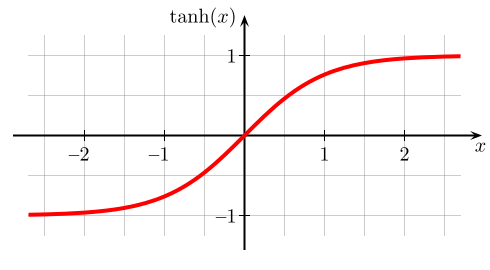

<!--
author:   Hartmut Stöcker
email:    hartmut.stoecker@physik.tu-freiberg.de
version:  0.0.1
language: de
narrator: Deutsch Female
comment:  Struktur der Materie 2 - Übung 05

@style
.lia-toc__bottom {
    display: none;
}
@end

import: https://raw.githubusercontent.com/liaTemplates/KekuleJS/master/README.md
import: https://github.com/liascript/CodeRunner
import: https://raw.githubusercontent.com/LiaTemplates/Pyodide/master/README.md
-->

# Übung 5

## Aufgabe 1

> Wir betrachten ein freies Elektronengas mit einer Dichte von $n=2,\!54 \cdot 10^{22}~\mathrm{cm}^{-3}$ (Natrium) und einem Volumen von $V = L_x L_y L_z = 1\cdot1\cdot1~\mathrm{cm}^3$.
>
> a) Berechnen Sie aus der Anzahl $N$ der Elektronen die Anzahl $Z_\mathrm{F}$ der im $k$-Raum besetzten Zustände, den Radius der Fermi-Kugel und die Anzahl $Z_0$ der in der Ebene $k_z=0$ von Elektronen besetzten Zustände.
>
> b) Wir legen nun ein Magnetfeld $B=1~\mathrm{T}$ in die $z$-Richtung an. Berechnen Sie die Anzahl der Kreise konstanter Energie $E(n, k_z=0)$, die sich innerhalb der ursprünglichen Grenzen der Fermi-Kugel befinden.
>
> c) Bestimmen Sie die Flussdichte $B_0$, bei welcher der innerste Landau-Zylinder $n=0$ die ursprüngliche Fermi-Kugel verlässt. Vergleichen Sie den Wert von $B_0$ mit technisch realisierbaren Magnetfeldern.

                                      {{1}}
**a)** Dichte der Zustände im $k$-Raum: $z(k) = V/(2 \pi)^3$

                                      {{2}}
Zahl der Elektronen: $N = n \cdot V = 2,\!54 \cdot 10^{22}$

                                      {{3}}
Zahl der besetzten Zustände in der Fermi-Kugel (jeweils 2 Spinzustände): $Z_\mathrm{F} = N/2 = 1,\!27 \cdot 10^{22}$

                                      {{4}}
Die Zahl der Zustände in der Fermi-Kugel ergibt sich aber auch aus der Zustandsdichte im $k$-Raum multipliziert mit dem Volumen der Fermi-Kugel mit dem Radius $k_\mathrm{F}$:
$$Z_\mathrm{F} = z(k) \cdot \frac{4}{3} \pi k_\mathrm{F}^3 = \frac{V}{(2 \pi)^3} \cdot \frac{4}{3} \pi k_\mathrm{F}^3 = \frac{V}{6 \pi^2} \cdot k_\mathrm{F}^3 = \frac{N}{2} = \frac{n V}{2}$$

                                      {{5}}
Für die Fermi-Wellenzahl folgt: $k_\mathrm{F} = (3 \pi^2 n)^{1/3} = 9,\!1 \cdot 10^7~\mathrm{cm^{-1}}$

                                      {{6}}
$Z_0$ ist die Anzahl der Zustände in der Ebene $k_z=0$, d. h. in einem dünnen Kreiszylinder mit der Dicke $2 \pi/L_z$:
$$Z_0 = z(k) \cdot \pi k_\mathrm{F}^2 \cdot \frac{2 \pi}{L_z} = \frac{V}{(2 \pi)^3} \cdot \pi k_\mathrm{F}^2 \cdot \frac{2 \pi}{L_z} = \frac{L_x L_y}{4 \pi} \cdot k_\mathrm{F}^2 = 6,\!58 \cdot 10^{14}$$

                                      {{7}}
**b)** Während nach den Gesetzen der klassischen Physik ein Teilchen jede beliebige transversale Energie annehmen kann, ist dies in der Quantenmechanik nicht möglich, sondern die Energie ist quantisiert, das heißt, die transversale Energie kann nur diskrete, durch eine natürliche Zahl $n$ charakterisierte Werte annehmen. Die Landau-Niveaus (nach Lew Dawidowitsch Landau) sind in der Quantenmechanik die Niveaus der transversalen Energie eines geladenen Teilchens, das sich in einem homogenen Magnetfeld $B$ bewegt. Diese Aufspaltung in Landau-Niveaus lässt sich zum Beispiel durch den De-Haas-van-Alphen-Effekt messen. In Bezug auf die longitudinale Bewegung in Richtung des Magnetfeldes $B$ ist die Energie auch nach der quantenmechanischen Behandlung nicht quantisiert und identisch zur klassischen Herangehensweise. 

                                      {{8}}
Im zweidimensionalen, transversalen Impulsraum bilden die Landau-Niveaus Kreise; im dreidimensionalen Impulsraum die Landau-Zylinder. Sie besitzen folgende Energiewerte:
$$E_n = \hbar \omega_c \left(n + \frac{1}{2} \right)$$

                                      {{9}}
Dabei ist $\omega_c = \frac{eB}{m_e}$ die Zyklotronfrequenz, also die Winkelgeschwindigkeit beim Umlauf des Elektrons im Magnetfeld.

                                      {{10}}
In einem Festkörper sind die transversalen Impulse $k_\perp$ zusätzlich aufgrund des Kristallgitters gequantelt:
$$E_n = \frac{\hbar^2 k_\perp^2}{2 m_e}$$

                                      {{11}}
Der maximal mögliche transversale Impuls innerhalb der Fermi-Kugel ist durch die Fermi-Wellenzahl $k_\mathrm{F}$ gegeben. Gleichsetzen der Energie-Formeln und Umstellen nach $n$ ergibt die Anzahl der Kreise:
$$n = \frac{\hbar k_\mathrm{F}^2}{2 e B} - \frac{1}{2} = 27196$$

                                      {{12}}
**c)** Damit bereits bei $n=0$ der transversale Impuls $k_\perp$ die Fermi-Kugel berührt, muss das Magnetfeld deutlich größer als zuvor sein. Den erforderlichen Wert für $B$ erhält man durch Einsetzen von $n=0$ in die letzte Formel:
$$0 = \frac{\hbar k_\mathrm{F}^2}{2 e B} - \frac{1}{2} \ \Rightarrow \ B = \frac{\hbar k_\mathrm{F}^2}{e} = 54400~\mathrm{T}$$

                                      {{13}}
***********************************
Zum Vergleich:

| Quelle des Magnetfeldes      | Magnetfeld                      |
|---------------|---------------------------------|
| Erdmagnetfeld | $30...60~\mathrm{µ T}$          |
| Kühlschrankmagnet | $1...10~\mathrm{m T}$          |
| Lautsprechermagnet | $1...2~\mathrm{T}$          |
| NMR-Gerät in der Medizin | $2...12~\mathrm{T}$          |
| Supraleitende Magnete in Messgeräten | $7...32~\mathrm{T}$          |
| Rekord für kontinuierliches Magnetfeld | $45,\!5~\mathrm{T}$          |
| Rekord für gepulstes Magnetfeld | $2800~\mathrm{T}$          |
************************************

## Aufgabe 2 

> Beschreiben Sie quantitativ den paramagnetischen Anteil der magnetischen Suszeptibilität eines freien Elektronengases in einem Metall. Wie groß ist dieser Anteil an der gesamten magnetischen Suszeptibilität?

                                      {{1}}
**Einfache Überlegung:** Zur Suszeptibilität tragen nicht alle Elektronen bei, sondern nur der Anteil in der Nähe der Fermie-Energie, der mit $T/T_\mathrm{F}$ abgeschätzt wird ($k_\mathrm{B} T_\mathrm{F} = E_\mathrm{F}$). Wir nutzen das Ergebnis von Übung 4, Aufgabe 4 und multiplizieren mit $T/T_\mathrm{F}$:
$$\chi = \mu_0 \frac{M}{B_0} \approx \frac{\mu_0 n \mu_\mathrm{eff}^2}{k_\mathrm{B} T} \cdot \frac{T}{T_\mathrm{F}}$$

                                      {{2}}
Für Elektronen mit $L = 0$ und $S = ½$ ist $\mu_\mathrm{eff} = ½ g_S \mu_\mathrm{B} \cong \mu_\mathrm{B}$, da $g_S \cong 2$. Damit erhalten wir:
$$\chi \approx \frac{n \mu_0 \mu_\mathrm{B}^2}{k_\mathrm{B} T_\mathrm{F}} = \frac{n \mu_0 \mu_\mathrm{B}^2}{E_\mathrm{F}}$$

                                      {{3}}
** Genauere Betrachtung:** Das äußere Magnetfeld bewirkt, dass sich die Zustandsdichtefunktionen der Elektronen mit Spin parallel bzw. antiparallel zum Magnetfeld um jeweils den Betrag $\mu_\mathrm{B}B$ gegenüber ihrer ursprünglichen Lage verschieben.

N+ = ½-µBEFfEDE+µBdE ≈ ½0EFfEDEdE+ ½µBD(EF)  
N- = ½+µBEFfEDE-µBdE ≈ ½0EFfEDEdE- ½µBD(EF)  
M = µB (N+ -N-) = µB  µBB D(EF),   D(EF) =  \frac{3N}{2E_F} (Struktur d. Materie1)
M = µB2 \frac{3N}{2E_F}B
  χpara = \frac{3}{2}N µ0 µB2/EF  (Paulische Spinsuszeptibilität)
Zusätzlicher diamagnetischer Beitrag durch Elektronenbewegung:
  χdia = - \frac{1}{2}N µ0 µB2/EF (Landau-Spinsuszeptibilität) ohne Herleitung!
Zusammen:
χ = N µ0 µB2/EF

**Fermi-Niveau Akzeptor-dotierter Halbleiter:**
*")<!-- style = "width: 300px;" -->

                                      {{3}}
************************************
Bei der Besetzung beachten wir vor allem die 2. Hundsche Regel: „Der Gesamtspin $S$ nimmt den maximal möglichen Wert an, die Spins der einzelnen Elektronen $m_s$ stehen also möglichst parallel.“ Daraus ergibt sich:

<!-- data-type="none" -->
| Ion    | Konfiguration                      | Kästchenschema für die $\mathrm{4f}$-Orbitale |
|--------|------------------------------------|----------------|
| Eu^2+^ | $\mathrm{[Xe] \, 4f^7}$    | $\fbox{↑\phantom{↓}} \fbox{↑\phantom{↓}} \fbox{↑\phantom{↓}} \fbox{↑\phantom{↓}} \fbox{↑\phantom{↓}} \fbox{↑\phantom{↓}} \fbox{↑\phantom{↓}}$ |
| Eu^3+^ | $\mathrm{[Xe] \, 4f^6}$    | $\fbox{↑\phantom{↓}} \fbox{↑\phantom{↓}} \fbox{↑\phantom{↓}} \fbox{↑\phantom{↓}} \fbox{↑\phantom{↓}} \fbox{↑\phantom{↓}} \fbox{\phantom{↑↓}}$  |
| Yb^3+^ | $\mathrm{[Xe] \, 4f^{13}}$ | $\fbox{↑↓} \fbox{↑↓} \fbox{↑↓} \fbox{↑↓} \fbox{↑↓} \fbox{↑↓} \fbox{↑\phantom{↓}}$ |
************************************

                                      {{4}}
************************************
Für die Termbezeichnungen müssen wir die Quantenzahlen zuordnen:

- Gesamtspin $S = |\sum m_s|$: Ergibt sich aus der 2. Hundschen Regel, d. h. er nimmt den maximal möglichen Wert an.
- Gesamtbahndrehimpuls $L = |\sum m_l|$: Nach der 3. Hundschen Regel werden die Unterzustände mit der Magnetquantenzahl $m_l$ so besetzt, dass $L$ maximal wird.
- Gesamtdrehimpuls $J$: Folgt aus der 4. Hundschen Regel: Ist die Schale weniger als halbvoll, so ist $J=|L-S|$. Ist die Schale mehr als halbvoll, so ist $J=L+S$.
************************************

                                      {{5}}
************************************
Erläuterung zum Wert für $L$ nach der 3. Hundschen Regel: 

- Das erste Elektron einer neuen Schale erhält den maximalen Wert von $|m_l|=l$. Für eine $\mathrm{f}$-Schale ist $l=3$. 
- Das zweite Elektron darf wegen der 2. Hundschen Regel nicht denselben Wert für $m_l$ bekommen, da beide Elektronen bereits den gleichen Spin $m_s$ besitzen. Gemäß Pauli-Prinzip müssen die zwei Elektronen unterschiedliche Zustände einnehmen. Das 2. Elektron bekommt also den zweitgrößten Wert $|m_l|=l-1$. 
- Ist die Schale halbgefüllt, so müssen nach der 2. Hundschen Regel alle $m_l = -l, ..., +l$ einmal vergeben sein, d. h. $L$ ist dann gleich Null. 
- Bei der Befüllung der zweiten Hälfte der Schale werden die $m_l$ in der gleichen Reihenfolge wie bei Befüllung der ersten Hälfte vergeben.
************************************

                                      {{6}}
************************************
Beispiel Eu^2+^: 

- Das neutrale Eu-Atom hat zwei $\mathrm{6s}$-Elektronen und sieben $\mathrm{4f}$-Elektronen. Das Eu^2+^-Ion behält nur die sieben $\mathrm{4f}$-Elektronen.
- Der Gesamtspin nimmt den maximal möglichen Wert $S = \frac{7}{2}$ an, wenn alle $m_s = +\frac{1}{2}$ parallel ausgerichtet sind.
- Die Bahndrehimpulse werden beginnend mit dem größten Wert $m_l=l=3$ an die einzelnen Elektronen verteilt. Die 7 Elektronen besitzen also die Werte $m_l = +3, +2, +1, 0, -1, -2, -3$. Der Gesamtbahndrehimpuls ist also $L = |\sum m_l| = 0$, wie für eine genau halbvolle Schale erwartet. 
- Da die Schale halbvoll und $L=0$ ist, ergibt $J=|L-S|$ denselben Wert wie $J=L+S=\frac{7}{2}$.
************************************

                                      {{7}}
************************************
Termbezeichnung: 

- Die spektroskopische Termbezeichnung folgt dem Schema: $^{2S+1}(L)_J$.
- Für $2S+1$ und $J$ werden direkt Zahlen eingesetzt, für $L$ kommen aufrechte Großbuchstaben zum Einsatz: $\mathrm{0 = S, 1 = P, 2 = D, 3 = F, 4 = G, 5 = H, 6 = I}$.
- Für das Beispiel Eu^2+^ ergibt sich also: $\mathrm{^8S_{7/2}}$
************************************

                                      {{8}}
************************************
Lösungsübersicht: 

<!-- data-type="none" -->
| Ion    | Konfiguration                      | Kästchenschema | $S$ | $L$ | $J$ | Termsymbol |
|--------|------------------------------------|----------------|-----|-----|-----|------------|
| Eu^2+^ | $\mathrm{[Xe] \, 4f^7}$    | $\fbox{↑\phantom{↓}} \fbox{↑\phantom{↓}} \fbox{↑\phantom{↓}} \fbox{↑\phantom{↓}} \fbox{↑\phantom{↓}} \fbox{↑\phantom{↓}} \fbox{↑\phantom{↓}}$ | $\frac{7}{2}$ | $0$ | $\frac{7}{2}$ | $\mathrm{^8S_{7/2}}$ |
| Eu^3+^ | $\mathrm{[Xe] \, 4f^6}$    | $\fbox{↑\phantom{↓}} \fbox{↑\phantom{↓}} \fbox{↑\phantom{↓}} \fbox{↑\phantom{↓}} \fbox{↑\phantom{↓}} \fbox{↑\phantom{↓}} \fbox{\phantom{↑↓}}$  | $3$ | $3$ | $0$ | $\mathrm{^7F_0}$ |
| Yb^3+^ | $\mathrm{[Xe] \, 4f^{13}}$ | $\fbox{↑↓} \fbox{↑↓} \fbox{↑↓} \fbox{↑↓} \fbox{↑↓} \fbox{↑↓} \fbox{↑\phantom{↓}}$ | $\frac{1}{2}$ | $3$ | $\frac{7}{2}$ | $\mathrm{^2F_{7/2}}$ |
************************************

## Aufgabe 3

> Die Fermi-Energie von Kupfer beträgt $E_\mathrm{F} = 7,\!00~\mathrm{eV}$. Berechnen Sie den Beitrag des Elektronengases zur molaren magnetischen Suszeptibilität von Kupfer in der Näherung freier Elektronen. Außer diesem Beitrag trägt auch noch der diamagnetische Anteil der abgeschlossenen Elektronenschalen der Ionenrümpfe (Cu^+^) von $-15 \cdot {10}^{-5}~\mathrm{cm^3/mol}$ zum Gesamtwert bei. Vergleichen Sie das Ergebnis mit dem experimentell bestimmten Messwert von $\chi_\mathrm{mol} = -6,\!9\cdot{10}^{-5}~\mathrm{cm^3/mol}$.

                                      {{1}}
************************************
Zunächst bestimmen wir die Quantenzahlen und gehen dabei wie in Aufgabe 2 vor:

 <!-- style = "width: 600px;" -->

<!-- data-type="none" -->
| Ion    | Konfiguration                      | Kästchenschema | $S$ | $L$ | $J$ | Termsymbol |
|--------|------------------------------------|----------------|-----|-----|-----|------------|
| La^3+^ | $\mathrm{[Xe]}$    | $\fbox{\phantom{↑↓}} \fbox{\phantom{↑↓}} \fbox{\phantom{↑↓}} \fbox{\phantom{↑↓}} \fbox{\phantom{↑↓}} \fbox{\phantom{↑↓}} \fbox{\phantom{↑↓}}$ | $0$ | $0$ | $0$ | $\mathrm{^1S_0}$ |
| Pr^3+^ | $\mathrm{[Xe] \, 4f^2}$    | $\fbox{↑\phantom{↓}} \fbox{↑\phantom{↓}} \fbox{\phantom{↑↓}} \fbox{\phantom{↑↓}} \fbox{\phantom{↑↓}} \fbox{\phantom{↑↓}} \fbox{\phantom{↑↓}}$  | $1$ | $5$ | $4$ | $\mathrm{^3H_4}$ |
| Tb^3+^ | $\mathrm{[Xe] \, 4f^8}$    | $\fbox{↑↓} \fbox{↑\phantom{↓}} \fbox{↑\phantom{↓}} \fbox{↑\phantom{↓}} \fbox{↑\phantom{↓}} \fbox{↑\phantom{↓}} \fbox{↑\phantom{↓}}$  | $3$ | $3$ | $6$ | $\mathrm{^7F_6}$ |
************************************

                                      {{2}}
Der Landé-Faktor $g$ folgt aus:
$$g = 1+\frac{J(J+1)+S(S+1)-L(L+1)}{2J(J+1)}$$

                                      {{3}}
Das effektive magnetische Moment ist dann:
$$\mu_\mathrm{eff} = g \cdot \sqrt{J(J+1)} \cdot \mu_\mathrm{B}$$

                                      {{4}}
************************************
Übersicht der berechneten Werte und Vergleich mit experimentellen Werten (*Quelle: Rudolf Gross und Achim Marx, Vorlesungsskript Festkörperphysik, 2008*):

<!-- data-type="none" -->
| Ion    | Landé-Faktor                      | $\mu_\mathrm{eff}/\mu_\mathrm{B}$ (Theorie) | $\mu_\mathrm{eff}/\mu_\mathrm{B}$ (Experiment)  |
|--------|------------------------------------|----------------|-----|
| La^3+^ | $0$ (definiert)   | $0$ | $0$ |
| Pr^3+^ | $\frac{4}{5}$ | $3,\!58$ | $3,\!5$ |
| Tb^3+^ | $\frac{3}{2}$ | $9,\!72$ | $9,\!5$ | 
************************************

                                      {{5}}
Für vollständig gefüllte Unterschalen ergibt sich ein $\mathrm{^1S_0}$-Zustand und es ist $\mu_\mathrm{eff} = 0$.

## Aufgabe 4 

> Wandeln Sie den experimentellen Messwert von Kupfer auch in die entsprechenden Werte für die Massensuszeptibilität und Volumensuszeptibilität um (Dichte $\rho = 8,\!93~\mathrm{g/cm^3}$, molare Masse $M = 63,\!5~\mathrm{g/mol}$).

                                      {{1}}
Wir betrachten ein quantenmechanisches Zweiniveausystem mit $J=½$ in einem externen Feld $B_0$, das parallel zur $z$-Richtung orientiert ist. Die magnetische Quantenzahl kann nur die beiden Werte $m_J = \pm ½$ einnehmen. Für Elektronen ist das magnetische Moment antiparallel zum Drehimpuls orientiert. Daher gilt:
$$E = - \vec{\mu} \cdot \vec{B}_0 = g μ_\mathrm{B} m_J B_0 = \pm ½ g μ_\mathrm{B} B_0$$

                                      {{2}}
Das magnetische Moment in Feldrichtung, also in $z$-Richtung, ist dabei:
$$\mu_z = -g μ_\mathrm{B} m_J = \mp ½ g μ_\mathrm{B} = \mp \mu_\mathrm{eff}$$

                                      {{3}}
Das effektive magnetische Moment ist dabei $\mu_\mathrm{eff} = ½ g μ_\mathrm{B}$. Den Mittelwert von $\mu_z$ berechnen wir aus:
$$\langle \mu_z \rangle = \frac{\sum_{m_J} \mu_z \cdot \mathrm{e}^{-E/(k_\mathrm{B}T)}}{\sum_{m_J} \mathrm{e}^{-E/(k_\mathrm{B} T)}} = - \frac{\sum_{m_J} g μ_\mathrm{B} m_J \cdot \mathrm{e}^{-g μ_\mathrm{B} m_J B_0/(k_\mathrm{B} T)}}{\sum_{m_J} \mathrm{e}^{-g μ_\mathrm{B} m_J B_0/(k_\mathrm{B}T)}} = - g μ_\mathrm{B} \frac{\sum_{m_J} m_J \cdot \mathrm{e}^{-m_J x}}{\sum_{m_J} \mathrm{e}^{-m_J x}}$$

                                      {{4}}
Im letzten Schritt haben wir zur besseren Übersichtlichkeit $x = g μ_\mathrm{B} B_0/(k_\mathrm{B} T)$ ersetzt. Jetzt müssen noch die Summen über die zwei Werte $m_J = \pm ½$ ausgeschrieben werden:
$$\langle \mu_z \rangle = -g μ_\mathrm{B} \frac{-½ \cdot \mathrm{e}^{x/2} + ½ \cdot \mathrm{e}^{-x/2}}{\mathrm{e}^{x/2} + \mathrm{e}^{-x/2}} = ½ \, g μ_\mathrm{B} \tanh (x/2)$$

                                      {{5}}
Für die letzte Umformung haben wir genutzt, dass $\tanh (y) = \frac{\mathrm{e}^{y} - \mathrm{e}^{-y}}{\mathrm{e}^{y} + \mathrm{e}^{-y}}$. Setzen wir $x$ wieder ein, ergibt sich:
$$\langle \mu_z \rangle = ½ \, g μ_\mathrm{B} \tanh \left( \frac{g μ_\mathrm{B} B_0}{2 k_\mathrm{B}T} \right) = \mu_\mathrm{eff} \tanh \left( \frac{\mu_\mathrm{eff} B_0}{k_\mathrm{B}T} \right)$$

                                      {{6}}
Daraus ergibt sich mit der Teilchendichte $n = \frac{N}{V}$ auch direkt die Magnetisierung:
$$M = n \langle \mu_z \rangle = n \mu_\mathrm{eff} \tanh \left( \frac{\mu_\mathrm{eff} B_0}{k_\mathrm{B} T} \right)$$

                                      {{7}}
Da die $\tanh$-Funktion maximal $1$ wird, ist die maximale Magnetisierung (oder Sättigungsmagnetisierung) durch $M_\mathrm{S} = n \mu_\mathrm{eff}$ gegeben. Damit folgt:
$$\frac{M}{M_\mathrm{S}} = \tanh \left( \frac{\mu_\mathrm{eff} B_0}{k_\mathrm{B} T} \right)$$

                                      {{8}}
************************************
Die Funktion verläuft wie nachfolgend gezeigt. Es genügt, den positiven Zweig für $x>0$ zu betrachten. Der negative Zweig für $x<0$ ist symmetrisch dazu und entspricht dem Umklappen der Magnetisierung in die negative $z$-Richtung:

 <!-- style = "width: 400px;" -->
************************************

                                      {{9}}
**Für hohe Magnetfelder und niedrige Temperaturen**, also für $\mu_\mathrm{eff} B_0 \gg k_\mathrm{B} T$ (oder $x \gg 1$) erreicht die Magnetisierung $M$ den Sättigungswert $M_\mathrm{S}$. Um $\mu_\mathrm{B} B_0 = k_\mathrm{B} T$ zu erreichen, wird bei $T = 4~\mathrm{K}$ beispielsweise ein Magnetfeld von $B_0 \approx 6~\mathrm{T}$ benötigt.

                                      {{10}}
**Für niedrige Magnetfelder und hohe Temperaturen**, also für $\mu_\mathrm{eff} B_0 \ll k_\mathrm{B} T$ (oder $x \ll 1$) kann die $\tanh$-Funktion durch $\tanh x \approx x$ angenähert werden. Damit gilt:
$$M \approx \frac{n \mu_\mathrm{eff}^2 B_0}{k_\mathrm{B} T}$$

                                      {{11}}
Für die magnetische Suszeptibilität folgt dann wieder das bekannte Curie-Gesetz mit der Konstante $C$:
$$\chi = \mu_0 \frac{M}{B_0} \approx \frac{\mu_0 n \mu_\mathrm{eff}^2}{k_\mathrm{B} T} = \frac{C}{T}$$

                                      {{12}}
Wir erhalten also einen zur klassischen Ableitung sehr ähnlichen Ausdruck. Für Elektronen mit $L = 0$ und $S = ½$ ist $\mu_\mathrm{eff} = ½ g_S \mu_\mathrm{B} \cong \mu_\mathrm{B}$, da $g_S \cong 2$.

## Aufgabe 5 

> Berechnen Sie für die Übergangsmetallionen Ti^2+^, Cr^3+^, Fe^3+^ und Cu^2+^ den Landéfaktor und das effektive magnetische Moment und vergleichen Sie diese Werte mit dem Experiment. Wie fällt der Vergleich aus, wenn reiner Spinmagnetismus ($g=2$) angenommen wird?

                                      {{1}}
Wir betrachten ein quantenmechanisches Zweiniveausystem mit $J=½$ in einem externen Feld $B_0$, das parallel zur $z$-Richtung orientiert ist. Die magnetische Quantenzahl kann nur die beiden Werte $m_J = \pm ½$ einnehmen. Für Elektronen ist das magnetische Moment antiparallel zum Drehimpuls orientiert. Daher gilt:
$$E = - \vec{\mu} \cdot \vec{B}_0 = g μ_\mathrm{B} m_J B_0 = \pm ½ g μ_\mathrm{B} B_0$$

                                      {{2}}
Das magnetische Moment in Feldrichtung, also in $z$-Richtung, ist dabei:
$$\mu_z = -g μ_\mathrm{B} m_J = \mp ½ g μ_\mathrm{B} = \mp \mu_\mathrm{eff}$$