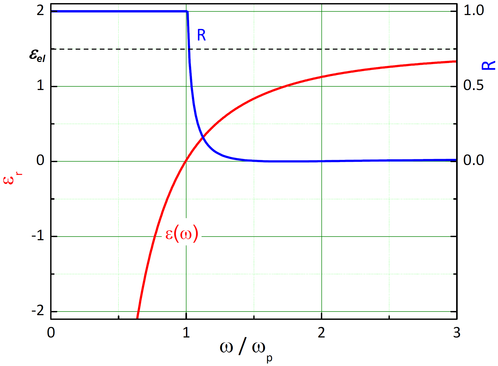
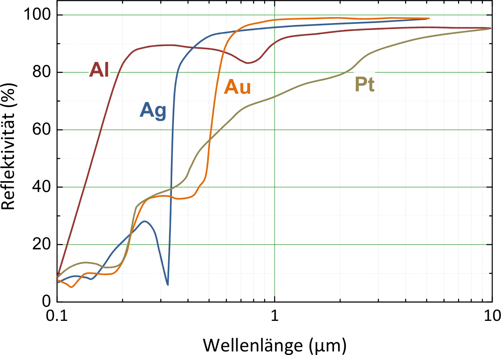

<!--
author:   Hartmut Stöcker
email:    hartmut.stoecker@physik.tu-freiberg.de
version:  0.2
language: de
narrator: Deutsch Female
comment:  Struktur der Materie 2 - Übung 06

@style
.lia-toc__bottom {
    display: none;
}
@end

import: https://raw.githubusercontent.com/liaTemplates/KekuleJS/master/README.md
import: https://github.com/liascript/CodeRunner
import: https://raw.githubusercontent.com/LiaTemplates/Pyodide/master/README.md
-->

# Übung 6

## Aufgabe 1

> Wie hängen die optischen Konstanten $n$ und $k$ vom Realteil $\varepsilon_1$ und Imaginärteil $\varepsilon_2$ der dielektrischen Funktion ab (Herleitung)?

                                      {{1}}
Der komplexe Brechungsindex $n'$ ist als Wurzel der komplexen dielektrischen Funktion $\varepsilon'$ definiert:
$$n' = \sqrt{\varepsilon'}$$

                                      {{2}}
Quadrieren liefert entsprechend $n'^2 = \varepsilon'$, wobei wir nun $n' = n + \mathrm{i}k$ und $\varepsilon' = \varepsilon_1 + \mathrm{i} \varepsilon_2$ einsetzen wollen:
$$n'^2 = (n + \mathrm{i}k)^2 = n^2 + \mathrm{i}2nk - k^2 = \varepsilon_1 + \mathrm{i} \varepsilon_2$$

                                      {{3}}
Daraus folgt direkt:
$$\varepsilon_1 = n^2 - k^2$$
$$\varepsilon_2 = 2nk$$

                                      {{4}}
Umstellen der zweiten Gleichung nach $k$ und Einsetzen in die erste Gleichung ergibt:
$$\varepsilon_1 = n^2 - \frac{\varepsilon_2^2}{4n^2}$$

                                      {{5}}
Daraus erhält man eine biquadratische Gleichung:
$$n^4 - \varepsilon_1 n^2 - \frac{\varepsilon_2^2}{4} = 0$$

                                      {{6}}
Diese hat die positive Lösung:
$$n^2 = \frac{\varepsilon_1}{2} + \frac{\sqrt{\varepsilon_1^2 + \varepsilon_2^2}}{2}$$
$$n = \sqrt{\frac{\varepsilon_1}{2} + \frac{\sqrt{\varepsilon_1^2 + \varepsilon_2^2}}{2}}$$

                                      {{7}}
Mit $k^2 = n^2 - \varepsilon_1$ folgt noch:
$$k^2 = -\frac{\varepsilon_1}{2} + \frac{\sqrt{\varepsilon_1^2 + \varepsilon_2^2}}{2}$$
$$k = \sqrt{-\frac{\varepsilon_1}{2} + \frac{\sqrt{\varepsilon_1^2 + \varepsilon_2^2}}{2}}$$

## Aufgabe 2

> Was sagen die Kramers-Kronig-Relationen aus und wozu werden sie verwendet?

                                      {{1}}
Die Kramers-Kronig-Relationen setzen Real- und Imaginärteil der dielektrischen Funktion in Form einer Integralgleichung miteinander in Beziehung. Auf diese Weise hängt die Absorption elektromagnetischer Wellen in einem Medium mit dem Brechungsindex zusammen. Es reicht also, die Abhängigkeit einer der beiden Größen von der Frequenz zu kennen, um die andere berechnen zu können.

                                      {{2}}
************************************
Mathematische Grundlage ist der Satz von Cauchy über komplexe analytische Funktionen unter den Bedingungen: 

- Die Funktion $f(x)$ hat in der oberen Halbebene keine Singularitäten.
- $f(x) \rightarrow 0$ für $x \rightarrow \infty$
- $\mathrm{Re}[f(x)]$ ist eine gerade Funktion.
- $\mathrm{Im}[f(x)]$ ist eine ungerade Funktion.
************************************

                                      {{3}}
Die Kramers-Kronig-Relationen haben die allgemeine Form:
$$\mathrm{Im}[f(x)] = -\frac{2}{\pi} \, \mathcal{P} \! \int_0^\infty \frac{x \cdot \mathrm{Re}[f(t)]}{t^2 - x^2} \, \mathrm{d}t$$
$$\mathrm{Re}[f(x)] = \frac{2}{\pi} \, \mathcal{P} \! \int_0^\infty \frac{t \cdot \mathrm{Im}[f(t)]}{t^2 - x^2} \, \mathrm{d}t$$
Dabei bezeichnet $\mathcal{P}$ den Cauchyschen Hauptwert des auftretenden Integrals.

                                      {{4}}
Für die dielektrische Funktion $\varepsilon' = \varepsilon_1 + \mathrm{i} \varepsilon_2$ wird als Realteil $\chi = \varepsilon_1 - 1$ betrachtet, um die Voraussetzung $\varepsilon'(\omega) \rightarrow 0$ für $\omega \rightarrow \infty$ zu erfüllen:
$$\chi(\omega) = \varepsilon_1(\omega) - 1 = \frac{2}{\pi} \, \mathcal{P} \! \int_0^\infty \frac{\omega' \cdot \varepsilon_2(\omega')}{\omega'^2 - \omega^2} \, \mathrm{d}\omega'$$
$$\varepsilon_2(\omega) = - \frac{2 \omega}{\pi} \, \mathcal{P} \! \int_0^\infty \frac{\varepsilon_1(\omega') - 1}{\omega'^2 - \omega^2} \, \mathrm{d}\omega'$$

                                      {{5}}
Eine wichtige Anwendung ist die Bestimmung von optischen Konstanten aus Reflexionsmessungen, wenn Transmissionsmessungen nicht möglich sind, z. B. oberhalb der Bandkante von Halbleitern.

## Aufgabe 3

> Welche verschiedenen Suszeptibilitätsanteile tragen zur dielektrischen Funktion von Stoffen bei?

                                      {{1}}
Zur dielektrischen Funktion tragen die Suszeptibilitätsanteile der Elektronen, Ionen und Dipole bei:
$$\varepsilon' = 1 + \chi_\mathrm{Elektronen} + \chi_\mathrm{Ionen} + \chi_\mathrm{Dipole}$$

                                      {{2}}

## Aufgabe 4

> Beschreiben Sie den Verlauf der dielektrischen Funktion und den Verlauf des Reflexionsvermögens im Bereich der Plasmonenabsorption von Metallen.

                                      {{1}}
Der Realteil der dielektrischen Funktion für freie Elektronen verläuft im Modell des freien Elektronengases (bzw. Drude-Modell oder Plasmon ohne Dämpfung) gemäß:
$$\varepsilon_1(\omega) = 1 - \frac{\omega_\mathrm{p}^2}{\omega^2}$$

                                      {{2}}
Dabei berechnet sich die Plasmafrequenz $\omega_\mathrm{p}$ aus:
$$\omega_\mathrm{p} = \sqrt{\frac{e^2 n}{\varepsilon_0 m^\ast}}$$

                                      {{3}}
Da die Dämpfung in diesem Bereich sehr gering ist, geht der Imaginärteil der dielektrischen Funktion gegen Null:
$$\varepsilon_2(\omega) \rightarrow 0$$

                                      {{4}}
**Für $\omega < \omega_\mathrm{p}$ wird $\varepsilon_1(\omega) < 0$, also negativ.** Damit wird der Wellenvektor $\vec{k}$ imaginär, eine Wellenausbreitung ist verboten und es kommt zu einer starken Reflexion nahe $1$. Eine auf ein Metall auftreffende elektromagnetische Welle wird totalreflektiert. Da für Metalle $\omega_\mathrm{p}$ im UV-Bereich liegt, wird sichtbares Licht von Metallen üblicherweise gut reflektiert, weshalb Metalle glänzend erscheinen.

                                      {{5}}
**Für $\omega > \omega_\mathrm{p}$ ist dagegen $\varepsilon_1(\omega) > 0$, also positiv.** Das Metall wird, aufgrund der gleichzeitig geringen Absorption (wegen $\varepsilon_2(\omega) \rightarrow 0$), für elektromagnetische Strahlung durchlässig. Dies trifft z. B. für Alkali-Metalle im UV-Bereich zu. Der nachfolgend gezeigte theoretische Verlauf von $\varepsilon_1 = \varepsilon_\mathrm{r}$ und $R$ wird experimentell für Metalle und Halbleiter meistens nicht beobachtet, da sich der Antwort des Elektronensystems durch Intraband-Übergänge auch immer noch Beiträge durch Interbandübergänge überlagern.

                                      {{6}}
<!-- style = "width: 450px;" -->

                                      {{7}}
<!-- style = "width: 450px;" -->

## Aufgabe 5

> Warum kann man die Lage der Plasmafrequenz von Metallen mit Hilfe der „Energieverlustfunktion“ $-\mathrm{Im}(1/\varepsilon')$ ausfindig machen?

                                      {{1}}
Die verallgemeinerte Permittivität setzt sich zusammen aus:
$$\varepsilon' = \varepsilon_1 + \mathrm{i} \varepsilon_2$$

                                      {{2}}
Das Reziproke ist:
$$\frac{1}{\varepsilon'} = \frac{\varepsilon_1 - \mathrm{i} \varepsilon_2}{\varepsilon_1^2 + \varepsilon_2^2}$$

                                      {{3}}
Der negative Imaginärteil dieser Funktion ist:
$$-\mathrm{Im}\left(\frac{1}{\varepsilon'}\right) = \frac{\varepsilon_2}{\varepsilon_1^2 + \varepsilon_2^2}$$

                                      {{4}}
Diese sogenannte „Energieverlustfunktion“ wird also maximal für $\varepsilon_1 \rightarrow 0$. Genau bei der Plasmafrequenz wird ebenfalls $\varepsilon_1 = 0$. Damit kennzeichnet ein Maximum in der Energieverlustfunktion gerade die Lage der Plasmafrequenz.

## Aufgabe 6

> Man bestimme den Zusammenhang zwischen Absorptionskoeffizient $\alpha$, Absorptionsindex $k$ und Eindringtiefe $w$ einer ebenen elektromagnetischen Welle beim Eindringen in ein absorbierendes Medium. Die Eindringtiefe $w$ soll die Entfernung von der Oberfläche beschreiben, bei der die Intensität der Welle auf den Wert $\mathrm{1/e}$ abfällt.

                                      {{1}}
Die Eindringtiefe $w$ soll einem Intensitätsabfall auf $\mathrm{1/e}$ entsprechen. Wir vergleichen mit dem Lambert-Beerschen-Schwächungsgesetz:
$$I = I_0 \cdot \exp(-\alpha w) = I_0 \cdot \exp(-1)$$

                                      {{2}}
Dabei ist $\alpha$ der Absorptionskoeffizient und es folgt: 
$$w = \frac{1}{\alpha}$$

                                      {{3}}
Wir betrachten eine einfallende ebene Welle, deren $E$-Feld in $x$-Richtung schwingt und die sich in $z$-Richtung ausbreitet (siehe Übung 5, Aufgabe 1):
$$E_{x,0} = E_0 \cdot \exp [\mathrm{i} (k_0 z - \omega t)]$$

                                      {{4}}
Die ins Medium mit dem komplexen Brechungsindex $n' = n + i \cdot k$ eindringende Welle besitzt die veränderte Amplitude $E_1$ und die gleiche Ausbreitungsrichtung wie die einfallende Welle. Allerdings ändert sich die Wellenzahl von $k_0$ zu $k_0 n'$ und es gilt:
$$E_{x,1} = E_1 \cdot \exp [\mathrm{i} (k_0 n' z - \omega t)]$$

                                      {{5}}
Einsetzen von $n' = n + i \cdot k$ führt zu:
$$E_{x,1} = E_1 \cdot \exp (-k k_0 z) \cdot \exp [\mathrm{i} (k_0 n z - \omega t)]$$

                                      {{6}}
Die Intensität $I$ ergibt sich aus dem Betragsquadrat der elektrischen Feldstärke:
$$I \sim |E_{x,1}|^2 = E_1^2 \cdot \exp (-2 k k_0 z)$$

                                      {{7}}
Aus dem Vergleich mit dem Lambert-Beerschen-Schwächungsgesetz (für die Tiefe $z$) folgt:
$$\exp (-2 k k_0 z) = \exp(-\alpha z)$$

                                      {{8}}
Damit erhalten wir den gesuchten Zusammenhang zwischen Absorptionskoeffizient $\alpha$ und Absorptionsindex $k$ als:
$$\alpha = 2 k k_0 = 2 k \frac{2 \pi}{\lambda} = \frac{4 \pi k}{\lambda}$$

