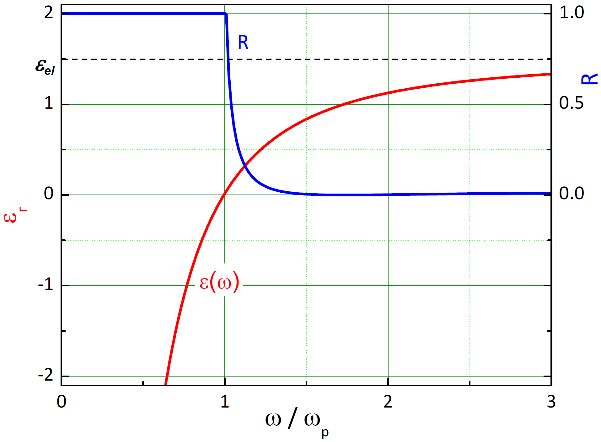
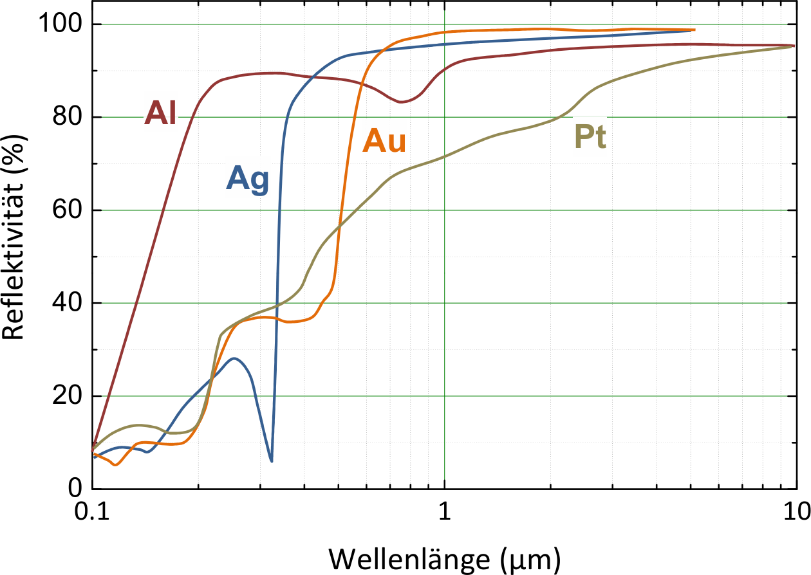

<!--
author:   Hartmut Stöcker
email:    hartmut.stoecker@physik.tu-freiberg.de
version:  0.0.1
language: de
narrator: Deutsch Female
comment:  Struktur der Materie 2 - Übung 10

@style
.lia-toc__bottom {
    display: none;
}
@end

import: https://raw.githubusercontent.com/liaTemplates/KekuleJS/master/README.md
import: https://github.com/liascript/CodeRunner
import: https://raw.githubusercontent.com/LiaTemplates/Pyodide/master/README.md
-->

# Übung 10

## Aufgabe 1

> Berechnen Sie für NaCl bei Vernachlässigung der Dämpfung die dielektrische Funktion im Infaroten aus $\varepsilon_\mathrm{r}(0) = 5,\!9$, der TO-Phononenfrequenz $\omega_\mathrm{TO} = 3,\!1 \cdot {10}^{13}~\mathrm{s^{-1}}$ und dem Brechungsindex im Sichtbaren $n_\mathrm{S} = 1,\!5$. Wie groß ist die LO-Phononenfrequenz $\omega_\mathrm{LO}$? Skizzieren Sie die Verläufe der dielektrischen Funktion und des Reflexionsvermögens.

                                      {{1}}
Der Realteil der dielektrischen Funktion eines Ionenkristalls ist bei Vernachlässigung der Dämpfung:
$$\varepsilon_\mathrm{r}(\omega) = \varepsilon_\mathrm{stat} \cdot \frac{\omega_\mathrm{LO}^2 - \omega^2}{\omega_\mathrm{TO}^2 - \omega^2}$$

                                      {{2}}
Außerdem gilt die **Lyddane-Sachs-Teller-Relation**, die das Verhältnis der Eigenfrequenzen der longitudinalen und transversalen optischen Schwingungen mit der Dielektrizitätskonstante $\varepsilon_\mathrm{r}(0)$ bei $\omega = 0$ und der Dielektrizitätskonstante $\varepsilon_\mathrm{stat}$ für sehr hohe Frequenzen $\omega \gg \omega_\mathrm{LO}$ in Beziehung setzt:
$$\frac{\omega_\mathrm{LO}^2}{\omega_\mathrm{TO}^2} = \frac{\varepsilon_\mathrm{r}(0)}{\varepsilon_\mathrm{stat}}$$

                                      {{3}}
Die Dielektrizitätskonstante $\varepsilon_\mathrm{stat}$ können wir aus dem Brechungsindex im Sichtbaren berechnen:
$$\varepsilon_\mathrm{stat} = n_\mathrm{S}^2 = 2,\!25$$

                                      {{4}}
Dann erhalten wir die LO-Phononenfrequenz $\omega_\mathrm{LO}$ aus der Lyddane-Sachs-Teller-Relation:
$$\omega_\mathrm{LO} = \omega_\mathrm{TO} \cdot \sqrt{\frac{\varepsilon_\mathrm{r}(0)}{\varepsilon_\mathrm{stat}}} = 5,\!02 \cdot {10}^{13}~\mathrm{s^{-1}}$$

                                      {{5}}
Die zwei Phononenfrequenzen liegen also im FIR-Bereich. Die entsprechenden Wellenlängen sind:
$$\lambda_\mathrm{LO} = 2 \pi c / \omega_\mathrm{LO} = 37,\!5~\mathrm{µm}$$
$$\lambda_\mathrm{TO} = 2 \pi c / \omega_\mathrm{TO} = 60,\!8~\mathrm{µm}$$

                                      {{6}}

## Aufgabe 2 

> Berechnen Sie die Polarisierbarkeit von KBr im elektrostatischen Fall und im sichtbaren Bereich. Wie groß sind die Polarisation, das auf ein Molekül bezogene elektrische Moment und die Dipollänge, wenn ein statisches Feld der Stärke $E = 1~\mathrm{MV/m}$ angelegt wird? Gegeben: $\varepsilon_\mathrm{r}(0) = 5,\!99, n_\mathrm{S} = 1,\!53$, Dichte $\varrho = 2,\!73~\mathrm{g/cm^3}$, molare Masse $M = 119~\mathrm{g/mol}$.

                                      {{1}}
Für den elektrostatischen Fall ($\omega = 0$) benutzen wir die **Clausius-Mossotti-Gleichung**:
$$\frac{\varepsilon_\mathrm{r} - 1}{\varepsilon_\mathrm{r} + 2} = \frac{\alpha_0 n}{3 \varepsilon_0} = \frac{\alpha_0}{3 \varepsilon_0} \cdot \frac{\varrho N_\mathrm{A}}{M}$$

                                      {{2}}
Umstellen nach der gesuchten Polarisation $\alpha_0$ und Einsetzen der gegebenen Werte liefert:
$$\alpha_0 = 3 \cdot \frac{\varepsilon_\mathrm{r}(0) - 1}{\varepsilon_\mathrm{r}(0) + 2} \cdot \frac{M \varepsilon_0}{\varrho N_\mathrm{A}} = 1,\!2 \cdot 10^{-39}~\mathrm{\frac{C m^2}{V}}$$

                                      {{3}}
Für die Lösung im sichtbaren Bereich setzen wir $n_\mathrm{S}^2 = \varepsilon_\mathrm{r}$ in die Clausius-Mossotti-Gleichung ein und erhalten die **Lorentz-Lorenz-Gleichung**:
$$\frac{n_\mathrm{S}^2 - 1}{n_\mathrm{S}^2 + 2} = \frac{\alpha_\mathrm{S} n}{3 \varepsilon_0} = \frac{\alpha_\mathrm{S}}{3 \varepsilon_0} \cdot \frac{\varrho N_\mathrm{A}}{M}$$

                                      {{4}}
Umgestellt nach $\alpha_\mathrm{S}$ erhalten wir:
$$\alpha_\mathrm{S} = 3 \cdot \frac{n_\mathrm{S}^2 - 1}{n_\mathrm{S}^2 + 2} \cdot \frac{M \varepsilon_0}{\varrho N_\mathrm{A}} = 5,\!9 \cdot 10^{-40}~\mathrm{\frac{C m^2}{V}}$$

                                      {{5}}
Wenn ein statisches elektrisches Feld angelegt wird, ergibt sich eine Polarisation von:
$$P_0 = (\varepsilon_\mathrm{r} - 1) \varepsilon_0 E = 4,\!4 \cdot 10^{-5}~\mathrm{C/m^2}$$

                                      {{6}}
Das elektrische Dipolmoment beträgt:
$$p = \frac{P_0}{n} = \frac{P_0 M}{\varrho N_\mathrm{A}} = 3,\!2 \cdot 10^{-33}~\mathrm{Cm}$$

                                      {{7}}
Die entsprechende Dipollänge ist:
$$r = \frac{p}{e} = 2,\!0 \cdot 10^{-14}~\mathrm{m} = 2,\!0 \cdot 10^{-4}~\mathrm{\AA}$$
Dies ist also weniger als ein Tausendstel der Gitterkonstante!

## Aufgabe 3

> Aus den ersten beiden Absorptionslinien des Mottschen Exzitons in GaAs bei $1,\!5156~\mathrm{eV}$ und $1,\!51815~\mathrm{eV}$ berechne man die Breite der Energielücke, die Bindungsenergie und den Exzitonenradius ($\varepsilon_\mathrm{r} = 10,\!6$).

                                      {{1}}
Exzitonen sind Wasserstoff-artige Energieniveaus unterhalb der Leitungsbandkante. Mit der Bandlückenenergie $E_\mathrm{g}$ und der reduzierten Masse $\mu^\ast$ gilt:
$$E_n = E_\mathrm{g} - \frac{\mu^\ast e^4}{2 (4 \pi \varepsilon_0 \varepsilon_\mathrm{r} \hbar)^2} \cdot \frac{1}{n^2}$$

                                      {{2}}
Für die ersten beiden Exzitonen mit $n=1$ und $n=2$ gilt also:
$$E_1 = E_\mathrm{g} - \frac{\mu^\ast e^4}{2 (4 \pi \varepsilon_0 \varepsilon_\mathrm{r} \hbar)^2} \cdot \frac{1}{1} = E_\mathrm{g} - \Delta E$$
$$E_2 = E_\mathrm{g} - \frac{\mu^\ast e^4}{2 (4 \pi \varepsilon_0 \varepsilon_\mathrm{r} \hbar)^2} \cdot \frac{1}{4} = E_\mathrm{g} - \frac{\Delta E}{4}$$

                                      {{3}}
Da $E_1$ und $E_2$ gegeben sind, können wir nach der Bandlückenenergie $E_\mathrm{g}$ und der Bindungsenergie $\Delta E$ des ersten Exzitons ($n=1$) auflösen:
$$E_\mathrm{g} = \frac{1}{3} \cdot (4 E_2 - E_1) = 1,\!519~\mathrm{eV}$$
$$\Delta E = \frac{4}{3} \cdot (E_2 - E_1) = 0,\!0034~\mathrm{eV}$$

                                      {{4}}
Den Exzitonenradius (für das erste Exziton mit $n=1$) erhalten wir folgendermaßen:
$$a_\mathrm{ex} = \frac{e^2}{8 \pi \varepsilon_0 \varepsilon_\mathrm{r} \Delta E} = 20~\mathrm{nm}$$

## Aufgabe 4

> Gegeben sei ein System aus zwei Atomen mit festem Abstand $a$ und der Polarisierbarkeit $\alpha$ für jedes Atom. Welche Beziehung zwischen $a$ und $\alpha$ muss gelten, wenn das System ferroelektrisch sein soll? Dabei ist das Dipolfeld am stärksten in Richtung Dipolachse.

                                      {{1}}
Der Realteil der dielektrischen Funktion für freie Elektronen verläuft im Modell des freien Elektronengases (bzw. Drude-Modell oder Plasmon ohne Dämpfung) gemäß:
$$\varepsilon_1(\omega) = 1 - \frac{\omega_\mathrm{p}^2}{\omega^2}$$

                                      {{2}}
Dabei berechnet sich die Plasmafrequenz $\omega_\mathrm{p}$ aus:
$$\omega_\mathrm{p} = \sqrt{\frac{e^2 n}{\varepsilon_0 m^\ast}}$$

                                      {{3}}
Da die Dämpfung in diesem Bereich sehr gering ist, geht der Imaginärteil der dielektrischen Funktion gegen Null:
$$\varepsilon_2(\omega) \rightarrow 0$$

                                      {{4}}
**Für $\omega < \omega_\mathrm{p}$ wird $\varepsilon_1(\omega) < 0$, also negativ.** Damit wird der Wellenvektor $\vec{k}$ imaginär, eine Wellenausbreitung ist verboten und es kommt zu einer starken Reflexion nahe $1$. Eine auf ein Metall auftreffende elektromagnetische Welle wird totalreflektiert. Da für Metalle $\omega_\mathrm{p}$ im UV-Bereich liegt, wird sichtbares Licht von Metallen üblicherweise gut reflektiert, weshalb Metalle glänzend erscheinen.

                                      {{5}}
**Für $\omega > \omega_\mathrm{p}$ ist dagegen $\varepsilon_1(\omega) > 0$, also positiv.** Das Metall wird, aufgrund der gleichzeitig geringen Absorption (wegen $\varepsilon_2(\omega) \rightarrow 0$), für elektromagnetische Strahlung durchlässig. Dies trifft z. B. für Alkali-Metalle im UV-Bereich zu. Der nachfolgend gezeigte theoretische Verlauf von $\varepsilon_1 = \varepsilon_\mathrm{r}$ und $R$ wird experimentell für Metalle und Halbleiter meistens nicht beobachtet, da sich der Antwort des Elektronensystems durch Intraband-Übergänge auch immer noch Beiträge durch Interbandübergänge überlagern.

                                      {{6}}
<!-- style = "width: 450px;" -->

                                      {{7}}
<!-- style = "width: 450px;" -->

## Aufgabe 5

> Berechnen Sie die Gitterverschiebung der positiven und negativen Ionen in BaTiO3, wenn die Sättigungspolarisation $P = 0,\!26~\mathrm{As/m^2}$ beträgt. Das molare Volumen von BaTiO3 beträgt $3,\!8 \cdot {10}^{-5}~\mathrm{m^3}$.

                                      {{1}}
Die Eindringtiefe $w$ soll einem Intensitätsabfall auf $\mathrm{1/e}$ entsprechen. Wir vergleichen mit dem Lambert-Beerschen-Schwächungsgesetz:
$$I = I_0 \cdot \exp(-\alpha w) = I_0 \cdot \exp(-1)$$

                                      {{2}}
Dabei ist $\alpha$ der Absorptionskoeffizient und es folgt: 
$$w = \frac{1}{\alpha}$$

                                      {{3}}
Wir betrachten eine einfallende ebene Welle, deren $E$-Feld in $x$-Richtung schwingt und die sich in $z$-Richtung ausbreitet (siehe Übung 8, Aufgabe 1):
$$E_x = E_0 \cdot \exp [\mathrm{i} (k_0 z - \omega t)]$$

                                      {{4}}
Die ins Medium mit dem komplexen Brechungsindex $n' = n + i \cdot k$ eindringende Welle besitzt die veränderte Amplitude $E_1$ und die gleiche Ausbreitungsrichtung wie die einfallende Welle. Allerdings ändert sich die Wellenzahl von $k_0$ zu $k_0 n'$ und es gilt:
$$E_x = E_1 \cdot \exp [\mathrm{i} (k_0 n' z - \omega t)]$$

                                      {{5}}
Einsetzen von $n' = n + i \cdot k$ führt zu:
$$E_x = E_1 \cdot \exp (-k k_0 z) \cdot \exp [\mathrm{i} (k_0 n z - \omega t)]$$

                                      {{6}}
Die Intensität $I$ ergibt sich aus dem Betragsquadrat der elektrischen Feldstärke:
$$I \sim |E_x|^2 = E_1^2 \cdot \exp (-2 k k_0 z)$$

                                      {{7}}
Aus dem Vergleich mit dem Lambert-Beerschen-Schwächungsgesetz (für die Tiefe $z$) folgt:
$$\exp (-2 k k_0 z) = \exp(-\alpha z)$$

                                      {{8}}
Damit erhalten wir den gesuchten Zusammenhang zwischen Absorptionskoeffizient $\alpha$ und Absorptionsindex $k$ als:
$$\alpha = 2 k k_0 = 2 k \frac{2 \pi}{\lambda} = \frac{4 \pi k}{\lambda}$$

