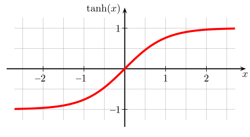

<!--
author:   Hartmut Stöcker
email:    hartmut.stoecker@physik.tu-freiberg.de
version:  0.0.1
language: de
narrator: Deutsch Female
comment:  Struktur der Materie 2 - Übung 04

@style
.lia-toc__bottom {
    display: none;
}
@end

import: https://raw.githubusercontent.com/liaTemplates/KekuleJS/master/README.md
import: https://github.com/liascript/CodeRunner
import: https://raw.githubusercontent.com/LiaTemplates/Pyodide/master/README.md
-->

# Übung 4

## Aufgabe 1

> Die magnetische Suszeptibilität eines kristallinen Materials kann bestimmt werden, indem eine zylindrische Probe an einem Balkenende der Gouy’schen Waage aufgehängt wird, die sich vor dem Versuchsbeginn im Gleichgewicht befindet. Das untere Ende der Probe wird in ein Magnetfeld gebracht. Um die Waage wieder ins Gleichgewicht zu bringen, muss ein Ausgleichsgewicht am anderen Balkenende aufgelegt werden.
>
>  <!-- style = "width: 350px;" -->
>
> Berechnen Sie für eine zylindrische Probe mit dem Durchmesser $d = 2r = 5~\mathrm{mm}$, die in ein Magnetfeld der Stärke $H = 10^4~\mathrm{Oe}$ gebracht und mit einem Gegengewicht von $0,\!5~\mathrm{g}$ ausgeglichen wird, die magnetische Suszeptibilität. Um welche Form des Magnetismus handelt es sich?

                                      {{1}}
Die magnetische Energiedichte (auch als magnetischer Druck bezeichnet) berechnet sich aus:
$$w_\mathrm{mag} = \frac{1}{2} B H = \frac{1}{2 \mu_0 \mu_r} B^2 = \frac{\mu_0 \mu_r}{2} H^2$$

                                      {{2}}
Das Volumenintegral über $w_\mathrm{mag}$ ergibt die potentielle Energie $E_\mathrm{mag}$ des Magnetfeldes. Dieses Integral führen wir genau über das Volumen der ins Magnetfeld $H$ eingetauchten Probe aus. Wir nehmen an, dass zwischen den Polschuhen ein homogenes Magnetfeld $H$ wirkt, das nach außen sehr schnell abfällt. Mit der Querschnittsfläche $A = \pi r^2$ und der Eintauchtiefe $z$ der Probe ins Magnetfeld erhalten wir:
$$E_\mathrm{mag} = \int_V w_\mathrm{mag} \, \mathrm{d}V = \int_V \frac{\mu_0 \mu_r}{2} H^2 \, \mathrm{d}V = \frac{\mu_0 \mu_r}{2} H^2 \cdot \int_V \mathrm{d}V = \frac{\mu_0 \mu_r}{2} H^2 \cdot \pi r^2z$$

                                      {{3}}
Da das Magnetfeld bereits ohne Probe eine potentielle Energie besitzt, weil ja $\mu_{r,1} = 1$ gilt, müssen wir die Änderung der potentiellen Energie betrachten:
$$\Delta E_\mathrm{mag} = E_\mathrm{mag,2} - E_\mathrm{mag,1} = \frac{\mu_0}{2} (\mu_{r,2}-\mu_{r,1}) \cdot H^2 \cdot \pi r^2z$$

                                      {{4}}
Die relative Permeabilität $\mu_{r}$ hängt mit der gesuchten magnetischen Suszeptibilität $\chi$ über $\mu_{r} = 1 + \chi$ zusammen. Da für Luft $\mu_{r,1} = 1$ gilt, ist $\chi_1 = 0$ und insgesamt:
$$\Delta E_\mathrm{mag} = \frac{\mu_0}{2} (\chi_2-\chi_1) \cdot H^2 \cdot \pi r^2z = \frac{\mu_0 \chi_2}{2} \cdot H^2 \cdot \pi r^2z$$

                                      {{5}}
Wird die Probe entlang der Richtung $z$ verschoben, ergibt sich aus der dadurch hervorgerufenen Änderung der potentiellen Energie eine Kraft:
$$F = \frac{\mathrm{d} \Delta E_\mathrm{mag}}{\mathrm{d} z} = \frac{\mu_0 \chi_2}{2} \cdot H^2 \cdot \pi r^2$$

                                      {{6}}
Bereits im Jahr 1889 ist von Louis Georges Gouy vorgeschlagen worden, diese Kraft $F$ zu messen und daraus die magnetische Suszeptibilität $\chi_2$ einer Probe zu bestimmen. Die zylindrische Probe wird dabei an einer Waage hängend zwischen die Pole eines Magneten gebracht. Die durch das Magnetfeld $H$ hervorgerufene Kraft wird als Gewichtsänderung an der Waage registriert. Die Gegenkraft ist also die Gewichtskraft $F_G = mg$:
$$F = \frac{\mu_0 \chi_2}{2} \cdot H^2 \cdot \pi r^2 = mg$$

                                      {{7}}
Die gesuchte Größe erhalten wir also aus:
$$\chi_2 = \frac{2mg}{\mu_0 H^2 \pi r^2}$$

                                      {{8}}
Die Stärke des Magnetfeldes $H$ ist im CGS-System gegeben und muss zunächst umgerechnet werden. Es gilt:
$$1~\mathrm{Oersted} = 1~\mathrm{Oe} = \frac{1000}{4 \pi} \, \mathrm{\frac{A}{m}}$$

                                      {{9}}
Damit erhalten wir schließlich einen Wert von:
$$\chi_2 = 6,\!3 \cdot 10^{-4}$$

                                      {{10}}
Dieser Wert stellt eine einheitenlose Volumensuszeptibilität dar. Aufgrund des Vorzeichens (positiv) und der Größe des Wertes (zwischen $0$ und $1$) handelt es sich um eine paramagnetische Probe.

## Aufgabe 2 

> Skizzieren Sie mit Hilfe eines symbolischen Kästchenschemas die Besetzung der $\mathrm{4f}$-Orbitale im Grundzustand der Ionen Eu^2+^, Eu^3+^ und Yb^3+^. Wie lauten die entsprechenden Termbezeichnungen des Grundzustands in spektroskopischer Notation?

                                      {{1}}
***********************************
Alle genannten Elemente gehören zu den Lanthanoiden (bzw. Seltenen Erden) und haben damit eine abgeschlossene Xenon-Konfiguration, zwei Elektronen im Zustand $\mathrm{6s}$ sowie unterschiedlich viele $\mathrm{4f}$-Elektronen. 

 <!-- style = "width: 600px;" -->
************************************

                                      {{2}}
Ausgehend vom voll besetzten Atom werden je nach Ionisationsgrad Elektronen entnommen. Bei den Lanthanoiden werden durch Ionisation zunächst die $\mathrm{6s}$-Elektronen entfernt.

                                      {{3}}
************************************
Bei der Besetzung beachten wir vor allem die 2. Hundsche Regel: „Der Gesamtspin $S$ nimmt den maximal möglichen Wert an, die Spins der einzelnen Elektronen $m_s$ stehen also möglichst parallel.“ Daraus ergibt sich:

<!-- data-type="none" -->
| Ion    | Konfiguration                      | Kästchenschema für die $\mathrm{4f}$-Orbitale |
|--------|------------------------------------|----------------|
| Eu^2+^ | $\mathrm{[Xe] \, 4f^7}$    | $\fbox{↑\phantom{↓}} \fbox{↑\phantom{↓}} \fbox{↑\phantom{↓}} \fbox{↑\phantom{↓}} \fbox{↑\phantom{↓}} \fbox{↑\phantom{↓}} \fbox{↑\phantom{↓}}$ |
| Eu^3+^ | $\mathrm{[Xe] \, 4f^6}$    | $\fbox{↑\phantom{↓}} \fbox{↑\phantom{↓}} \fbox{↑\phantom{↓}} \fbox{↑\phantom{↓}} \fbox{↑\phantom{↓}} \fbox{↑\phantom{↓}} \fbox{\phantom{↑↓}}$  |
| Yb^3+^ | $\mathrm{[Xe] \, 4f^{13}}$ | $\fbox{↑↓} \fbox{↑↓} \fbox{↑↓} \fbox{↑↓} \fbox{↑↓} \fbox{↑↓} \fbox{↑\phantom{↓}}$ |
************************************

                                      {{4}}
************************************
Für die Termbezeichnungen müssen wir die Quantenzahlen zuordnen:

- Gesamtspin $S = |\sum m_s|$: Ergibt sich aus der 2. Hundschen Regel, d. h. er nimmt den maximal möglichen Wert an.
- Gesamtbahndrehimpuls $L = |\sum m_l|$: Nach der 3. Hundschen Regel werden die Unterzustände mit der Magnetquantenzahl $m_l$ so besetzt, dass $L$ maximal wird.
- Gesamtdrehimpuls $J$: Folgt aus der 4. Hundschen Regel: Ist die Schale weniger als halbvoll, so ist $J=|L-S|$. Ist die Schale mehr als halbvoll, so ist $J=L+S$.
************************************

                                      {{5}}
************************************
Erläuterung zum Wert für $L$ nach der 3. Hundschen Regel: 

- Das erste Elektron einer neuen Schale erhält den maximalen Wert von $|m_l|=l$. Für eine $\mathrm{f}$-Schale ist $l=3$. 
- Das zweite Elektron darf wegen der 2. Hundschen Regel nicht denselben Wert für $m_l$ bekommen, da beide Elektronen bereits den gleichen Spin $m_s$ besitzen. Gemäß Pauli-Prinzip müssen die zwei Elektronen unterschiedliche Zustände einnehmen. Das 2. Elektron bekommt also den zweitgrößten Wert $|m_l|=l-1$. 
- Ist die Schale halbgefüllt, so müssen nach der 2. Hundschen Regel alle $m_l = -l, ..., +l$ einmal vergeben sein, d. h. $L$ ist dann gleich Null. 
- Bei der Befüllung der zweiten Hälfte der Schale werden die $m_l$ in der gleichen Reihenfolge wie bei Befüllung der ersten Hälfte vergeben.
************************************

                                      {{6}}
************************************
Beispiel Eu^2+^: 

- Das neutrale Eu-Atom hat zwei $\mathrm{6s}$-Elektronen und sieben $\mathrm{4f}$-Elektronen. Das Eu^2+^-Ion behält nur die sieben $\mathrm{4f}$-Elektronen.
- Der Gesamtspin nimmt den maximal möglichen Wert $S = \frac{7}{2}$ an, wenn alle $m_s = +\frac{1}{2}$ parallel ausgerichtet sind.
- Die Bahndrehimpulse werden beginnend mit dem größten Wert $m_l=l=3$ an die einzelnen Elektronen verteilt. Die 7 Elektronen besitzen also die Werte $m_l = +3, +2, +1, 0, -1, -2, -3$. Der Gesamtbahndrehimpuls ist also $L = |\sum m_l| = 0$, wie für eine genau halbvolle Schale erwartet. 
- Da die Schale halbvoll und $L=0$ ist, ergibt $J=|L-S|$ denselben Wert wie $J=L+S=\frac{7}{2}$.
************************************

                                      {{7}}
************************************
Termbezeichnung: 

- Die spektroskopische Termbezeichnung folgt dem Schema: $^{2S+1}(L)_J$.
- Für $2S+1$ und $J$ werden direkt Zahlen eingesetzt, für $L$ kommen aufrechte Großbuchstaben zum Einsatz: $\mathrm{0 = S, 1 = P, 2 = D, 3 = F, 4 = G, 5 = H, 6 = I}$.
- Für das Beispiel Eu^2+^ ergibt sich also: $\mathrm{^8S_{7/2}}$
************************************

                                      {{8}}
************************************
Lösungsübersicht: 

<!-- data-type="none" -->
| Ion    | Konfiguration                      | Kästchenschema | $S$ | $L$ | $J$ | Termsymbol |
|--------|------------------------------------|----------------|-----|-----|-----|------------|
| Eu^2+^ | $\mathrm{[Xe] \, 4f^7}$    | $\fbox{↑\phantom{↓}} \fbox{↑\phantom{↓}} \fbox{↑\phantom{↓}} \fbox{↑\phantom{↓}} \fbox{↑\phantom{↓}} \fbox{↑\phantom{↓}} \fbox{↑\phantom{↓}}$ | $\frac{7}{2}$ | $0$ | $\frac{7}{2}$ | $\mathrm{^8S_{7/2}}$ |
| Eu^3+^ | $\mathrm{[Xe] \, 4f^6}$    | $\fbox{↑\phantom{↓}} \fbox{↑\phantom{↓}} \fbox{↑\phantom{↓}} \fbox{↑\phantom{↓}} \fbox{↑\phantom{↓}} \fbox{↑\phantom{↓}} \fbox{\phantom{↑↓}}$  | $3$ | $3$ | $0$ | $\mathrm{^7F_0}$ |
| Yb^3+^ | $\mathrm{[Xe] \, 4f^{13}}$ | $\fbox{↑↓} \fbox{↑↓} \fbox{↑↓} \fbox{↑↓} \fbox{↑↓} \fbox{↑↓} \fbox{↑\phantom{↓}}$ | $\frac{1}{2}$ | $3$ | $\frac{7}{2}$ | $\mathrm{^2F_{7/2}}$ |
************************************

## Aufgabe 3

> Berechnen Sie den Landé-Faktor $g$ und das effektive magnetische Moment der $\mathrm{4f}$-Ionen La^3+^, Pr^3+^ und Tb^3+^. Vergleichen Sie die Ergebnisse mit den experimentell ermittelten Werten. Weshalb liefern abgeschlossene Schalen eines Atoms keinen Beitrag zum Langevin-Paramagnetismus?

                                      {{1}}
************************************
Zunächst bestimmen wir die Quantenzahlen und gehen dabei wie in Aufgabe 2 vor:

 <!-- style = "width: 600px;" -->

<!-- data-type="none" -->
| Ion    | Konfiguration                      | Kästchenschema | $S$ | $L$ | $J$ | Termsymbol |
|--------|------------------------------------|----------------|-----|-----|-----|------------|
| La^3+^ | $\mathrm{[Xe]}$    | $\fbox{\phantom{↑↓}} \fbox{\phantom{↑↓}} \fbox{\phantom{↑↓}} \fbox{\phantom{↑↓}} \fbox{\phantom{↑↓}} \fbox{\phantom{↑↓}} \fbox{\phantom{↑↓}}$ | $0$ | $0$ | $0$ | $\mathrm{^1S_0}$ |
| Pr^3+^ | $\mathrm{[Xe] \, 4f^2}$    | $\fbox{↑\phantom{↓}} \fbox{↑\phantom{↓}} \fbox{\phantom{↑↓}} \fbox{\phantom{↑↓}} \fbox{\phantom{↑↓}} \fbox{\phantom{↑↓}} \fbox{\phantom{↑↓}}$  | $1$ | $5$ | $4$ | $\mathrm{^3H_4}$ |
| Tb^3+^ | $\mathrm{[Xe] \, 4f^8}$    | $\fbox{↑↓} \fbox{↑\phantom{↓}} \fbox{↑\phantom{↓}} \fbox{↑\phantom{↓}} \fbox{↑\phantom{↓}} \fbox{↑\phantom{↓}} \fbox{↑\phantom{↓}}$  | $3$ | $3$ | $6$ | $\mathrm{^7F_6}$ |
************************************

                                      {{2}}
Der Landé-Faktor $g$ folgt aus:
$$g = 1+\frac{J(J+1)+S(S+1)-L(L+1)}{2J(J+1)}$$

                                      {{3}}
Das effektive magnetische Moment ist dann:
$$\mu_\mathrm{eff} = g \cdot \sqrt{J(J+1)} \cdot \mu_\mathrm{B}$$

                                      {{4}}
************************************
Übersicht der berechneten Werte und Vergleich mit experimentellen Werten (*Quelle: Rudolf Gross und Achim Marx, Vorlesungsskript Festkörperphysik, 2008*):

<!-- data-type="none" -->
| Ion    | Landé-Faktor                      | $\mu_\mathrm{eff}/\mu_\mathrm{B}$ (Theorie) | $\mu_\mathrm{eff}/\mu_\mathrm{B}$ (Experiment)  |
|--------|------------------------------------|----------------|-----|
| La^3+^ | $0$ (definiert)   | $0$ | $0$ |
| Pr^3+^ | $\frac{4}{5}$ | $3,\!58$ | $3,\!5$ |
| Tb^3+^ | $\frac{3}{2}$ | $9,\!72$ | $9,\!5$ | 
************************************

                                      {{5}}
Für vollständig gefüllte Unterschalen ergibt sich ein $\mathrm{^1S_0}$-Zustand und es ist $\mu_\mathrm{eff} = 0$.

## Aufgabe 4 

> Betrachten Sie als einfachsten Fall ein Zweiniveausystem, das wegen $J=½$ nur die zwei Energieniveaus $E = \pm ½ g μ_\mathrm{B} B_0$ annehmen kann. Berechnen Sie das mittlere magnetische Moment, welches sich in diesem Fall bei Anlegen eines magnetischen Feldes $B_0$ ergibt. Diskutieren Sie den Einfluss von Temperatur und Magnetfeld.

                                      {{1}}
Wir betrachten ein quantenmechanisches Zweiniveausystem mit $J=½$ in einem externen Feld $B_0$, das parallel zur $z$-Richtung orientiert ist. Die magnetische Quantenzahl kann nur die beiden Werte $m_J = \pm ½$ einnehmen. Für Elektronen ist das magnetische Moment antiparallel zum Drehimpuls orientiert. Daher gilt:
$$E = - \vec{\mu} \cdot \vec{B}_0 = g μ_\mathrm{B} m_J B_0 = \pm ½ g μ_\mathrm{B} B_0$$

                                      {{2}}
Das magnetische Moment in Feldrichtung, also in $z$-Richtung, ist dabei:
$$\mu_z = -g μ_\mathrm{B} m_J = \mp ½ g μ_\mathrm{B} = \mp \mu_\mathrm{eff}$$

                                      {{3}}
Das effektive magnetische Moment ist dabei $\mu_\mathrm{eff} = ½ g μ_\mathrm{B}$. Den Mittelwert von $\mu_z$ berechnen wir aus:
$$\langle \mu_z \rangle = \frac{\sum_{m_J} \mu_z \cdot \mathrm{e}^{-E/(k_\mathrm{B}T)}}{\sum_{m_J} \mathrm{e}^{-E/(k_\mathrm{B} T)}} = - \frac{\sum_{m_J} g μ_\mathrm{B} m_J \cdot \mathrm{e}^{-g μ_\mathrm{B} m_J B_0/(k_\mathrm{B} T)}}{\sum_{m_J} \mathrm{e}^{-g μ_\mathrm{B} m_J B_0/(k_\mathrm{B}T)}} = - g μ_\mathrm{B} \frac{\sum_{m_J} m_J \cdot \mathrm{e}^{-m_J x}}{\sum_{m_J} \mathrm{e}^{-m_J x}}$$

                                      {{4}}
Im letzten Schritt haben wir zur besseren Übersichtlichkeit $x = g μ_\mathrm{B} B_0/(k_\mathrm{B} T)$ ersetzt. Jetzt müssen noch die Summen über die zwei Werte $m_J = \pm ½$ ausgeschrieben werden:
$$\langle \mu_z \rangle = -g μ_\mathrm{B} \frac{-½ \cdot \mathrm{e}^{x/2} + ½ \cdot \mathrm{e}^{-x/2}}{\mathrm{e}^{x/2} + \mathrm{e}^{-x/2}} = ½ \, g μ_\mathrm{B} \tanh (x/2)$$

                                      {{5}}
Für die letzte Umformung haben wir genutzt, dass $\tanh (y) = \frac{\mathrm{e}^{y} - \mathrm{e}^{-y}}{\mathrm{e}^{y} + \mathrm{e}^{-y}}$. Setzen wir $x$ wieder ein, ergibt sich:
$$\langle \mu_z \rangle = ½ \, g μ_\mathrm{B} \tanh \left( \frac{g μ_\mathrm{B} B_0}{2 k_\mathrm{B}T} \right) = \mu_\mathrm{eff} \tanh \left( \frac{\mu_\mathrm{eff} B_0}{k_\mathrm{B}T} \right)$$

                                      {{6}}
Daraus ergibt sich mit der Teilchendichte $n = \frac{N}{V}$ auch direkt die Magnetisierung:
$$M = n \langle \mu_z \rangle = n \mu_\mathrm{eff} \tanh \left( \frac{\mu_\mathrm{eff} B_0}{k_\mathrm{B} T} \right)$$

                                      {{7}}
Da die $\tanh$-Funktion maximal $1$ wird, ist die maximale Magnetisierung (oder Sättigungsmagnetisierung) durch $M_\mathrm{S} = n \mu_\mathrm{eff}$ gegeben. Damit folgt:
$$\frac{M}{M_\mathrm{S}} = \tanh \left( \frac{\mu_\mathrm{eff} B_0}{k_\mathrm{B} T} \right)$$

                                      {{8}}
************************************
Die Funktion verläuft wie nachfolgend gezeigt. Es genügt, den positiven Zweig für $x>0$ zu betrachten. Der negative Zweig für $x<0$ ist symmetrisch dazu und entspricht dem Umklappen der Magnetisierung in die negative $z$-Richtung:

 <!-- style = "width: 400px;" -->
************************************

                                      {{9}}
**Für hohe Magnetfelder und niedrige Temperaturen**, also für $\mu_\mathrm{eff} B_0 \gg k_\mathrm{B} T$ (oder $x \gg 1$) erreicht die Magnetisierung $M$ den Sättigungswert $M_\mathrm{S}$. Um $\mu_\mathrm{B} B_0 = k_\mathrm{B} T$ zu erreichen, wird bei $T = 4~\mathrm{K}$ beispielsweise ein Magnetfeld von $B_0 \approx 6~\mathrm{T}$ benötigt.

                                      {{10}}
**Für niedrige Magnetfelder und hohe Temperaturen**, also für $\mu_\mathrm{eff} B_0 \ll k_\mathrm{B} T$ (oder $x \ll 1$) kann die $\tanh$-Funktion durch $\tanh x \approx x$ angenähert werden. Damit gilt:
$$M \approx \frac{n \mu_\mathrm{eff}^2 B_0}{k_\mathrm{B} T}$$

                                      {{11}}
Für die magnetische Suszeptibilität folgt dann wieder das bekannte Curie-Gesetz mit der Konstante $C$:
$$\chi = \mu_0 \frac{M}{B_0} \approx \frac{\mu_0 n \mu_\mathrm{eff}^2}{k_\mathrm{B} T} = \frac{C}{T}$$

                                      {{12}}
Wir erhalten also einen zur klassischen Ableitung sehr ähnlichen Ausdruck. Für Elektronen mit $L = 0$ und $S = ½$ ist $\mu_\mathrm{eff} = ½ g_S \mu_\mathrm{B} \cong \mu_\mathrm{B}$, da $g_S \cong 2$.
