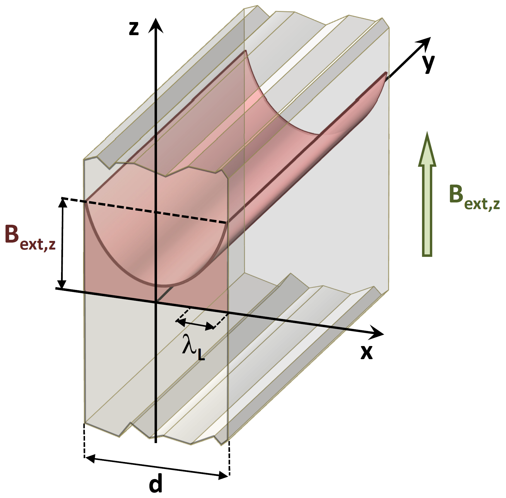

<!--
author:   Hartmut Stöcker
email:    hartmut.stoecker@physik.tu-freiberg.de
version:  0.2
language: de
narrator: Deutsch Female
comment:  Struktur der Materie 2 - Übung 12

@style
.lia-toc__bottom {
    display: none;
}
@end

import: https://raw.githubusercontent.com/liaTemplates/KekuleJS/master/README.md
import: https://github.com/liascript/CodeRunner
import: https://raw.githubusercontent.com/LiaTemplates/Pyodide/master/README.md
-->

# Übung 12

## Aufgabe 1

> Gegeben sei eine Kugel (Entmagnetisierungsfaktor $N = \frac{1}{3}$) aus einem Supraleiter erster Art mit einem kritischen Feld $H_\mathrm{C}$. Zeigen Sie, dass im Bereich des Meißner-Effekts die effektive Magnetisierung innerhalb der Kugel durch $M = -\frac{3}{2} H_\mathrm{a}$ gegeben ist und dass das Magnetfeld an der Oberfläche der Kugel in der Äquatorebene $\frac{3}{2} B_\mathrm{a}$ ist.

                                      {{1}}
In Übung 11, Aufgabe 1 hatten wir gezeigt, dass für das Magnetfeld $H$ und die magnetische Induktion $B$ im Probeninneren gilt:
$$H = \frac{1}{1 + N \cdot \chi} \cdot H_\mathrm{a}$$
$$B = \frac{1 + \chi}{1 + N \cdot \chi} \cdot B_\mathrm{a}$$

                                      {{2}}
Dabei ist $B_\mathrm{a} = \mu_0 H_\mathrm{a}$. Für eine Kugel ist der Entmagnetisierungsfaktor $N = \frac{1}{3}$. Weiterhin ist für einen Supraleiter erster Art $\chi = -1$. Damit erhalten wir:
$$H = \frac{3}{2} H_\mathrm{a}$$
$$B = 0$$

                                      {{3}}
Die Magnetisierung erhalten wir aus $M = \chi H$ und es ergibt sich:
$$M = -H = - \frac{3}{2} H_\mathrm{a}$$

                                      {{4}}
Das obige Ergebnis $B = 0$ gilt tatsächlich nur im Inneren der Kugel. Da die Tangentialkomponente von $\vec{H}$ stetig sein muss, folgt für $B$ an der Oberfläche der Kugel in der Äquatorebene:
$$B_\mathrm{Äquator} = \mu_0 H = \mu_0 \frac{3}{2} H_\mathrm{a} = \frac{3}{2} B_\mathrm{a}$$

                                      {{5}}
Da die Normalkomponente von $\vec{B}$ stetig sein muss, folgt für die Pole auf der Kugeloberfläche:
$$B_\mathrm{Pole} = B_\mathrm{a}$$

## Aufgabe 2 

> Berechnen Sie die Ortsabhängigkeit der magnetischen Flussdichte im Inneren eines Supraleiters für den Fall:
>
> a) dass ein homogenes magnetisches Feld $\vec{B}_0 = B_0 \vec{e}_z$ in einen den Halbraum $x \geq 0$ ausfüllenden Supraleiter eindringt.
>
> b) dass ein homogenes magnetisches Feld $\vec{B}_0 = B_0 \vec{e}_z$ parallel zur Oberfläche einer dünnen supraleitenden Platte, welche den Raum $–\frac{d}{2} \leq x \leq+\frac{d}{2}$ ausfüllt, angelegt wird.

                                      {{1}}
Die **2. London-Gleichung** können wir mit dem Laplace-Operator $\Delta$ allgemein schreiben als:
$$\Delta \vec{B} - \frac{1}{\lambda_\mathrm{L}^2} \vec{B} = 0$$

                                      {{2}}
Für ein homogenes magnetisches Feld $\vec{B}_0 = B_0 \vec{e}_z$, das ausschließlich in $z$-Richtung zeigt, und einen Supraleiter, der in $y$- und $z$-Richtung unendlich ausgedeht ist, ergibt sich:
$$\frac{\mathrm{d}^2 B}{\mathrm{d} x^2} - \frac{1}{\lambda_\mathrm{L}^2} B = 0$$

                                      {{3}}
Da sich das Material (und damit das Magnetfeld $B$) nur in $x$-Richtung ändert, muss nur die Ableitung nach $x$ berücksichtigt werden. Die allgemeine Lösung dieser Differentialgleichung 2. Ordnung ist:
$$B(x) = C_1 \exp \left( -\frac{x}{\lambda_\mathrm{L}} \right) + C_2 \exp \left( \frac{x}{\lambda_\mathrm{L}} \right)$$

                                      {{4}}
**a)** Für einen den Halbraum $x \geq 0$ ausfüllenden Supraleiter gelten die Randbedingungen $B(0) = B_0$ und $B(\infty) = 0$. Einsetzen der Randbedingung $B(\infty) = 0$ in die allgemeine Lösung liefert $C_2 = 0$. Aus $B(0) = B_0$ folgt dann noch $C_1 = B_0$. Damit ergibt sich für diesen Fall die Lösung:
$$B(x) = B_0 \exp \left( -\frac{x}{\lambda_\mathrm{L}} \right)$$

                                      {{5}}
**b)** Für eine dünne supraleitende Platte, welche den Raum $–\frac{d}{2} \leq x \leq+\frac{d}{2}$ ausfüllt, gelten die Randbedingungen $B(-x) = B(+x)$ und $B(\frac{d}{2}) = B_0$. Einsetzen der ersten Randbedingung $B(-x) = B(+x)$ in die allgemeine Lösung liefert $C_1 = C_2$. Die zweite Randbedingung $B(\frac{d}{2}) = B_0$ führt dann auf:
$$B_0 = C_1 \exp \left( -\frac{d}{2 \lambda_\mathrm{L}} \right) + C_1 \exp \left( \frac{d}{2 \lambda_\mathrm{L}} \right) = 2 C_1 \cosh \left( \frac{d}{2 \lambda_\mathrm{L}} \right)$$

                                      {{6}}
Für den Parameter $C_1$ gilt also:
$$C_1 = \frac{B_0}{2 \cosh \left( \frac{d}{2 \lambda_\mathrm{L}} \right)}$$

                                      {{7}}
Da $C_1 = C_2$ gilt, können wir den Zusammenhang $2 \cosh(z) = \exp(z) + \exp(-z)$ auch auf die allgemeine Lösung anwenden und erhalten für den Fall der supraleitenden Platte:
$$B(x) = B_0 \frac{\cosh(\frac{x}{\lambda_\mathrm{L}})}{\cosh(\frac{d}{2 \lambda_\mathrm{L}})}$$

                                      {{8}}
$ als Funktion des Abstandes $x$ von der Oberfläche eines massiven Supraleiter. Das externe Feld ist in $z$-Richtung angelegt, der Supraleiter erstreckt sich im Halbraum $x \geq 0$. *Quelle: Rudolf Gross und Achim Marx, Vorlesungsskript Festkörperphysik, 2008*")

## Aufgabe 3

> In einem Dauerstromexperiment wird das Abklingen des durch den Suprastrom $I_\mathrm{S}$ in einem geschlossenen supraleitenden Ring (Radius $r_0 = 1~\mathrm{mm}$ und Drahtradius $r_1 = 0,\!1~\mathrm{mm}$) erzeugten magnetischen Moments benutzt, um den Widerstand des Supraleiters abzuschätzen.
>
> a) Schätzen Sie den Strom $I_\mathrm{S}$ für ein Feld von $1~\mathrm{mT}$ im Zentrum des Rings ab.
>
> b) Nach einem Jahr wird eine Abnahme des magnetischen Moments um $5~\%$ gemessen. Welcher maximale Widerstand des Supraleiters kann daraus abgeschätzt werden?

                                      {{1}}
**a)** Das Durchflutungsgesetz lautet:
$$\oint \vec{B} \, \mathrm{d} \vec{l} = \mu_0 I_\mathrm{S}$$

                                      {{2}}
Wir integrieren entlang eines Kreises um den supraleitenden Draht im Abstand $r_0 = 1~\mathrm{mm}$ und erhalten für den Strom:
$$I_\mathrm{S} = \frac{2 \pi r_0 B}{\mu_0} = 5~\mathrm{A}$$

                                      {{3}}
**b)** Um die Induktivität $L$ des supraleitenden Rings zu bestimmen, nutzen wir die Formel für die Induktivität einer Zylinderspule und setzen die Wicklungszahl $N=1$. Dies ist tatsächlich nur eine grobe Abschätzung:
$$L \approx \frac{\mu_0 A}{l} = \frac{\mu_0 \pi r_0^2}{2 \pi r_0} = \frac{\mu_0 r_0}{2} = 6 \cdot 10^{-10}~\mathrm{\frac{Vs}{A}} = 0,\!6~\mathrm{nH}$$

                                      {{4}}
Aufgrund des Widerstands $R$ des supraleitenden Rings mit Induktivität $L$ ergibt sich als Ersatzschaltbild insgesamt ein $RL$-Kreis. Der Stromabfall im Ring folgt einem exponentiellen Zusammenhang:
$$I_\mathrm{S}(t) = I_\mathrm{S}(0) \cdot \exp \left( -\frac{R}{L}t \right)$$

                                      {{5}}
Umstellen nach $R$ liefert:
$$R = -\frac{L}{t} \cdot \ln \left( \frac{I_\mathrm{S}(t)}{I_\mathrm{S}(0)} \right) \approx 10^{-18}~\Omega$$

                                      {{6}}
Ein derart kleiner Widerstand wäre mit einer klassischen Strom-Spannungs-Messung nicht nachweisbar. Für $I_\mathrm{S} \approx 10~\mathrm{A}$ müsste man eine Spannung von $U \approx 10^{-17}~\mathrm{V}$ messen. Spannungsmessungen sind praktisch aber minimal bis $1~\mathrm{nV} = 10^{-9}~\mathrm{V}$ möglich. Dies entspricht einem minimalen detektierbaren Widerstand von $R \approx 10^{-10}~\Omega$.

## Aufgabe 4

> Ein Magnet mit einer Masse von $5~\mathrm{g}$ und einem magnetischen Moment $\mu$ von $0,\!3~\mathrm{J/T}$ schwebt über einer Scheibe aus einem Supraleiter vom Typ I (Meißner-Effekt). In welcher Höhe $h$ schwebt der Magnet, wenn sich die potentielle magnetische Energie des Magneten wie folgt berechnet:
> $$E_\mathrm{mag} = \frac{\mu_0 \mu^2}{32 \pi h^3}$$

                                      {{1}}
Wir setzen die potentielle Lage-Energie gleich der magnetischen Energie:
$$E_\mathrm{pot} = m g h = \frac{\mu_0 \mu^2}{32 \pi h^3} = E_\mathrm{mag}$$

                                      {{2}}
Umstellen nach der Höhe $h$ liefert: 
$$h = \left( \frac{\mu_0 \mu^2}{32 \pi m g} \right)^\frac{1}{4} = 1,\!23~\mathrm{cm}$$