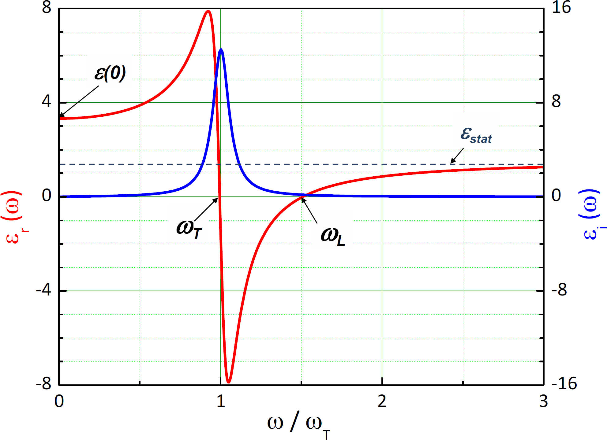
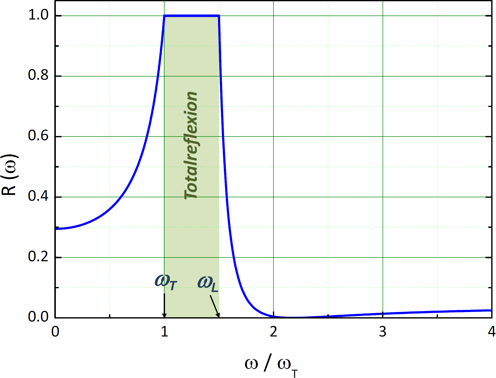

<!--
author:   Hartmut Stöcker
email:    hartmut.stoecker@physik.tu-freiberg.de
version:  0.0.1
language: de
narrator: Deutsch Female
comment:  Struktur der Materie 2 - Übung 12

@style
.lia-toc__bottom {
    display: none;
}
@end

import: https://raw.githubusercontent.com/liaTemplates/KekuleJS/master/README.md
import: https://github.com/liascript/CodeRunner
import: https://raw.githubusercontent.com/LiaTemplates/Pyodide/master/README.md
-->

# Übung 12

## Aufgabe 1

> Ein Supraleiter hat eine kritische Temperatur von $T_\mathrm{C} = 20~\mathrm{K}$. Bei $4,\!2~\mathrm{K}$ beträgt das kritische Feld $B_\mathrm{C} = 30~\mathrm{T}$. Bei welcher maximalen Arbeitstemperatur kann der Supraleiter für einen supraleitenden Magneten von $10~\mathrm{T}$ eingesetzt werden?

                                      {{1}}
Der Realteil der dielektrischen Funktion eines Ionenkristalls ist bei Vernachlässigung der Dämpfung:
$$\varepsilon_\mathrm{r}(\omega) = \varepsilon_\mathrm{stat} \cdot \frac{\omega_\mathrm{LO}^2 - \omega^2}{\omega_\mathrm{TO}^2 - \omega^2}$$

                                      {{2}}
Außerdem gilt die **Lyddane-Sachs-Teller-Relation**, die das Verhältnis der Eigenfrequenzen der longitudinalen und transversalen optischen Schwingungen mit der Dielektrizitätskonstante $\varepsilon_\mathrm{r}(0)$ bei $\omega = 0$ und der Dielektrizitätskonstante $\varepsilon_\mathrm{stat}$ für sehr hohe Frequenzen $\omega \gg \omega_\mathrm{LO}$ in Beziehung setzt:
$$\frac{\omega_\mathrm{LO}^2}{\omega_\mathrm{TO}^2} = \frac{\varepsilon_\mathrm{r}(0)}{\varepsilon_\mathrm{stat}}$$

                                      {{3}}
Die Dielektrizitätskonstante $\varepsilon_\mathrm{stat}$ können wir aus dem Brechungsindex im Sichtbaren berechnen:
$$\varepsilon_\mathrm{stat} = n_\mathrm{S}^2 = 2,\!25$$

                                      {{4}}
Dann erhalten wir die LO-Phononenfrequenz $\omega_\mathrm{LO}$ aus der Lyddane-Sachs-Teller-Relation:
$$\omega_\mathrm{LO} = \omega_\mathrm{TO} \cdot \sqrt{\frac{\varepsilon_\mathrm{r}(0)}{\varepsilon_\mathrm{stat}}} = 5,\!02 \cdot {10}^{13}~\mathrm{s^{-1}}$$

                                      {{5}}
Die zwei Phononenfrequenzen liegen also im FIR-Bereich. Die entsprechenden Wellenlängen sind:
$$\lambda_\mathrm{LO} = 2 \pi c / \omega_\mathrm{LO} = 37,\!5~\mathrm{µm}$$
$$\lambda_\mathrm{TO} = 2 \pi c / \omega_\mathrm{TO} = 60,\!8~\mathrm{µm}$$

                                      {{6}}

## Aufgabe 2 

> In einem Draht aus Blei mit dem Radius von $3~\mathrm{mm}$ fließt im supraleitenden Zustand ein Strom von $100~\mathrm{A}$. Angenommen die Zahl der Cooper-Paare beträgt $5 \cdot 10^{27}~\mathrm{m^{-3}}$, wie groß ist dann die mittlere Geschwindigkeit der Paare? Vergleichen Sie das Ergebnis mit der Fermi-Geschwindigkeit der Elektronen in Blei ($E_\mathrm{F} = 9,\!37~\mathrm{eV}$).

                                      {{1}}
Für den elektrostatischen Fall ($\omega = 0$) benutzen wir die **Clausius-Mossotti-Gleichung**:
$$\frac{\varepsilon_\mathrm{r} - 1}{\varepsilon_\mathrm{r} + 2} = \frac{\alpha_0 n}{3 \varepsilon_0} = \frac{\alpha_0}{3 \varepsilon_0} \cdot \frac{\varrho N_\mathrm{A}}{M}$$

                                      {{2}}
Umstellen nach der gesuchten Polarisation $\alpha_0$ und Einsetzen der gegebenen Werte liefert:
$$\alpha_0 = 3 \cdot \frac{\varepsilon_\mathrm{r}(0) - 1}{\varepsilon_\mathrm{r}(0) + 2} \cdot \frac{M \varepsilon_0}{\varrho N_\mathrm{A}} = 1,\!2 \cdot 10^{-39}~\mathrm{\frac{C m^2}{V}}$$

                                      {{3}}
Für die Lösung im sichtbaren Bereich setzen wir $n_\mathrm{S}^2 = \varepsilon_\mathrm{r}$ in die Clausius-Mossotti-Gleichung ein und erhalten die **Lorentz-Lorenz-Gleichung**:
$$\frac{n_\mathrm{S}^2 - 1}{n_\mathrm{S}^2 + 2} = \frac{\alpha_\mathrm{S} n}{3 \varepsilon_0} = \frac{\alpha_\mathrm{S}}{3 \varepsilon_0} \cdot \frac{\varrho N_\mathrm{A}}{M}$$

                                      {{4}}
Umgestellt nach $\alpha_\mathrm{S}$ erhalten wir:
$$\alpha_\mathrm{S} = 3 \cdot \frac{n_\mathrm{S}^2 - 1}{n_\mathrm{S}^2 + 2} \cdot \frac{M \varepsilon_0}{\varrho N_\mathrm{A}} = 5,\!9 \cdot 10^{-40}~\mathrm{\frac{C m^2}{V}}$$

                                      {{5}}
Wenn ein statisches elektrisches Feld angelegt wird, ergibt sich eine Polarisation von:
$$P_0 = (\varepsilon_\mathrm{r} - 1) \varepsilon_0 E = 4,\!4 \cdot 10^{-5}~\mathrm{C/m^2}$$

                                      {{6}}
Das elektrische Dipolmoment beträgt:
$$p = \frac{P_0}{n} = \frac{P_0 M}{\varrho N_\mathrm{A}} = 3,\!2 \cdot 10^{-33}~\mathrm{Cm}$$

                                      {{7}}
Die entsprechende Dipollänge ist:
$$r = \frac{p}{e} = 2,\!0 \cdot 10^{-14}~\mathrm{m} = 2,\!0 \cdot 10^{-4}~\mathrm{\AA}$$
Dies ist also weniger als ein Tausendstel der Gitterkonstante!

## Aufgabe 3

> Temperatur- und feldabhängige Messungen des elektrischen Widerstands haben gezeigt, dass Nb3Ge bei $22,\!3~\mathrm{K}$ in den supraleitenden Zustand übergeht. Das kritische Feld $B_\mathrm{C2}$ beträgt $7,\!3~\mathrm{T}$. Die direkte Messung der Eindringtiefe ergab $\lambda = 2250~\mathrm{\AA}$. Die Energielücke wurde aus dem Verlauf der elektronischen spezifischen Wärme zu $\Delta = 5~\mathrm{meV}$ ermittelt. Zu welchem Supraleiter-Typ gehört Nb3Ge? Kann Nb3Ge als konventioneller BCS-Supraleiter betrachtet werden?

                                      {{1}}
Die Kohärenzlänge $\xi_\mathrm{GL}$ erhalten wir aus dem Zusammenhang mit dem kritischen Feld $B_\mathrm{C2}$:
$$B_\mathrm{C2} = \frac{\hbar}{q_\mathrm{S} \xi_\mathrm{GL}^2} = \frac{\Phi_0}{2 \pi \xi_\mathrm{GL}^2}$$

                                      {{2}}
Dabei beträgt die Ladung $q_\mathrm{S} = 2 e$ und die Konstante $\Phi_0$ ergibt sich aus $\Phi_0 = h / q_\mathrm{S} = 2,\!07 \cdot 10^{-15}~\mathrm{Vs}$. Die Ginzburg-Landau-Kohärenzlänge ist damit:
$$\xi_\mathrm{GL} = \sqrt{\frac{\Phi_0}{2 \pi B_\mathrm{C2}}} = 6,\!7~\mathrm{nm}$$

                                      {{3}}
Das kritische thermodynamische Feld ist:
$$B_{cth}=\ \frac{\phi_0}{2\pi\sqrt2\xi\lambda} = 0.15 T$$

                                      {{4}}
Der Ginzburg-Landau-Parameter ist:
$$\kappa_{GL}=\ \frac{\lambda}{\xi}=34\ \ \gg1/\sqrt2$$
$$\kappa_{GL}=\ \frac{B_{c2}}{B_{cth}\sqrt2}=34\ \gg1/\sqrt2    (Supraleiter Typ II)$$

                                      {{5}}
Das Energielückenverhältnis ist:
$$∆(0)kBTC=2,6 ≫1,764    (unkonventioneller Supraleiter)$$

## Aufgabe 4

> Bis zu welcher maximalen Stromdichte bleibt ein Blei-Draht von $4~\mathrm{mm}$ Durchmesser bei $4,\!2~\mathrm{K}$ supraleitend? Die kritische Temperatur für Blei liegt bei $7,\!2~\mathrm{K}$ und das kritische Feld $B_\mathrm{C}$ beträgt $8,\!0 \cdot 10^{-2}~\mathrm{T}$.

                                      {{1}}
Fließt durch einen geraden, langen Leiter ein elektrischer Strom $I$, dann bilden die magnetischen Feldlinien Kreise um den Leiterquerschnitt. Der Betrag der magnetischen Flussdichte $B$ im Abstand $r$ ist:
$$B = \frac{\mu_0 I}{2 \pi r}$$

                                      {{2}}
Wird der Strom so stark, dass das dadurch erzeugte Magnetfeld $B$ die kritische Feldstärke $B_\mathrm{C}$ übersteigt, bricht die Supraleitung zusammen. Dann ist der kritische Strom $I_\mathrm{C}$ erreicht:
$$I_\mathrm{C} = \frac{2 \pi r B_\mathrm{C}}{\mu_0}$$

                                      {{3}}
Nun benötigen wir noch die kritische Feldstärke $B_\mathrm{C}(T)$ für $T = 4,\!2~\mathrm{K}$. Dazu nutzen wir die gleiche Formel wie in Aufgabe 1:
$$B_\mathrm{C}(T) = B_\mathrm{C}(0) \cdot \left[1 - \left( \frac{T}{T_\mathrm{C}} \right)^2 \right] = 5,\!28 \cdot 10^{-2}~\mathrm{T}$$

                                      {{4}}
Anhand der vorherigen Formel können wir nun den kritischen Strom $I_\mathrm{C}$ berechnen. Wenn wir noch den Durchmesser $d = 2r$ einsetzen, erhalten wir:
$$I_\mathrm{C} = \frac{\pi d B_\mathrm{C}}{\mu_0} = 528~\mathrm{A}$$

                                      {{5}}
Die Stromdichte $j$ ergibt sich aus dem Strom $I$ geteilt durch die Querschnittsfläche $A$. Nähme man an, dass die gesamte Querschnittsfläche des Blei-Drahts vom Strom durchflossen wird, würde sich ergeben:
$$j_\mathrm{C} = \frac{I_\mathrm{C}}{A} = \frac{I_\mathrm{C}}{\frac{\pi}{4} d^2} = 4,\!2 \cdot 10^7~\mathrm{\frac{A}{m^2}}$$

                                      {{6}}
Aufgrund des Meißner-Effekts darf das Magnetfeld aber nicht ins Innere des Supraleiters 1. Art eindringen. Daher kann auch der supraleitende Strom nur direkt an der Oberfläche des Supraleiters fließen. Er klingt mit der London’schen Eindringtiefe $\lambda_\mathrm{L}$ exponentiell von der Mantelfläche des Drahtes her ab. Für Blei ist $\lambda_\mathrm{L} = 37~\mathrm{nm}$. Die stromdurchflossene Fläche ist also viel kleiner und kann mit $A = \pi d \cdot \lambda_\mathrm{L}$ abgeschätzt werden. Dann folgt für die kritische Stromdichte:
$$j_\mathrm{C} = \frac{I_\mathrm{C}}{A} = \frac{I_\mathrm{C}}{\pi d \lambda_\mathrm{L}} = 1,\!1 \cdot 10^{12}~\mathrm{\frac{A}{m^2}}$$

## Aufgabe 5

> Die Sprungtemperaturen für die Quecksilber-Isotope ^200^Hg und ^204^Hg betragen $4,\!185~\mathrm{K}$ und $4,\!146~\mathrm{K}$. Für den funktionellen Zusammenhang zwischen der Sprungtemperatur und der Isotopenmasse gilt: $T_\mathrm{C} = c \cdot M^{-\alpha}$ mit den Konstanten $c$ und $\alpha$. Bestimmen Sie den Wert der Konstante $\alpha$. Vergleichen Sie das Ergebnis mit der Masseabhängigkeit der Frequenz eines harmonischen Oszillators.

                                      {{1}}
Gemäß des gegebenen Zusammenhangs zwischen der Sprungtemperatur und der Isotopenmasse gilt für die zwei zu betrachtenden Isotope:
$$T_\mathrm{C,1} = c \cdot M_1^{-\alpha}$$
$$T_\mathrm{C,2} = c \cdot M_2^{-\alpha}$$

                                      {{2}}
Für das Verhältnis der zwei Sprungtemperaturen folgt: 
$$\frac{T_\mathrm{C,1}}{T_\mathrm{C,2}} = \frac{M_1^{-\alpha}}{M_2^{-\alpha}} = \left( \frac{M_1}{M_2} \right)^{-\alpha}$$

                                      {{3}}
Um den Exponenten zu erhalten, nutzen wir den Logarithmus:
$$\alpha = - \frac{\ln ( T_\mathrm{C,1} / T_\mathrm{C,2} )}{\ln (M_1 / M_2)} = 0,\!473$$

                                      {{4}}
Wir erhalten also $\alpha \approx \frac{1}{2}$, d. h. die Isotopenmasse beeinflusst nur die Phononenfrequenz und nicht das gesamte Phononenspektrum. Es gilt näherungsweise:
$$T_\mathrm{C} \approx \frac{c}{\sqrt{M}}$$

                                      {{5}}
Dies entspricht der Masseabhängigkeit der Kreisfrequenz eines harmonischen Oszillators mit der Federkonstante $k$ und der Masse $M$:
$$\omega = \sqrt{\frac{k}{M}}$$

## Aufgabe 6

> Ein Magnet mit einer Masse von $5~\mathrm{g}$ und einem magnetischen Moment $\mu$ von $0,\!3~\mathrm{J/T}$ schwebt über einer Scheibe aus einem Supraleiter vom Typ I (Meißner-Effekt). In welcher Höhe $h$ schwebt der Magnet, wenn sich die potentielle magnetische Energie des Magneten wie folgt berechnet:
> $$E_\mathrm{mag} = \frac{\mu_0 \mu^2}{32 \pi h^3}$$

                                      {{1}}
Wir setzen die potentielle Lage-Energie gleich der magnetischen Energie:
$$E_\mathrm{pot} = m g h = \frac{\mu_0 \mu^2}{32 \pi h^3} = E_\mathrm{mag}$$

                                      {{2}}
Umstellen nach der Höhe $h$ liefert: 
$$h = \left( \frac{\mu_0 \mu^2}{32 \pi m g} \right)^\frac{1}{4} = 1,\!23~\mathrm{cm}$$