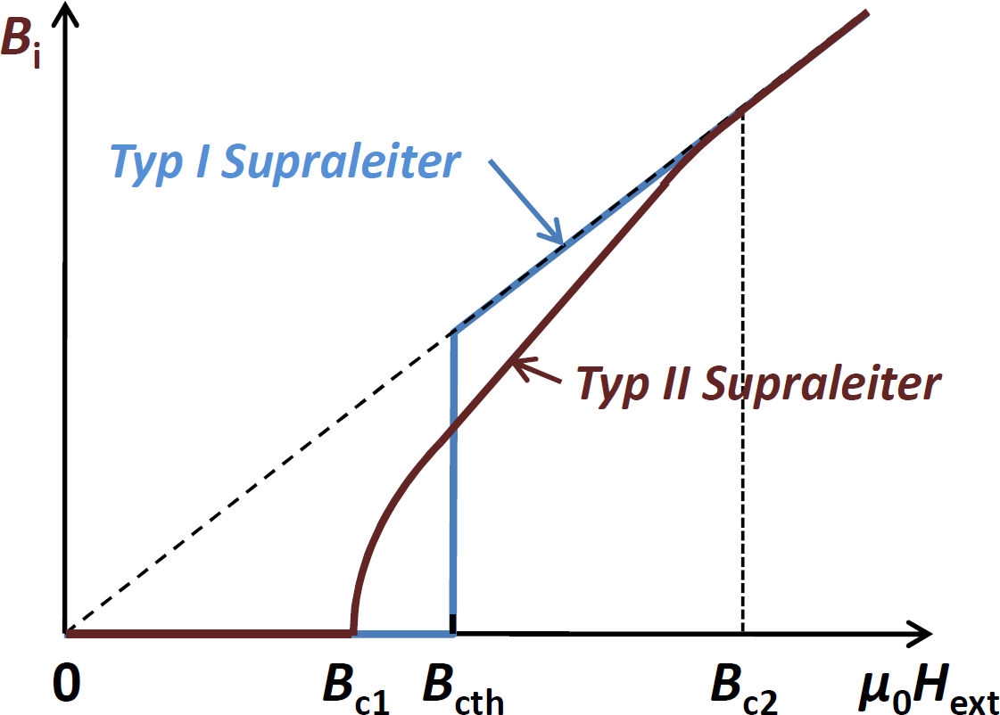
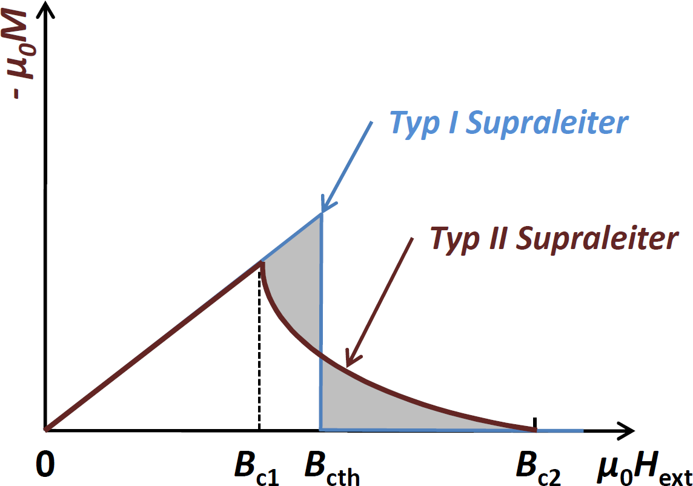

<!--
author:   Hartmut Stöcker
email:    hartmut.stoecker@physik.tu-freiberg.de
version:  0.2
language: de
narrator: Deutsch Female
comment:  Struktur der Materie 2 - Übung 13

@style
.lia-toc__bottom {
    display: none;
}
@end

import: https://raw.githubusercontent.com/liaTemplates/KekuleJS/master/README.md
import: https://github.com/liascript/CodeRunner
import: https://raw.githubusercontent.com/LiaTemplates/Pyodide/master/README.md
-->

# Übung 13

                                      {{1}}
Oberhalb einer kritischen Feldstärke geht ein Typ-I-Supraleiter abrupt in den [[ (normalleitenden) | supraleitenden ]] Zustand über. Bei Typ-II-Supraleitern geschieht dies oberhalb von [[ $B_\mathrm{C,1}$ | ($B_\mathrm{C,2}$) | $B_\mathrm{C,th}$ ]].

                                      {{2}}
Der Meißner-Effekt tritt bei Typ-I-Supraleitern immer [[ (vollständig) | unvollständig ]] auf. Bei Typ-II-Supraleitern ist dies nur unterhalb [[ ($B_\mathrm{C,1}$) | $B_\mathrm{C,2}$ | $B_\mathrm{C,th}$ ]] der Fall.

                                      {{3}}
Die Shubnikov-Phase tritt nur in  [[ Typ-I-Supraleitern | (Typ-II-Supraleitern) ]] auf. Sie stellt den Mischzustand dar, in dem [[ polarisierte und dielektrische | paramagnetische und diamagnetische | (supraleitende und normalleitende) ]] Bereiche koexistieren.

## Aufgabe 1

> Worin besteht der Unterschied zwischen einem Supraleiter vom Typ I und einem Supraleiter vom Typ II? Was versteht man unter einer Shubnikov-Phase?

                                      {{1}}
Oberhalb einer **kritischen Feldstärke** $B_\mathrm{C}$ geht ein Typ-I-Supraleiter abrupt in den normalleitenden Zustand über. Ein Typ-II-Supraleiter geht oberhalb einer ersten kritischen Feldstärke $B_\mathrm{C,1}$ zunächst in einen Mischzustand über, bevor er bei $B_\mathrm{C,2}$ vollständig normalleitend wird.

                                      {{2}}
Der **Meißner-Effekt** tritt bei Typ-I-Supraleitern immer vollständig auf. Bei Typ-II-Supraleitern ist dies nur unterhalb $B_\mathrm{C,1}$ der Fall. Zwischen $B_\mathrm{C,1}$ und $B_\mathrm{C,2}$ kann das Magnetfeld teilweise in den Supraleiter vom Typ II eindringen.

                                      {{3}}
Die **Shubnikov-Phase** tritt nur in Typ-II-Supraleitern auf. Sie stellt den Mischzustand dar, in dem supraleitende und normalleitende Bereiche koexistieren. Dadurch kann ein äußeres Magnetfeld eindringen und bildet regelmäßig angeordnete Fluss-Schläuche (in den normalleitenden Bereichen).

                                      {{4}}
. *Quelle: Rudolf Gross und Achim Marx, Vorlesungsskript Festkörperphysik, 2008*")
. Die durchgezogenen Linien geben den empirischen $1-(T/T_\mathrm{C})^2$ Temperaturverlauf wieder. *Quelle: Rudolf Gross und Achim Marx, Vorlesungsskript Festkörperphysik, 2008*")

                                      {{5}}

## Aufgabe 2

> Die Sprungtemperaturen für die Quecksilber-Isotope ^200^Hg und ^204^Hg betragen $4,\!185~\mathrm{K}$ und $4,\!146~\mathrm{K}$. Für den funktionellen Zusammenhang zwischen der Sprungtemperatur und der Isotopenmasse gilt: $T_\mathrm{C} = c \cdot M^{-\alpha}$ mit den Konstanten $c$ und $\alpha$. Bestimmen Sie den Wert der Konstante $\alpha$. Vergleichen Sie das Ergebnis mit der Masseabhängigkeit der Frequenz eines harmonischen Oszillators.

                                      {{1}}
Gemäß des gegebenen Zusammenhangs zwischen der Sprungtemperatur und der Isotopenmasse gilt für die zwei zu betrachtenden Isotope:
$$T_\mathrm{C,1} = c \cdot M_1^{-\alpha}$$
$$T_\mathrm{C,2} = c \cdot M_2^{-\alpha}$$

                                      {{2}}
Für das Verhältnis der zwei Sprungtemperaturen folgt: 
$$\frac{T_\mathrm{C,1}}{T_\mathrm{C,2}} = \frac{M_1^{-\alpha}}{M_2^{-\alpha}} = \left( \frac{M_1}{M_2} \right)^{-\alpha}$$

                                      {{3}}
Um den Exponenten zu erhalten, nutzen wir den Logarithmus:
$$\alpha = - \frac{\ln ( T_\mathrm{C,1} / T_\mathrm{C,2} )}{\ln (M_1 / M_2)} = 0,\!473$$

                                      {{4}}
Wir erhalten also $\alpha \approx \frac{1}{2}$, d. h. die Isotopenmasse beeinflusst nur die Phononenfrequenz und nicht das gesamte Phononenspektrum. Es gilt näherungsweise:
$$T_\mathrm{C} \approx \frac{c}{\sqrt{M}}$$

                                      {{5}}
Dies entspricht der Masseabhängigkeit der Kreisfrequenz eines harmonischen Oszillators mit der Federkonstante $k$ und der Masse $M$:
$$\omega = \sqrt{\frac{k}{M}}$$

## Aufgabe 3

> Ein Supraleiter hat eine kritische Temperatur von $T_\mathrm{C} = 20~\mathrm{K}$. Bei $4,\!2~\mathrm{K}$ beträgt das kritische Feld $B_\mathrm{C} = 30~\mathrm{T}$. Bei welcher maximalen Arbeitstemperatur kann der Supraleiter für einen supraleitenden Magneten von $10~\mathrm{T}$ eingesetzt werden?

                                      {{1}}
Der Zusammenhang zwischen kritischer Feldstärke $B_\mathrm{C}(T)$ und kritischer Temperatur $T_\mathrm{C}$ lautet:
$$B_\mathrm{C}(T) = B_\mathrm{C}(0) \cdot \left[1 - \left( \frac{T}{T_\mathrm{C}} \right)^2 \right]$$

                                      {{2}}
Umstellen liefert $B_\mathrm{C}(0)$, also die kritische Feldstärke bei $T = 0~\mathrm{K}$:
$$B_\mathrm{C}(0) = \frac{B_\mathrm{C}(T)}{1 - \left( \frac{T}{T_\mathrm{C}} \right)^2} = 31,\!4~\mathrm{T}$$

                                      {{3}}
Damit können wir nun die gleiche Formel nach der Temperatur $T$ umstellen, bei der $B_\mathrm{C}$ gerade den Wert $10~\mathrm{T}$ erreicht:
$$T = T_\mathrm{C} \cdot \sqrt{1 - \frac{B_\mathrm{C}(T)}{B_\mathrm{C}(0)}} = 16,\!5~\mathrm{K}$$

## Aufgabe 4 

> In einem Draht aus Blei mit dem Radius von $3~\mathrm{mm}$ fließt im supraleitenden Zustand ein Strom von $100~\mathrm{A}$. Die London’sche Eindringtiefe für Blei ist $\lambda_\mathrm{L} = 37~\mathrm{nm}$. Angenommen die Zahl der Cooper-Paare beträgt $5 \cdot 10^{27}~\mathrm{m^{-3}}$, wie groß ist dann die mittlere Geschwindigkeit der Paare? Vergleichen Sie das Ergebnis mit der Fermi-Geschwindigkeit der Elektronen in Blei ($E_\mathrm{F} = 9,\!37~\mathrm{eV}$).

                                      {{1}}
Für den elektrischen Strom gilt:
$$I = \frac{Q}{t} = 2e n_\mathrm{S} A v_\mathrm{S}$$

                                      {{2}}
Umstellen nach der gesuchten Geschwindigkeit $v_\mathrm{S}$ der Cooper-Paare liefert:
$$v_\mathrm{S} = \frac{I}{2e A n_\mathrm{S}}$$

                                      {{3}}
Würde die gesamte Querschnittsfläche $A$ des Blei-Drahts vom Strom durchflossen, wäre $A = \pi r^2 = 2,\!83 \cdot 10^{-5}~\mathrm{m^2}$ und die Rechnung ergäbe:
$$v_\mathrm{S} = 0,\!0022~\mathrm{\frac{m}{s}}$$

                                      {{4}}
Aufgrund des Meißner-Effekts darf das Magnetfeld aber nicht ins Innere des Supraleiters 1. Art eindringen. Daher kann auch der supraleitende Strom nur direkt an der Oberfläche des Supraleiters fließen. Er klingt mit der London’schen Eindringtiefe $\lambda_\mathrm{L}$ exponentiell von der Mantelfläche des Drahtes her ab. Die stromdurchflossene Fläche ist also viel kleiner und kann aus dem Umfang des Drahtes mit $A = 2 \pi r \cdot \lambda_\mathrm{L} = 6,\!97 \cdot 10^{-10}~\mathrm{m^2}$ abgeschätzt werden. Daraus folgt für die Geschwindigkeit der Cooper-Paare:
$$v_\mathrm{S} = 89~\mathrm{\frac{m}{s}}$$

                                      {{5}}
Die Fermi-Geschwindigkeit $v_\mathrm{F}$ der Elektronen in Blei erhalten wir aus dem Zusammenhang $E_\mathrm{F} = \frac{m}{2} v_\mathrm{F}^2$ als:
$$v_\mathrm{F} = \sqrt{\frac{2 E_\mathrm{F}}{m}} = 1,\!82 \cdot 10^6~\mathrm{\frac{m}{s}}$$

                                      {{6}}
Die mittlere Geschwindigkeit der Cooper-Paare ist also viel kleiner als die Fermi-Geschwindigkeit der Elektronen.

## Aufgabe 5

> Bis zu welcher maximalen Stromdichte bleibt ein Blei-Draht von $4~\mathrm{mm}$ Durchmesser bei $4,\!2~\mathrm{K}$ supraleitend? Die kritische Temperatur für Blei liegt bei $7,\!2~\mathrm{K}$ und das kritische Feld $B_\mathrm{C}$ beträgt $8,\!0 \cdot 10^{-2}~\mathrm{T}$.

                                      {{1}}
Fließt durch einen geraden, langen Leiter ein elektrischer Strom $I$, dann bilden die magnetischen Feldlinien Kreise um den Leiterquerschnitt. Der Betrag der magnetischen Flussdichte $B$ im Abstand $r$ ist:
$$B = \frac{\mu_0 I}{2 \pi r}$$

                                      {{2}}
Wird der Strom so stark, dass das dadurch erzeugte Magnetfeld $B$ die kritische Feldstärke $B_\mathrm{C}$ übersteigt, bricht die Supraleitung zusammen. Dann ist der kritische Strom $I_\mathrm{C}$ erreicht:
$$I_\mathrm{C} = \frac{2 \pi r B_\mathrm{C}}{\mu_0}$$

                                      {{3}}
Nun benötigen wir noch die kritische Feldstärke $B_\mathrm{C}(T)$ für $T = 4,\!2~\mathrm{K}$. Dazu nutzen wir die gleiche Formel wie in Aufgabe 3:
$$B_\mathrm{C}(T) = B_\mathrm{C}(0) \cdot \left[1 - \left( \frac{T}{T_\mathrm{C}} \right)^2 \right] = 5,\!28 \cdot 10^{-2}~\mathrm{T}$$

                                      {{4}}
Anhand der vorherigen Formel können wir nun den kritischen Strom $I_\mathrm{C}$ berechnen. Wenn wir noch den Durchmesser $d = 2r$ einsetzen, erhalten wir:
$$I_\mathrm{C} = \frac{\pi d B_\mathrm{C}}{\mu_0} = 528~\mathrm{A}$$

                                      {{5}}
Die Stromdichte $j$ ergibt sich aus dem Strom $I$ geteilt durch die Querschnittsfläche $A$. Nähme man an, dass die gesamte Querschnittsfläche des Blei-Drahts vom Strom durchflossen wird, würde sich ergeben:
$$j_\mathrm{C} = \frac{I_\mathrm{C}}{A} = \frac{I_\mathrm{C}}{\frac{\pi}{4} d^2} = 4,\!2 \cdot 10^7~\mathrm{\frac{A}{m^2}}$$

                                      {{6}}
Aufgrund des Meißner-Effekts darf das Magnetfeld aber nicht ins Innere des Supraleiters 1. Art eindringen. Daher kann auch der supraleitende Strom nur direkt an der Oberfläche des Supraleiters fließen. Er klingt mit der London’schen Eindringtiefe $\lambda_\mathrm{L}$ exponentiell von der Mantelfläche des Drahtes her ab. Für Blei ist $\lambda_\mathrm{L} = 37~\mathrm{nm}$. Die stromdurchflossene Fläche ist also viel kleiner und kann mit $A = \pi d \cdot \lambda_\mathrm{L}$ abgeschätzt werden. Dann folgt für die kritische Stromdichte:
$$j_\mathrm{C} = \frac{I_\mathrm{C}}{A} = \frac{I_\mathrm{C}}{\pi d \lambda_\mathrm{L}} = 1,\!1 \cdot 10^{12}~\mathrm{\frac{A}{m^2}}$$
