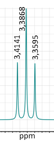
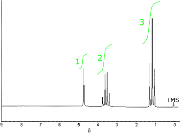

<!--
author:   Hartmut Stöcker
email:    hartmut.stoecker@physik.tu-freiberg.de
version:  0.1
language: de
narrator: Deutsch Female
comment:  Struktur der Materie 2 - Übung 14

@style
.lia-toc__bottom {
    display: none;
}
@end

import: https://raw.githubusercontent.com/liaTemplates/KekuleJS/master/README.md
import: https://github.com/liascript/CodeRunner
import: https://raw.githubusercontent.com/LiaTemplates/Pyodide/master/README.md
-->

# Übung 14

## Aufgabe 1

> a) Erklären Sie, wie ein NMR-Spektrum zustande kommt. 
>
> b) Welche Eigenschaften eines Atomkerns führen zu einer großen NMR-Empfindlichkeit?
>
> c) In welcher Einheit wird die $x$-Achse im NMR-Spektrum angegeben und wie ist sie definiert?
>
> d) Welchen Vorteil bietet in der NMR-Spektrometrie ein möglichst starkes Magnetfeld?

                                      {{1}}
**a)** NMR-Signale entstehen durch die Wechselwirkung der Kernspins mit einem externen Magnetfeld, die Anregung durch HF-Pulse und die anschließende Relaxation, die ein messbares elektrisches Signal in einer Spule erzeugt. Die Analyse dieses Signals durch Fourier-Transformation liefert ein Spektrum, das Informationen über die chemische Struktur und Umgebung der Atome in der Probe enthält.
*")

                                      {{2}}
************************************
**b)** Ein Isotop eines Elements wird empfindlich genannt, wenn es zu einem starken Signal im NMR-Spektrum führt. Dazu muss das Isotop:

- im natürlichen Isotopengemisch mit großer Häufigkeit vorkommen,
- ein großes magnetogyrisches Verhältnis besitzen,
- eine Kernspinquantenzahl von ungleich Null haben, da die Atomkerne dieses Isotops sonst kein magnetisches Moment besitzen.
************************************

                                      {{3}}
**c)** Die Energieeinheit im NMR-Spektrum ist die chemische Verschiebung $\delta$. Die chemische Verschiebung ist der Unterschied der Resonanzfrequenz der Atome einer Probe zu der der Atome des Standards TMS (Tetramethylsilan), also bezogen auf die TMS-Frequenz (bzw. $f_0$). Da die Unterschiede der Resonanzfrequenzen sehr klein sind, wird $\delta$ in $\mathrm{ppm}$ angegeben. Die chemische Verschiebung ist ein Relativmaß und daher unabhängig von der Magnetfeldstärke $B_0$.

                                      {{4}}
************************************
**d)** Je stärker das Magnetfeld ist, desto größer ist der Energieunterschied der verschiedenen Orientierungen eines atomaren magnetischen Moments im Magnetfeld. Je stärker das Magnetfeld ist, desto:

- mehr unterscheiden sich die Resonanzenergien verschiedener Atomkerne,
- intensiver werden die Absorptionen, weil weniger Atomkerne thermisch angeregt sind,
- einfacher interpretierbar werden die NMR-Spektren.
************************************

## Aufgabe 2

> a) Was ist die Kopplungskonstante $J$ in der NMR-Spektroskopie und welche Informationen lassen sich aus der Feinstruktur eines NMR-Signals ableiten?
>
> b) Sie sehen nebenstehend ein Triplett aus einem $\mathrm{250~MHz}$-Spektrum, in dem die Bandenmaxima in $\mathrm{ppm}$ beschriftet sind. Geben Sie die Kopplungskonstante $J$ in $\mathrm{Hz}$ an.
>
> 

                                      {{1}}
**a)** Die in der Protonenresonanz gemessenen Signale zeigen häufig eine Feinstruktur. Nach der Anzahl der Teilbanden im Signal spricht man von einem Singulett, einem Dublett, einem Triplett, einem Quartett, einem Quintett usw. (bei vielen Linien: Multiplett). Ursache für die Aufspaltung von Signalen ist die Wechselwirkung eines Kerns mit Nachbarkernen. Diese Spin-Spin-Kopplung tritt zwischen Kernen derselben Sorte auf (homonuklear) und zwischen Kernen verschiedener Elemente (heteronuklear). Sie wird durch die Beeinflussung der Resonanz eines Kerns A durch das lokale Magnetfeld des koppelnden Kerns X verursacht.

                                      {{2}}
Vereinfacht kann man den Effekt folgendermaßen erklären: Sind zwei Kerne A und X so weit voneinander entfernt, dass sie sich gegenseitig nicht beeinflussen, beobachtet man für beide Kerne Singuletts bei den charakteristischen Resonanzfrequenzen. Ist allerdings der Abstand klein genug und die beiden lokalen Magnetfelder von A und X beeinflussen einander, sind die Signale der beiden Kerne zu jeweils einem Dublett aufgespalten. Ursache hierfür ist, dass die Anregungsenergie beider Kerne vom Zustand des jeweilig anderen abhängt. Ist Kern X z. B. im α-Zustand, so führt das lokale Feld von X zur Verringerung der zur Anregung von A vom α- in den β-Zustand notwendigen Energie, da X das Feld von A verstärkt. Umgekehrt ist, wenn sich X im β-Zustand befindet, das Feld von X dem von A entgegengerichtet, so dass zur Resonanz von A ein höherer Energiebetrag notwendig ist und sich das entsprechende Signal zu höherer Feldstärke verschiebt. Als Ergebnis erhält man also zwei Dubletts, in dem die beiden Linien jeweils denselben Abstand besitzen. Dieses einfache Spinsystem wird AX-System genannt. Es handelt sich um ein Spektrum erster Ordnung.

                                      {{3}}
Das Ausmaß der Kopplung wird quantitativ durch Angabe der Kopplungskonstante $J$ beschrieben, die in $\mathrm{Hertz}$ angegeben wird. Die Kopplungskonstante ergibt sich bei dem obigen AX-System aus den Abständen der beiden Linien in den Dubletts, welche jeweils gleich sein müssen. In Abhängigkeit der Anzahl der Bindungen zwischen zwei miteinander koppelnden Kernen unterscheidet man $^1J$-Kopplungen (direkte heteronukleare Kopplungen), $^2J$-Kopplungen (geminale Kopplungen, $8...18~\mathrm{Hz}$) und $^3J$-Kopplungen (vicinale Kopplungen, $6...8~\mathrm{Hz}$). Kopplungen über mehr als drei Bindungen sind meist vernachlässigbar außer in speziellen Systemen, in denen solche sogenannten Fernkopplungen signifikante Kopplungskonstanten besitzen können.

                                      {{4}}
Neben der Linienanzahl ist für ein Signal mit Feinstruktur auch die Intensitätsverteilung der einzelnen Linien charakteristisch. In der ^1^H-NMR-Spektroskopie entsprechen die relativen Intensitäten von Multipletts den Binominalkoeffizienten, welche dem Pascal’schen-Dreieck zu entnehmen sind. Bei Spektren erster Ordnung ergibt sich die chemische Verschiebung eines Kerns aus dem Schwerpunkt (Mittelpunkt) des Signals und die Kopplungskonstante aus dem Abstand zweier Linien.

                                      {{5}}
Die Feinstruktur eines NMR-Signals spiegelt die Kopplungen eines Atomkernes mit anderen Kernen des Moleküls wider. Es lassen sich deshalb Zahl, Art und Abstand von Atomen in der Umgebung eines Atomkernes ableiten.

                                      {{6}}
**b)** Wir berechnen als erstes die Differenzen:
$$3,\!4141~\mathrm{ppm} - 3,\!3868~\mathrm{ppm} = 0,\!0273~\mathrm{ppm}$$
$$3,\!3868~\mathrm{ppm} - 3,\!3595~\mathrm{ppm} = 0,\!0273~\mathrm{ppm}$$

                                      {{7}}
Beide Differenzen sind gleich! Es handelt sich also tatsächlich um ein Triplett. Die Kopplungskonstante beträgt:
$$J = 0,\!0273~\mathrm{ppm} \cdot 250~\mathrm{MHz} = 6,\!8~\mathrm{Hz}$$

## Aufgabe 3 

> Was besagt die Multiplizität in der NMR-Spektroskopie? Bestimmen Sie die Multiplizität der abgebildeten ^1^H-Signale der gegebenen Molekülfragmente. Hinweis: Das betrachtete Proton ist blau markiert. Die Unterscheidung von HA und HB meint ungleiche Bindungspartner.
>
> 

                                      {{1}}
Durch Kopplung mit $n$ magnetisch äquivalenten Kernen spaltet sich das Signal in $n + 1$ Linien auf ($n+1$-Regel). Die **Multiplizität** $M$ gibt also an, wie viele Linien zu einem Signal gehören und gleichzeitig auch wie viele Kopplungspartner zu diesem Signal beitragen.

                                      {{2}}
**a)** Das betrachtete, blau markierte Proton koppelt an $n=3$ äquivalente H-Kerne, die sich am benachbarten C-Atom befinden:
$$M = n+1 = 4 \quad \mathrm{(Quartett)}$$

                                      {{3}}
**b)** Falls nicht alle Kopplungspartner eines Kerns gleichartig sind, können die Kopplungskonstanten verschieden sein (AMX-System). Dann gilt die $n+1$-Regel nicht mehr, da die Signale nicht mehr zusammenfallen. Wir benötigen die erweiterte $n + 1$-Regel: $(n_1 + 1) \cdot (n_2 + 1)$ und erhalten für dieses Fragment ein Dublett vom Dublett (dd):
$$M = (n_1 + 1) \cdot (n_2 + 1) = 2 \cdot 2 = 4 \quad \mathrm{(dd)}$$

                                      {{4}}
**c)** Das betrachtete, blau markierte Proton koppelt an $n=8$ äquivalente H-Kerne, die sich an den benachbarten C-Atomen befinden:
$$M = n+1 = 9 \quad \mathrm{(Nonett)}$$

                                      {{5}}
**d)** Das betrachtete, blau markierte Proton koppelt an $n=7$ äquivalente H-Kerne, die sich an den benachbarten C-Atomen befinden:
$$M = n+1 = 8 \quad \mathrm{(Oktett)}$$

                                      {{6}}
**e)** Da zwei verschiedene Kopplungspartner auftreten, benötigen wir die erweiterte $n + 1$-Regel und erhalten für dieses Fragment ein Dublett vom Triplett (dt):
$$M = (n_1 + 1) \cdot (n_2 + 1) = 3 \cdot 2 = 6 \quad \mathrm{(dt)}$$
. Die beiden inneren Linien liegen im Spektrum fast übereinander. *Quelle: Thomas Köhler, [CC BY-NC-SA](https://creativecommons.org/licenses/by-nc-sa/4.0/)*")

                                      {{7}}
**f)** Da drei verschiedene Kopplungspartner auftreten, benötigen wir die erweiterte $n + 1$-Regel für drei Partner: $(n_1 + 1) \cdot (n_2 + 1) \cdot (n_3 + 1)$. Wir erhalten für dieses Fragment ein Dublett Dublett Triplett (ddt):
$$M = (n_1 + 1) \cdot (n_2 + 1) \cdot (n_3 + 1) = 3 \cdot 2 \cdot 2 = 12 \quad \mathrm{(ddt)}$$

## Aufgabe 4

> a) Welche Multipletts ergeben sich für (i) die Methylengruppe und (ii) die Methylgruppe von Chlorethan (CH3–CH2–Cl)?
>
>b) Welche Multipletts sind für (i) die Methylengruppe und (ii) die Methingruppe von 1,1,2-Trichlorethan (Cl–CH2–CH–Cl2) zu erwarten?

                                      {{1}}
************************************
**a)** Chlorethan (CH3–CH2–Cl)

**(i)** Das Signal der Methylengruppe (–CH2–) wird durch die drei Wasserstoff-Atome der benachbarten Methylgruppe (–CH3) in ein Quartett aufgespalten.

**(ii)** Das Signal der Methylgruppe (–CH3) wird durch die beiden H-Atome der Methylengruppe (–CH2–) in ein Triplett aufgespalten.
************************************

                                      {{2}}
************************************
**b)** 1,1,2-Trichlorethan (Cl–CH2–CH–Cl2)

**(i)** Das Methylen-Signal (–CH2–) wird durch die benachbarte Methingruppe (–CH–) in ein Dublett aufgespalten. 

**(ii)** Das Signal der Methingruppe (–CH–) wird durch die Methylengruppe (–CH2–) wieder zu einem Triplett.
************************************

## Aufgabe 5

> a) Wie groß ist die Resonanzfrequenz eines Protons in einem Magnetfeld von $B = 14,\!1~\mathrm{T}$? Der Landé-Faktor für das Proton ist mit $g = 5,\!5857$ gegeben und sein magnetisches Moment entspricht einem Kernmagneton $\mu_\mathrm{N} = 5,\!0508 \cdot {10}^{-27}~\mathrm{J/T}$.
>
> b) In welchem der folgenden Systeme ist die Aufspaltung der Energieniveaus größer: (i) in einem Proton in einem $\mathrm{600~MHz}$-Spektrometer oder (ii) in einem Deuteron in demselben Spektrometer ($g_I = 0,\!8575$)?

                                      {{1}}
**a)** Für das Proton ist die Resonanzfrequenz $\nu$ gleich der Larmor-Frequenz $\nu_\mathrm{L}$. Entsprechend gilt:
$$\nu = \nu_\mathrm{L} = \frac{\gamma B_0}{2\pi} \quad \mathrm{mit} \quad \gamma = \frac{g_I \cdot \mu_\mathrm{N}}{\hbar}$$

                                      {{2}}
Damit folgt:
$$\nu = \frac{g_I \cdot \mu_\mathrm{N} \cdot B_0}{h} = 600~\mathrm{MHz}$$

                                      {{3}}
**b)** Wie in a) gezeigt, hat ein $600~\mathrm{MHz}$-Spektrometer ein Magnetfeld von $14,\!1~\mathrm{T}$. Daher gilt für die Resonanz des (i) Protons: 
$$\Delta E = \gamma B_0 \hbar = h \nu_\mathrm{L} = h \nu = 2,\!5~\mathrm{µeV}$$

                                      {{4}}
(ii) Bei einem $600~\mathrm{MHz}$-Spektrometer ist die Resonanz für Protonen bei $600~\mathrm{MHz}$ erfüllt und das Magnetfeld beträgt $14,\!1~\mathrm{T}$. Bei Geräten mit starken Feldern ist das Feld konstant, nicht die Frequenz. Für das Deuteron gilt also:
$$\nu = \frac{g_I \cdot \mu_\mathrm{N} \cdot B_0}{h} = 92,\!2~\mathrm{MHz}$$
$$\Delta E = h \nu = 0,\!38~\mathrm{µeV}$$

                                      {{5}}
Die Energieaufspaltung ist also für das Proton größer.

## Aufgabe 6

> a) Die chemische Verschiebung der CH3-Protonen in Acetaldehyd (Ethanal) ist $\delta = 2,\!20~\mathrm{ppm}$, die des Aldehydprotons (−CHO) ist $\delta = 9,\!80~\mathrm{ppm}$. Wie groß ist die Differenz der lokalen Feldstärken für diese beiden Protonen bei einem äußeren Feld von (i) $\mathrm{1,\!5~T}$ und (ii) $\mathrm{15~T}$?
>
> b) Skizieren Sie das Aussehen des ^1^H-NMR-Spektrums von Acetaldehyd (i) in einem $\mathrm{250~MHz}$ und (ii) $\mathrm{500~MHz}$-Spektrometer. Verwenden Sie dazu $J = 2,\!9~\mathrm{Hz}$ sowie die Daten aus Teilaufgabe (a).

                                      {{1}}
**a)** Die magnetischen Momente der Kerne in der Probe spüren lokale Magnetfelder an ihrem Ort. Das lokale Feld kann sich vom angelegten Feld unterscheiden, da dieses einen elektronischen Bahndrehimpuls induziert, welcher am Kern ein kleines zusätzliches Magnetfeld $\Delta B$ erzeugt:
$$\Delta B = -\sigma B_0$$

                                      {{2}}
Dabei ist $\sigma$ die Abschirmungskonstante. Das gesamte lokale Feld am Ort eines betrachteten Kerns ist somit:
$$B_\mathrm{lokal} = B_0 + \Delta B = (1 - \sigma) B_0$$

                                      {{3}}
Der Betrag der Abschirmungskonstante $\sigma$ entspricht der chemischen Verschiebung $\delta$, die allerdings auf die TMS-Frequenz als Referenz bezogen wird. Betrachtet man die Differenz der lokalen Feldstärken von zwei Protonen, dann ist die Differenz der jeweiligen Abschirmungskonstanten gleich der Differenz der chemischen Verschiebungen:
$$|\Delta \sigma| = |\Delta \delta|$$

                                      {{4}}
Für die Differenz der lokalen Feldstärken ergibt sich:
$$|\Delta B_\mathrm{lokal}| = |\Delta \sigma| \cdot B_0 = |\Delta \delta| \cdot B_0 = |\delta(\mathrm{CHO}) - \delta(\mathrm{CH_3})| \cdot B_0$$

                                      {{5}}
************************************
Mit den gegebenen Werten erhalten wir:

(i) $|\Delta B_\mathrm{lokal}| = 11~\mathrm{µT}$

(ii) $|\Delta B_\mathrm{lokal}| = 110~\mathrm{µT}$
************************************

                                      {{6}}
**b)** Wir müssen zunächst den Abstand der beiden Protonengruppen CH3 und CHO berechnen. Die chemische Verschiebung ist definiert als:
$$\delta = \frac{\nu - \nu_0}{\nu_0}$$

                                      {{7}}
Die Differenz der Resonanzfrequenz eines Kerns und der Referenz beträgt also:
$$\nu - \nu_0 = \nu_0 \cdot \delta$$

                                      {{8}}
Der gesuchte Frequenzabstand ist also:
$$\Delta \nu = [\nu(\mathrm{CHO}) - \nu_0] - [\nu(\mathrm{CH_3}) - \nu_0] = \nu(\mathrm{CHO}) - \nu(\mathrm{CH_3})$$
$$\Delta \nu = \nu_0 \cdot [\delta(\mathrm{CHO}) - \delta(\mathrm{CH_3})] = \nu_0 \cdot 7,\!60~\mathrm{ppm}$$

                                      {{9}}
************************************
Mit den gegebenen Werten erhalten wir:

(i) $\Delta \nu = 1,\!9~\mathrm{kHz}$

(ii) $\Delta \nu = 3,\!8~\mathrm{kHz}$
************************************

                                      {{10}}
Was wissen wir noch: CHO wird aufgrund der Multiplizität zu einem Quartett und CH3 zu einem Dublett aufspalten, wobei $J = 2,\!9~\mathrm{Hz}$ gegeben ist. Wir können also nun das Spektrum zeichnen:
*")

                                      {{11}}
Wenn man die Frequenz auf $\mathrm{500~MHz}$ ändert, ändert sich $\Delta \nu$ auf $3,\!8~\mathrm{kHz}$. Die Feinstruktur, d. h. die Aufspaltung innerhalb der Gruppen, bleibt jedoch gleich, da die Spin-Spin-Aufspaltung durch die Stärke des angelegten Feldes nicht beeinflusst wird. Allerdings steigt wegen $\frac{\Delta N}{N} \sim \nu$ die Intensität der Linien um den Faktor $2$!

## Aufgabe 7

> Die Abbildung zeigt das ^1^H-NMR-Spektrum von Ethanol (CH3CH2OH). Die stufenartigen Kurven zeigen das integrierte Signal.
>
> a) Ordnen Sie die Signale der H-Gruppen von Ethanol den Signalen im Spektrum zu.
>
> b) Erklären Sie die Feinstruktur der C-H-Protonen im Spektrum.
>
> 

                                      {{1}}
**a)** Die Existenz der chemischen Verschiebung erklärt bereits die allgemeinen Eigenschaften des Spektrums. Die CH3-Protonen bilden eine Gruppe von Kernen mit $\delta \sim 1~\mathrm{ppm}$. Die beiden CH2-Protonen befinden sich in einer anderen Umgebung, spüren dort ein anderes lokales Feld und erscheinen daher bei $\delta \sim 3,\!5~\mathrm{ppm}$. Das OH-Proton liegt wieder in einem anderen Bereich des Moleküls und besitzt eine chemische Verschiebung von $\delta \sim 4,\!8~\mathrm{ppm}$. Der Anstieg von $\delta$ (d. h. die Abnahme der Abschirmung) passt zur Elektron-anziehenden Wirkung des Sauerstoffatoms: Die Elektronendichte am Hydroxyl-Wasserstoffatom wird am stärksten reduziert, so dass dieses Proton stark entschirmt wird. Die Elektronendichte an den weit entfernten Methylprotonen kann es am wenigsten beeinflussen, daher werden sie am wenigsten entschirmt und befinden sich nahe dem TMS-Signal.

                                      {{2}}
Die relativen Intensitäten der Signale (Fläche unter der Absorptionslinie – Integration) kann als Hilfe dienen, um die einzelnen Signale bestimmten Gruppen von Protonen zuzuordnen. Im Spektrum des Ethanols zeigen die Stufen ein Intensitätsverhältnis von $3:2:1$, da es 3 Methylprotonen, 2 CH2-Protonen und ein OH-Proton im Molekül gibt. **Merke:** Integration der Spektren gemeinsam mit der chemischen Verschiebung hilft bei der Identifikation unbekannter Substanzen.
*")<!-- style = "width: 400px;" -->

                                      {{3}}
**b)** Wir erkennen im Spektrum 3 Linien für die CH3-Gruppe und 4 Linien für die CH2-Gruppe mit den Intensitätsverhältnissen $1:2:1$ bzw. $1:3:3:1$.

                                      {{4}}
Aber betrachten wir diese Aussage genauer! Sie ist nachvollziehbar über die Formel zur Multiplizität: $M = n + 1$. Trägt also der „Nachbar-Kohlenstoff“ zwei H-Atome (wie etwa die Methylengruppe CH2–), ergibt sich entsprechend: $M = 2+1 = 3$, also ein Triplett mit der Intensität $1:2:1$ mit dem jeweils gleichen Abstand $J$.

                                      {{5}}
Und ist an das Kohlenstoff-Atom, das unser gerade betrachtetes H-Atom trägt (das also für das betreffende Signal verantwortlich ist), eine Methylgruppe –CH3 gebunden, führt dies zu einem Quartett (mit den relativen Intensitäten $1:3:3:1$ im jeweiligen Abstand $J$), denn $M = n + 1 = 3 + 1 = 4$.

                                      {{6}}
Die drei Protonen der CH3-Gruppe koppeln also über drei Bindungen mit den beiden Protonen der CH2-Gruppe. Betrachten wir jeweils dazu die möglichen Orientierungen des ^1^H-Spins:
*")<!-- style = "width: 600px;" -->

                                      {{7}}
Mit Ausnahme der einmaligen parallelen und antiparallelen Orientierung der Kopplungspartner (relative Intensitäten je $1$) bestimmt die Anzahl der Kopplungspartner wechselseitig, wie viele Spinkombinationen das gleiche $B_\mathrm{eff}$ generieren (z. B. jene von 1 Spin der CH3-Protonen antiparallel und 2 CH3-Spins parallel). Diese Zahl bestimmt die relative Häufigkeit, mit der Kopplungspartner im jeweiligen $B_\mathrm{eff}$ energetisch entarteter Spinkombination gemessen werden. Die Resonanz der CH2-Protonen im $B_\mathrm{eff}$ der CH3-Spinkombination einmal antiparallel und zweimal parallel ist also dreimal wahrscheinlicher als jene im $B_\mathrm{eff}$ der Spinkombination dreimal antiparallel bzw. parallel. Es sind also dreimal mehr Moleküle im ersten Spinzustand vorhanden – daher beträgt das Intensitätsverhältnis zwischen den 4 Linien des Quadrupletts der CH2-Gruppe $1:3:3:1$ und jene des Tripletts $1:2:1$.

## Aufgabe 8

> Gegeben ist ein ^1^H-NMR-Spektrum von 4-Methyl-Benzoesäureethylester (C10H12O2). Ermitteln Sie die chemischen Verschiebungen, alle vicinalen Kopplungen $^3J$ und ordnen Sie die Protongruppen im Spektrum der Molekülstruktur zu.
>
> <!-- style = "width: 500px;" -->

                                      {{1}}
Zur Berechnung der chemischen Verschiebung $\delta$ der Banden mitteln wir zunächst die gegebenen Linien der einzelnen Banden. Am Beispiel der ersten Bande:
$$\delta = \frac{1}{2} \cdot (7,\!977 + 7,\!885)~\mathrm{ppm} \approx 7,\!93~\mathrm{ppm}$$

                                      {{2}}
Um die Kopplungskonstanten zu berechnen, mitteln wir (wenn möglich) die Abstände zwischen den einzelnen Linien einer Bande, um möglichst genaue Werte zu erhalten. Dann wird der Abstand mit der Frequenz der Messung multipliziert. Am Beispiel der ersten Bande:
$$^3J = (7,\!977 - 7,\!885)~\mathrm{ppm} \cdot 89,\!56~\mathrm{MHz} = 8,\!24~\mathrm{Hz}$$

                                      {{3}}
************************************
| Signal | $\delta$              | Multiplizität | $^3J$                | Zuordnung                             |
|--------|-----------------------|---------------|----------------------|---------------------------------------|
| 1      | $7,\!93~\mathrm{ppm}$ | Dublett       | $8,\!24~\mathrm{Hz}$ | aromatische Protonen in Position 1    |
| 2      | $7,\!21~\mathrm{ppm}$ | Dublett       | $7,\!88~\mathrm{Hz}$ | aromatische Protonen in Position 2    |
| 3      | $4,\!35~\mathrm{ppm}$ | Quartett      | $7,\!16~\mathrm{Hz}$ | CH2-Gruppe der Ethylgruppe |
| 4      | $2,\!39~\mathrm{ppm}$ | Singulett     |                      | Methylgruppe am aromatischen Ring     |
| 5      | $1,\!38~\mathrm{ppm}$ | Triplett      | $7,\!12~\mathrm{Hz}$ | CH3-Gruppe der Ethylgruppe |

 mit Nummerierung der Protonen. *Quelle: Thomas Köhler, [CC BY-NC-SA](https://creativecommons.org/licenses/by-nc-sa/4.0/)*")<!-- style = "width: 150px;" -->
************************************
